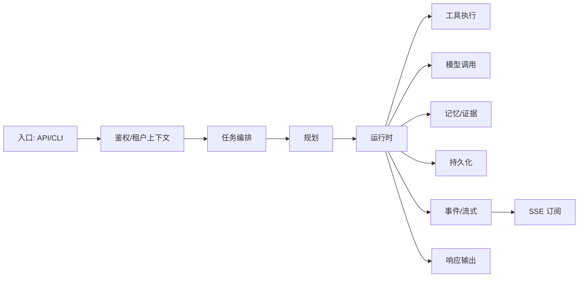
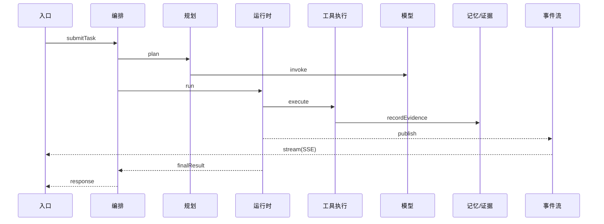

# fagent 系统入口与证据索引

> 范围：`src/main/java`（全量检索）

## A) 系统入口清单

| 类型 | 方法 | 路径 | 证据（类#方法 + 路径） |
| --- | --- | --- | --- |
| API | POST | /api/approvals/decide | `ToolApprovalController#decide` - `src/main/java/com/example/agent/gateway/controller/ToolApprovalController.java` |
| API | GET | /api/v1/events | `TimelineController#listEvents` - `src/main/java/com/example/agent/gateway/controller/TimelineController.java` |
| API | GET | /api/v1/timeline | `TimelineController#getTimeline` - `src/main/java/com/example/agent/gateway/controller/TimelineController.java` |
| API | GET | /api/v1/timeline/steps | `TimelineController#listSteps` - `src/main/java/com/example/agent/gateway/controller/TimelineController.java` |
| API | POST | /api/v1/tasks | `TaskController#submitTask` - `src/main/java/com/example/agent/gateway/controller/TaskController.java` |
| API | GET | /api/v1/tasks/{taskId} | `TaskController#getTask` - `src/main/java/com/example/agent/gateway/controller/TaskController.java` |
| API | GET | /api/v1/tasks | `TaskController#listTasks` - `src/main/java/com/example/agent/gateway/controller/TaskController.java` |
| API | POST | /api/v1/schedules | `ScheduleController#create` - `src/main/java/com/example/agent/gateway/controller/ScheduleController.java` |
| API | PUT | /api/v1/schedules | `ScheduleController#update` - `src/main/java/com/example/agent/gateway/controller/ScheduleController.java` |
| API | GET | /api/v1/schedules | `ScheduleController#list` - `src/main/java/com/example/agent/gateway/controller/ScheduleController.java` |
| API | POST | /api/v1/schedules/{scheduleId}/pause | `ScheduleController#pause` - `src/main/java/com/example/agent/gateway/controller/ScheduleController.java` |
| API | POST | /api/v1/schedules/{scheduleId}/resume | `ScheduleController#resume` - `src/main/java/com/example/agent/gateway/controller/ScheduleController.java` |
| API | POST | /api/v1/schedules/{scheduleId}/cancel | `ScheduleController#cancel` - `src/main/java/com/example/agent/gateway/controller/ScheduleController.java` |
| API | DELETE | /api/v1/schedules/{scheduleId} | `ScheduleController#delete` - `src/main/java/com/example/agent/gateway/controller/ScheduleController.java` |
| API | POST | /api/v1/replay | `ReplayController#replay` - `src/main/java/com/example/agent/gateway/controller/ReplayController.java` |
| API | POST | /api/v1/policy/evaluate | `PolicyController#evaluate` - `src/main/java/com/example/agent/gateway/controller/PolicyController.java` |
| API | POST | /api/v1/memory/save | `MemoryController#save` - `src/main/java/com/example/agent/gateway/controller/MemoryController.java` |
| API | POST | /api/v1/memory/search | `MemoryController#search` - `src/main/java/com/example/agent/gateway/controller/MemoryController.java` |
| API | POST | /api/v1/memory/compress | `MemoryController#compress` - `src/main/java/com/example/agent/gateway/controller/MemoryController.java` |
| MCP | POST | /api/v1/mcp/tools/list | `McpController#listTools` - `src/main/java/com/example/agent/gateway/controller/McpController.java` |
| MCP | POST | /api/v1/mcp/tools/call | `McpController#callTool` - `src/main/java/com/example/agent/gateway/controller/McpController.java` |
| API | POST | /api/v1/budget/usage | `BudgetController#recordUsage` - `src/main/java/com/example/agent/gateway/controller/BudgetController.java` |
| API | GET | /api/v1/budget/summary | `BudgetController#summary` - `src/main/java/com/example/agent/gateway/controller/BudgetController.java` |
| API | POST | /api/v1/workflows/{workflowId}/approval/decision | `ApprovalController#decide` - `src/main/java/com/example/agent/gateway/controller/ApprovalController.java` |
| OpenAPI | GET | /v3/api-docs | `OpenApiController#getOpenApi` - `src/main/java/com/example/agent/contracts/OpenApiController.java` |
| SSE | GET | /api/v1/stream/sse | `SseStreamController#stream` - `src/main/java/com/example/agent/streaming/SseStreamController.java` |

### A.2 进程入口/CLI/stdio
- `AgentApplication#main` - `src/main/java/com/example/agent/AgentApplication.java`
- 未发现独立 CLI/stdio 入口类（检索关键词：`CommandLineRunner`、`ApplicationRunner`、`Stdio`、`stdio`，范围：`src/main/java`）

## B) 核心链路节点

### Planner
- `PlannerService#plan(TaskRequest, TenantContext)` - `src/main/java/com/example/agent/planning/PlannerService.java`
- `PlannerService#plan(TaskRequest, TenantContext, String, AtomicLong)` - `src/main/java/com/example/agent/planning/PlannerService.java`
- `ContextAssembler#assemble(...)` - `src/main/java/com/example/agent/context/ContextAssembler.java`
- `PromptAssembler#build(...)` - `src/main/java/com/example/agent/model/PromptAssembler.java`

### Orchestrator
- `TaskOrchestrator#submitTask(TaskRequest, TenantContext)` - `src/main/java/com/example/agent/orchestrator/TaskOrchestrator.java`
- `TaskOrchestrator#getTask(String, TenantContext)` - `src/main/java/com/example/agent/orchestrator/TaskOrchestrator.java`
- `TaskOrchestrator#listTasks(TaskQuery, TenantContext)` - `src/main/java/com/example/agent/orchestrator/TaskOrchestrator.java`
- `WorkflowRouter#route(TaskRequest, TenantContext)` - `src/main/java/com/example/agent/orchestrator/WorkflowRouter.java`
- `TaskExecutionService#submit(String, Runnable)` - `src/main/java/com/example/agent/orchestrator/TaskExecutionService.java`

### Runtime
- `AgentRuntime#run(TaskRequest, TenantContext)` - `src/main/java/com/example/agent/runtime/AgentRuntime.java`
- `LlmStepService#run(TaskRequest, StepRequest, TenantContext, String, String, AtomicLong)` - `src/main/java/com/example/agent/runtime/LlmStepService.java`
- `ReactLoopService#run(TaskRequest, StepRequest, TenantContext, String, String, AtomicLong)` - `src/main/java/com/example/agent/runtime/ReactLoopService.java`
- `StepRuntimeService#startStep(String, StepRequest, TenantContext, AtomicLong)` - `src/main/java/com/example/agent/runtime/StepRuntimeService.java`
- `StepRuntimeService#completeStep(StepRecord, Map<String, Object>, AtomicLong)` - `src/main/java/com/example/agent/runtime/StepRuntimeService.java`
- `StepRuntimeService#failStep(StepRecord, FailureType, String, AtomicLong)` - `src/main/java/com/example/agent/runtime/StepRuntimeService.java`
- `FinalOutputService#finalizeOutput(TaskRequest, Map<String, Object>, TenantContext)` - `src/main/java/com/example/agent/runtime/FinalOutputService.java`
- `ExecutionControlService#pause(String)` - `src/main/java/com/example/agent/runtime/ExecutionControlService.java`

### Tool 执行
- `ToolExecutor#execute(TaskRequest, StepRequest, TenantContext, String, String, AtomicLong)` - `src/main/java/com/example/agent/agentcore/ToolExecutor.java`
- `ToolExecutor#executeWithArguments(TaskRequest, StepRequest, Map<String, Object>, TenantContext, String, String, AtomicLong)` - `src/main/java/com/example/agent/agentcore/ToolExecutor.java`
- `ToolRegistry#execute(String, Map<String, Object>)` - `src/main/java/com/example/agent/agentcore/ToolRegistry.java`
- `ToolRegistry#registerDefinitions(List<McpToolDefinition>, String, boolean)` - `src/main/java/com/example/agent/agentcore/ToolRegistry.java`
- `McpToolClient#callTool(McpToolCallRequest, TenantContext)` - `src/main/java/com/example/agent/tools/McpToolClient.java`
- `McpToolClient#listTools(McpToolListRequest, TenantContext)` - `src/main/java/com/example/agent/tools/McpToolClient.java`

### Model Provider
- `ModelInvocationService#invoke(ModelRequest, TenantContext, String, AtomicLong)` - `src/main/java/com/example/agent/model/ModelInvocationService.java`
- `LlmClient#generate(ModelRequest)` - `src/main/java/com/example/agent/model/LlmClient.java`
- `DefaultLlmClient#generate(ModelRequest)` - `src/main/java/com/example/agent/model/DefaultLlmClient.java`
- `ModelProvider#invoke(ModelDefinition, ModelRequest)` - `src/main/java/com/example/agent/model/ModelProvider.java`
- `DefaultModelProvider#invoke(ModelDefinition, ModelRequest)` - `src/main/java/com/example/agent/model/DefaultModelProvider.java`
- `ModelRouter#route(ModelScene)` - `src/main/java/com/example/agent/model/ModelRouter.java`
- `ModelToolResolver#applyTooling(ModelRequest, TaskRequest, Map<String, Object>)` - `src/main/java/com/example/agent/model/ModelToolResolver.java`

### Memory / Evidence
- `MemoryStore#save(MemoryRecord, TenantContext)` - `src/main/java/com/example/agent/memory/MemoryStore.java`
- `MemoryStore#search(MemoryQuery, TenantContext)` - `src/main/java/com/example/agent/memory/MemoryStore.java`
- `MemoryStore#compress(CompressionRequest, TenantContext)` - `src/main/java/com/example/agent/memory/MemoryStore.java`
- `MemoryRecallService#recall(TaskRequest, Map<String, Object>, TenantContext)` - `src/main/java/com/example/agent/memory/MemoryRecallService.java`
- `EvidencePackService#createPack(String, String, String)` - `src/main/java/com/example/agent/context/EvidencePackService.java`
- `EvidencePackService#addToolCall(EvidencePack, ToolCallEvidence, String, String)` - `src/main/java/com/example/agent/context/EvidencePackService.java`
- `EvidencePackService#finalizePack(EvidencePack, String, String)` - `src/main/java/com/example/agent/context/EvidencePackService.java`

### Persistence
- `TaskRepository#save(TaskRecord)` - `src/main/java/com/example/agent/orchestrator/TaskRepository.java`
- `TaskRepository#findById(String, String)` - `src/main/java/com/example/agent/orchestrator/TaskRepository.java`
- `TaskRepository#findByIdempotencyKey(String, String)` - `src/main/java/com/example/agent/orchestrator/TaskRepository.java`
- `TaskRepository#listByTenant(String, String)` - `src/main/java/com/example/agent/orchestrator/TaskRepository.java`
- `JdbcTaskRepository#save(TaskRecord)` - `src/main/java/com/example/agent/orchestrator/JdbcTaskRepository.java`
- `StepRecordRepository#save(StepRecord)` - `src/main/java/com/example/agent/runtime/StepRecordRepository.java`
- `StepRecordRepository#findByWorkflow(String, String)` - `src/main/java/com/example/agent/runtime/StepRecordRepository.java`
- `JdbcStepRecordRepository#save(StepRecord)` - `src/main/java/com/example/agent/runtime/JdbcStepRecordRepository.java`
- `MemoryRepository#save(MemoryRecord)` - `src/main/java/com/example/agent/memory/MemoryRepository.java`
- `MemoryRepository#search(String, String, String, int)` - `src/main/java/com/example/agent/memory/MemoryRepository.java`
- `MemoryRepository#deleteExpired(String, Instant)` - `src/main/java/com/example/agent/memory/MemoryRepository.java`
- `JdbcMemoryRepository#save(MemoryRecord)` - `src/main/java/com/example/agent/memory/JdbcMemoryRepository.java`
- `EventLogRepository#saveIfAbsent(EventLogRecord)` - `src/main/java/com/example/agent/history/EventLogRepository.java`
- `EventLogRepository#findByWorkflow(String, String)` - `src/main/java/com/example/agent/history/EventLogRepository.java`
- `JdbcEventLogRepository#saveIfAbsent(EventLogRecord)` - `src/main/java/com/example/agent/history/JdbcEventLogRepository.java`

### Event / SSE
- `EventStreamService#stream(TaskStreamRequest, TenantContext)` - `src/main/java/com/example/agent/streaming/EventStreamService.java`
- `EventStreamService#onStreamEvent(StreamEvent)` - `src/main/java/com/example/agent/streaming/EventStreamService.java`
- `EventStreamService#nextSequence(String, String)` - `src/main/java/com/example/agent/streaming/EventStreamService.java`
- `ContextEventPublisher#publishSnapshot(TenantContext, ContextSnapshot, EvidencePack, EvidenceStats, ContextSnapshotStage, String, String)` - `src/main/java/com/example/agent/streaming/ContextEventPublisher.java`
- `ContextEventPublisher#publishSnapshotStage(TenantContext, ContextSnapshotStage, ContextSnapshot, EvidencePack, EvidenceStats, String, String)` - `src/main/java/com/example/agent/streaming/ContextEventPublisher.java`
- `SseStreamController#stream(String, String, String, String, String, ServerWebExchange)` - `src/main/java/com/example/agent/streaming/SseStreamController.java`

## C) 核心 DTO/对象

- `TaskRequest` (`src/main/java/com/example/agent/common/TaskRequest.java`) 字段：`query`、`sessionId`、`skillName`、`context`、`idempotencyKey`、`toolChoice`、`executionMode`、`waitTimeoutMs`
- `TaskResponse` (`src/main/java/com/example/agent/common/TaskResponse.java`) 字段：`taskId`、`workflowId`、`status`、`streamUrl`、`result`
- `PlanContext`：未发现定义（检索：`class PlanContext`，范围：`src/main/java`）
- `Plan` (`src/main/java/com/example/agent/planning/Plan.java`) 字段：`planId`、`steps`
- `PlanResult` (`src/main/java/com/example/agent/planning/PlanResult.java`) 字段：`planId`、`summary`、`steps`
- `Step`：未发现同名类；相关对象见 `StepRequest`、`StepResponse`、`StepRecord`
- `StepRequest` (`src/main/java/com/example/agent/runtime/StepRequest.java`) 字段：`stepType`、`input`、`requiresApproval`、`approvalSource`
- `StepResponse` (`src/main/java/com/example/agent/runtime/StepResponse.java`) 字段：`stepId`、`status`、`output`、`errorCode`
- `StepRecord` (`src/main/java/com/example/agent/runtime/StepRecord.java`) 字段：`stepId`、`workflowId`、`stepSeq`、`type`、`status`、`attempt`、`input`、`output`、`errorCode`、`tenantId`、`startedAt`、`completedAt`
- `StepInput`：未发现同名类；当前最接近的是 `StepRequest`（见上）
- `McpToolCallRequest` (`src/main/java/com/example/agent/tools/McpToolCallRequest.java`) 字段：`callId`、`serverId`、`toolName`、`arguments`、`timeoutMs`
- `McpToolCallResponse` (`src/main/java/com/example/agent/tools/McpToolCallResponse.java`) 字段：`callId`、`status`、`result`、`error`
- `ToolCallEvidence` (`src/main/java/com/example/agent/context/ToolCallEvidence.java`) 字段：`toolName`、`argsDigest`、`resultDigest`、`durationMs`、`status`、`errorCode`、`toolCallId`
- `ToolResult`：未发现独立同名类；内部类 `LlmStepService.ToolCallResult` (`src/main/java/com/example/agent/runtime/LlmStepService.java`) 字段：`status`、`result`、`errorCode`、`errorMessage`、`retryable`
- `ContextSnapshot` (`src/main/java/com/example/agent/context/ContextSnapshot.java`) 字段：`snapshotId`、`runtimeMeta`、`roleBoundary`、`taskIntent`、`workingMemory`、`domainKnowledge`、`longTermMemory`、`toolState`、`budgetState`、`auditMetadata`
- `EvidencePack` (`src/main/java/com/example/agent/context/EvidencePack.java`) 字段：`version`、`tenantId`、`workflowId`、`snapshotId`、`createdAt`、`toolCalls`、`memoriesUsed`、`citations`、`stats`、`items`

## D) Mermaid 图（骨架占位）

```mermaid
classDiagram
    class TaskSubmissionService
    class TaskQueryService
    class TaskOrchestrator
    TaskSubmissionService <|.. TaskOrchestrator
    TaskQueryService <|.. TaskOrchestrator

    class TaskRepository
    class JdbcTaskRepository
    class InMemoryTaskRepository
    TaskRepository <|.. JdbcTaskRepository
    TaskRepository <|.. InMemoryTaskRepository

    class StepRecordRepository
    class JdbcStepRecordRepository
    class InMemoryStepRecordRepository
    StepRecordRepository <|.. JdbcStepRecordRepository
    StepRecordRepository <|.. InMemoryStepRecordRepository

    class MemoryRepository
    class JdbcMemoryRepository
    class InMemoryMemoryRepository
    MemoryRepository <|.. JdbcMemoryRepository
    MemoryRepository <|.. InMemoryMemoryRepository

    class ModelProvider
    class DefaultModelProvider
    ModelProvider <|.. DefaultModelProvider

    class LlmClient
    class DefaultLlmClient
    LlmClient <|.. DefaultLlmClient
```

