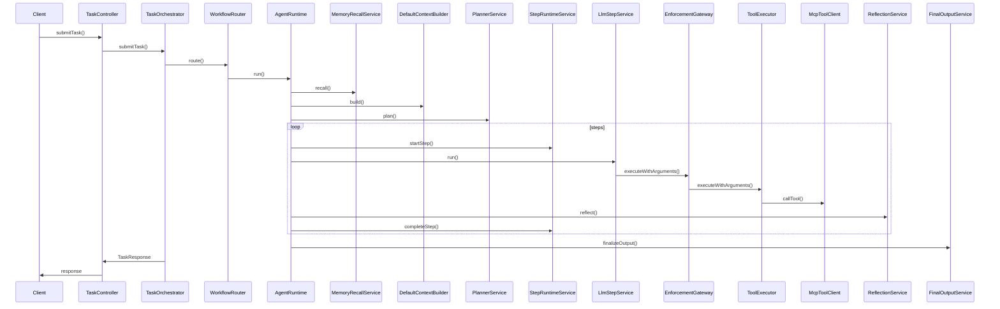

# 智能体流程 v2

## 1) 概览要点
- 多入口统一：`HTTP` 任务入口、`MCP` 工具入口、`SSE` 订阅入口已落地，`StdIO` 入口未检索到（`TaskController#submitTask` `src/main/java/com/example/agent/gateway/controller/TaskController.java`；`McpController#callTool` `src/main/java/com/example/agent/gateway/controller/McpController.java`；`SseStreamController#stream` `src/main/java/com/example/agent/streaming/SseStreamController.java`；`rg "StdIO|Stdio|stdio" src/main/java`）。
- 入口完成鉴权与租户上下文写入，并补齐 `traceId`（`TaskController#submitTask` `src/main/java/com/example/agent/gateway/controller/TaskController.java`；`AuthService#authenticate` `src/main/java/com/example/agent/auth/AuthService.java`；`TaskController#resolveTraceId` `src/main/java/com/example/agent/gateway/controller/TaskController.java`）。
- 幂等与执行模式在编排层规范化（`TaskOrchestrator#normalizeIdempotencyKey` `src/main/java/com/example/agent/orchestrator/TaskOrchestrator.java`；`TaskOrchestrator#resolveExecutionMode` `src/main/java/com/example/agent/orchestrator/TaskOrchestrator.java`）。
- 能力评估与模型路由用于规划场景选择（`PlannerService#evaluateCapability` `src/main/java/com/example/agent/planning/PlannerService.java`；`CapabilityBoundaryEvaluator#evaluate` `src/main/java/com/example/agent/evaluation/CapabilityBoundaryEvaluator.java`；`ModelRouter#route` `src/main/java/com/example/agent/model/ModelRouter.java`；`ModelScene` `src/main/java/com/example/agent/model/ModelScene.java`）。
- 上下文召回与预算裁剪/压缩在运行时构建阶段完成（`MemoryRecallService#recall` `src/main/java/com/example/agent/memory/MemoryRecallService.java`；`DefaultContextBuilder#build` `src/main/java/com/example/agent/context/DefaultContextBuilder.java`；`DefaultContextBudgetAllocator#allocate` `src/main/java/com/example/agent/budget/DefaultContextBudgetAllocator.java`；`DefaultContextTrimmer#trim` `src/main/java/com/example/agent/budget/DefaultContextTrimmer.java`；`DefaultContextPruner#prune` `src/main/java/com/example/agent/budget/DefaultContextPruner.java`；`ContextCompressionController#compressIfNeeded` `src/main/java/com/example/agent/budget/ContextCompressionController.java`）。
- 规划阶段生成计划并支持解析修复（`PlannerService#plan` `src/main/java/com/example/agent/planning/PlannerService.java`；`PlannerService#parsePlan` `src/main/java/com/example/agent/planning/PlannerService.java`；`PlannerService#tryRepairPlan` `src/main/java/com/example/agent/planning/PlannerService.java`；`JsonOutputRepairService#repair` `src/main/java/com/example/agent/repair/JsonOutputRepairService.java`）。
- `Step` 循环串行驱动，含审批与反思判定（`AgentRuntime#run` `src/main/java/com/example/agent/runtime/AgentRuntime.java`；`AgentRuntime#requestApprovalIfNeeded` `src/main/java/com/example/agent/runtime/AgentRuntime.java`；`StepRuntimeService#startStep` `src/main/java/com/example/agent/runtime/StepRuntimeService.java`；`ReflectionService#reflect` `src/main/java/com/example/agent/reflection/ReflectionService.java`；`ReflectionResult#isRetryRequested` `src/main/java/com/example/agent/reflection/ReflectionResult.java`）。
- 提示词组装与 `LLM` 调用分离（`DefaultContextAssembler#assemble` `src/main/java/com/example/agent/context/DefaultContextAssembler.java`；`DefaultPromptAssembler#build` `src/main/java/com/example/agent/model/DefaultPromptAssembler.java`；`DefaultPromptTemplate#render` `src/main/java/com/example/agent/model/DefaultPromptTemplate.java`；`ModelInvocationService#invoke` `src/main/java/com/example/agent/model/ModelInvocationService.java`）。
- 工具执行含重试与错误映射（`LlmStepService#executeToolCall` `src/main/java/com/example/agent/runtime/LlmStepService.java`；`RetryPolicy#sleepBeforeRetry` `src/main/java/com/example/agent/runtime/RetryPolicy.java`；`LlmStepService#mapToolErrorCode` `src/main/java/com/example/agent/runtime/LlmStepService.java`；`McpToolClient#callToolRemoteWithRetry` `src/main/java/com/example/agent/tools/McpToolClient.java`）。
- 证据、持久化与事件发布贯穿全链路（`EvidencePackService#addToolCall` `src/main/java/com/example/agent/context/EvidencePackService.java`；`EvidencePackService#addCitations` `src/main/java/com/example/agent/context/EvidencePackService.java`；`EvidencePack#recomputeStats` `src/main/java/com/example/agent/context/EvidencePack.java`；`TaskRepository#save` `src/main/java/com/example/agent/orchestrator/TaskRepository.java`；`StepRecordRepository#save` `src/main/java/com/example/agent/runtime/StepRecordRepository.java`；`EventLogService#onStreamEvent` `src/main/java/com/example/agent/history/EventLogService.java`；`EventStreamService#stream` `src/main/java/com/example/agent/streaming/EventStreamService.java`；`ContextEventPublisher#publishSnapshot` `src/main/java/com/example/agent/streaming/ContextEventPublisher.java`；`SseStreamController#stream` `src/main/java/com/example/agent/streaming/SseStreamController.java`）。

```mermaid
flowchart LR
  HTTP[HTTP入口] --> Auth[鉴权/租户/trace/幂等]
  MCP[MCP入口] --> Auth
  StdIO[StdIO入口(缺口)] --> Auth
  Auth --> Orchestrator[TaskOrchestrator]
  Orchestrator --> Router[WorkflowRouter]
  Router --> Runtime[AgentRuntime]
  Runtime --> Recall[MemoryRecallService]
  Runtime --> ContextBuilder[DefaultContextBuilder]
  ContextBuilder --> Budget[ContextBudgetAllocator]
  ContextBuilder --> Trim[ContextTrimmer/Pruner]
  ContextBuilder --> Compress[ContextCompressionController]
  Runtime --> Planner[PlannerService]
  Planner --> StepLoop[Step循环]
  StepLoop --> Prompt[PromptAssembler/Template]
  Prompt --> LLM[ModelInvocationService]
  LLM --> ToolGate[EnforcementGateway]
  ToolGate --> ToolExec[ToolExecutor]
  ToolExec --> MCPClient[McpToolClient]
  StepLoop --> Reflection[ReflectionService]
  StepLoop --> Final[FinalOutputService]
  Final --> Memory[MemoryWriteService]
  Final --> Evidence[EvidencePackService]
  Final --> Persist[Task/Step/Event仓库]
  Persist --> EventStream[EventStreamService]
  EventStream --> SSE[SSE订阅]
```

## 2) 端到端流程
1. 入口鉴权与租户上下文写入后提交任务，`traceId` 在入口补齐并写入响应（`TaskController#submitTask` `src/main/java/com/example/agent/gateway/controller/TaskController.java`；`AuthService#authenticate` `src/main/java/com/example/agent/auth/AuthService.java`；`TaskController#resolveTraceId` `src/main/java/com/example/agent/gateway/controller/TaskController.java`）。
2. 幂等键与执行模式在编排层规范化后进入路由（`TaskOrchestrator#normalizeIdempotencyKey` `src/main/java/com/example/agent/orchestrator/TaskOrchestrator.java`；`TaskOrchestrator#resolveExecutionMode` `src/main/java/com/example/agent/orchestrator/TaskOrchestrator.java`；`WorkflowRouter#route` `src/main/java/com/example/agent/orchestrator/WorkflowRouter.java`）。
3. 运行时启动后完成上下文召回与构建（`AgentRuntime#run` `src/main/java/com/example/agent/runtime/AgentRuntime.java`；`MemoryRecallService#recall` `src/main/java/com/example/agent/memory/MemoryRecallService.java`；`DefaultContextBuilder#build` `src/main/java/com/example/agent/context/DefaultContextBuilder.java`）。
4. 预算分配、裁剪、清理与压缩在构建阶段完成（`DefaultContextBudgetAllocator#allocate` `src/main/java/com/example/agent/budget/DefaultContextBudgetAllocator.java`；`DefaultContextTrimmer#trim` `src/main/java/com/example/agent/budget/DefaultContextTrimmer.java`；`DefaultContextPruner#prune` `src/main/java/com/example/agent/budget/DefaultContextPruner.java`；`ContextCompressionController#compressIfNeeded` `src/main/java/com/example/agent/budget/ContextCompressionController.java`）。
5. 能力评估与模型路由用于规划场景选择（`PlannerService#evaluateCapability` `src/main/java/com/example/agent/planning/PlannerService.java`；`CapabilityBoundaryEvaluator#evaluate` `src/main/java/com/example/agent/evaluation/CapabilityBoundaryEvaluator.java`；`ModelRouter#route` `src/main/java/com/example/agent/model/ModelRouter.java`；`ModelScene` `src/main/java/com/example/agent/model/ModelScene.java`）。
6. 规划生成计划并进行解析与修复（`PlannerService#plan` `src/main/java/com/example/agent/planning/PlannerService.java`；`PlannerService#parsePlan` `src/main/java/com/example/agent/planning/PlannerService.java`；`PlannerService#tryRepairPlan` `src/main/java/com/example/agent/planning/PlannerService.java`；`JsonOutputRepairService#repair` `src/main/java/com/example/agent/repair/JsonOutputRepairService.java`）。
7. `Step` 循环按顺序执行，包含审批、提示词组装与模型调用（`StepRuntimeService#startStep` `src/main/java/com/example/agent/runtime/StepRuntimeService.java`；`AgentRuntime#requestApprovalIfNeeded` `src/main/java/com/example/agent/runtime/AgentRuntime.java`；`DefaultContextAssembler#assemble` `src/main/java/com/example/agent/context/DefaultContextAssembler.java`；`DefaultPromptAssembler#build` `src/main/java/com/example/agent/model/DefaultPromptAssembler.java`；`ModelInvocationService#invoke` `src/main/java/com/example/agent/model/ModelInvocationService.java`）。
8. 工具调用通过网关与执行器发起，支持重试与超时映射（`EnforcementGateway#executeWithArguments` `src/main/java/com/example/agent/agentcore/EnforcementGateway.java`；`ToolExecutor#executeInternal` `src/main/java/com/example/agent/agentcore/ToolExecutor.java`；`McpToolClient#callToolRemoteWithRetry` `src/main/java/com/example/agent/tools/McpToolClient.java`；`LlmStepService#executeToolCall` `src/main/java/com/example/agent/runtime/LlmStepService.java`；`RetryPolicy#sleepBeforeRetry` `src/main/java/com/example/agent/runtime/RetryPolicy.java`；`LlmStepService#mapToolErrorCode` `src/main/java/com/example/agent/runtime/LlmStepService.java`）。
9. 反思判定重试或结束，最终结果写回上下文、记忆、证据与持久化并通过事件流输出（`ReflectionService#reflect` `src/main/java/com/example/agent/reflection/ReflectionService.java`；`ReflectionResult#isRetryRequested` `src/main/java/com/example/agent/reflection/ReflectionResult.java`；`FinalOutputService#finalizeOutput` `src/main/java/com/example/agent/runtime/FinalOutputService.java`；`FinalOutputService#tryRepairFinalOutput` `src/main/java/com/example/agent/runtime/FinalOutputService.java`；`AgentRuntime#updateRuntimeContext` `src/main/java/com/example/agent/runtime/AgentRuntime.java`；`MemoryWriteService#saveTaskMemory` `src/main/java/com/example/agent/memory/MemoryWriteService.java`；`EvidencePackService#addToolCall` `src/main/java/com/example/agent/context/EvidencePackService.java`；`EvidencePackService#addCitations` `src/main/java/com/example/agent/context/EvidencePackService.java`；`TaskRepository#save` `src/main/java/com/example/agent/orchestrator/TaskRepository.java`；`StepRecordRepository#save` `src/main/java/com/example/agent/runtime/StepRecordRepository.java`；`EventLogService#onStreamEvent` `src/main/java/com/example/agent/history/EventLogService.java`；`EventStreamService#stream` `src/main/java/com/example/agent/streaming/EventStreamService.java`；`ContextEventPublisher#publishSnapshot` `src/main/java/com/example/agent/streaming/ContextEventPublisher.java`；`SseStreamController#stream` `src/main/java/com/example/agent/streaming/SseStreamController.java`）。

## 3) 调用时序


时序中的关键方法与运行时链路实现一一对应（`TaskController#submitTask` `src/main/java/com/example/agent/gateway/controller/TaskController.java`；`TaskOrchestrator#submitTask` `src/main/java/com/example/agent/orchestrator/TaskOrchestrator.java`；`WorkflowRouter#route` `src/main/java/com/example/agent/orchestrator/WorkflowRouter.java`；`AgentRuntime#run` `src/main/java/com/example/agent/runtime/AgentRuntime.java`；`PlannerService#plan` `src/main/java/com/example/agent/planning/PlannerService.java`；`LlmStepService#run` `src/main/java/com/example/agent/runtime/LlmStepService.java`；`EnforcementGateway#executeWithArguments` `src/main/java/com/example/agent/agentcore/EnforcementGateway.java`；`FinalOutputService#finalizeOutput` `src/main/java/com/example/agent/runtime/FinalOutputService.java`）。

## 4) 接口职责关系

```mermaid
classDiagram
  class ContextBuilder
  class DefaultContextBuilder
  ContextBuilder <|.. DefaultContextBuilder

  class ContextAssembler
  class DefaultContextAssembler
  ContextAssembler <|.. DefaultContextAssembler

  class ContextTrimmer
  class DefaultContextTrimmer
  ContextTrimmer <|.. DefaultContextTrimmer

  class ContextPruner
  class DefaultContextPruner
  ContextPruner <|.. DefaultContextPruner

  class PromptAssembler
  class DefaultPromptAssembler
  PromptAssembler <|.. DefaultPromptAssembler

  class PromptTemplate
  class DefaultPromptTemplate
  PromptTemplate <|.. DefaultPromptTemplate

  class TaskSubmissionService
  class TaskQueryService
  class TaskOrchestrator
  TaskSubmissionService <|.. TaskOrchestrator
  TaskQueryService <|.. TaskOrchestrator

  class TaskRepository
  class JdbcTaskRepository
  class InMemoryTaskRepository
  TaskRepository <|.. JdbcTaskRepository
  TaskRepository <|.. InMemoryTaskRepository

  class StepRecordRepository
  class JdbcStepRecordRepository
  class InMemoryStepRecordRepository
  StepRecordRepository <|.. JdbcStepRecordRepository
  StepRecordRepository <|.. InMemoryStepRecordRepository

  class EventLogRepository
  class JdbcEventLogRepository
  class InMemoryEventLogRepository
  EventLogRepository <|.. JdbcEventLogRepository
  EventLogRepository <|.. InMemoryEventLogRepository

  class MemoryRepository
  class JdbcMemoryRepository
  class InMemoryMemoryRepository
  MemoryRepository <|.. JdbcMemoryRepository
  MemoryRepository <|.. InMemoryMemoryRepository

  class TokenUsageRepository
  class JdbcTokenUsageRepository
  class InMemoryTokenUsageRepository
  TokenUsageRepository <|.. JdbcTokenUsageRepository
  TokenUsageRepository <|.. InMemoryTokenUsageRepository

  class ModelProvider
  class DefaultModelProvider
  ModelProvider <|.. DefaultModelProvider

  class LlmClient
  class DefaultLlmClient
  LlmClient <|.. DefaultLlmClient
```


接口与实现映射覆盖上下文装配、持久化仓库与模型提供方（`ContextBuilder` `src/main/java/com/example/agent/context/ContextBuilder.java`；`DefaultContextBuilder` `src/main/java/com/example/agent/context/DefaultContextBuilder.java`；`TaskRepository` `src/main/java/com/example/agent/orchestrator/TaskRepository.java`；`JdbcTaskRepository` `src/main/java/com/example/agent/orchestrator/JdbcTaskRepository.java`；`ModelProvider` `src/main/java/com/example/agent/model/ModelProvider.java`；`DefaultModelProvider` `src/main/java/com/example/agent/model/DefaultModelProvider.java`）。

## 5) 对象流转表
| 对象 | 创建点 | 填充点 | 裁剪/压缩点 | 持久化/事件输出点 | 备注 |
| --- | --- | --- | --- | --- | --- |
| `TaskRequest`（`src/main/java/com/example/agent/common/TaskRequest.java`） | `TaskController#submitTask` `src/main/java/com/example/agent/gateway/controller/TaskController.java` | `TaskOrchestrator#normalizeIdempotencyKey` `src/main/java/com/example/agent/orchestrator/TaskOrchestrator.java`；`AgentRuntime#buildRequestWithContext` `src/main/java/com/example/agent/runtime/AgentRuntime.java`；`LlmStepService#updateToolContext` `src/main/java/com/example/agent/runtime/LlmStepService.java` | 不适用，裁剪针对 `ContextSnapshot`（`DefaultContextTrimmer#trim` `src/main/java/com/example/agent/budget/DefaultContextTrimmer.java`） | `TaskOrchestrator#createTask` `src/main/java/com/example/agent/orchestrator/TaskOrchestrator.java`；`TaskRepository#save` `src/main/java/com/example/agent/orchestrator/TaskRepository.java` | 幂等与执行模式规范化（`TaskOrchestrator#resolveExecutionMode` `src/main/java/com/example/agent/orchestrator/TaskOrchestrator.java`） |
| `PlanResult`（`src/main/java/com/example/agent/planning/PlanResult.java`） | `PlannerService#plan` `src/main/java/com/example/agent/planning/PlannerService.java` | `PlannerService#parsePlan` `src/main/java/com/example/agent/planning/PlannerService.java`；`PlannerService#applyApprovalRequirement` `src/main/java/com/example/agent/planning/PlannerService.java`；`PlannerService#buildHeuristicPlan` `src/main/java/com/example/agent/planning/PlannerService.java` | 不适用 | `AgentRuntime#publishPlanEvent` `src/main/java/com/example/agent/runtime/AgentRuntime.java` | 解析失败尝试修复（`PlannerService#tryRepairPlan` `src/main/java/com/example/agent/planning/PlannerService.java`；`JsonOutputRepairService#repair` `src/main/java/com/example/agent/repair/JsonOutputRepairService.java`） |
| `StepRequest`（`src/main/java/com/example/agent/runtime/StepRequest.java`） | `PlannerService#parsePlan` `src/main/java/com/example/agent/planning/PlannerService.java`；`PlannerService#buildHeuristicPlan` `src/main/java/com/example/agent/planning/PlannerService.java` | `AgentRuntime#mergeStepInput` `src/main/java/com/example/agent/runtime/AgentRuntime.java`；`AgentRuntime#requestApprovalIfNeeded` `src/main/java/com/example/agent/runtime/AgentRuntime.java` | 不适用 | `StepRuntimeService#startStep` `src/main/java/com/example/agent/runtime/StepRuntimeService.java`；`StepRecordRepository#save` `src/main/java/com/example/agent/runtime/StepRecordRepository.java` | `Step` 循环驱动（`AgentRuntime#run` `src/main/java/com/example/agent/runtime/AgentRuntime.java`） |
| `StepRequest#input`（`src/main/java/com/example/agent/runtime/StepRequest.java`） | `PlannerService#parsePlan` `src/main/java/com/example/agent/planning/PlannerService.java`；`PlannerService#buildHeuristicPlan` `src/main/java/com/example/agent/planning/PlannerService.java` | `AgentRuntime#mergeStepInput` `src/main/java/com/example/agent/runtime/AgentRuntime.java`；`LlmStepService#updateToolContext` `src/main/java/com/example/agent/runtime/LlmStepService.java` | 不适用，裁剪针对 `ContextSnapshot`（`DefaultContextTrimmer#trim` `src/main/java/com/example/agent/budget/DefaultContextTrimmer.java`） | `StepRuntimeService#startStep` `src/main/java/com/example/agent/runtime/StepRuntimeService.java` | 输入写入 `StepRecord`（`StepRuntimeService#startStep` `src/main/java/com/example/agent/runtime/StepRuntimeService.java`） |
| `McpToolCallRequest`（`src/main/java/com/example/agent/tools/McpToolCallRequest.java`） | `ToolExecutor#buildCallRequest` `src/main/java/com/example/agent/agentcore/ToolExecutor.java` | `ToolExecutor#buildMergedArguments` `src/main/java/com/example/agent/agentcore/ToolExecutor.java` | `ToolExecutor#removeInternalArguments` `src/main/java/com/example/agent/agentcore/ToolExecutor.java` | `McpToolClient#callTool` `src/main/java/com/example/agent/tools/McpToolClient.java` | `traceId` 写入调用载荷（`EnforcementGateway#attachTraceContext` `src/main/java/com/example/agent/agentcore/EnforcementGateway.java`） |
| `McpToolCallResponse`（`src/main/java/com/example/agent/tools/McpToolCallResponse.java`） | `McpToolClient#callToolRemote` `src/main/java/com/example/agent/tools/McpToolClient.java`；`McpToolClient#callToolLocal` `src/main/java/com/example/agent/tools/McpToolClient.java` | `ToolExecutor#executeInternal` `src/main/java/com/example/agent/agentcore/ToolExecutor.java`；`LlmStepService#executeToolCall` `src/main/java/com/example/agent/runtime/LlmStepService.java` | 不适用 | `StepRuntimeService#completeStep` `src/main/java/com/example/agent/runtime/StepRuntimeService.java`；`EvidencePackService#addToolCall` `src/main/java/com/example/agent/context/EvidencePackService.java` | 错误映射与重试（`LlmStepService#mapToolErrorCode` `src/main/java/com/example/agent/runtime/LlmStepService.java`；`RetryPolicy#sleepBeforeRetry` `src/main/java/com/example/agent/runtime/RetryPolicy.java`） |
| `PromptBundle`（`src/main/java/com/example/agent/model/PromptBundle.java`） | `DefaultPromptAssembler#build` `src/main/java/com/example/agent/model/DefaultPromptAssembler.java` | `DefaultPromptAssembler#build` `src/main/java/com/example/agent/model/DefaultPromptAssembler.java` | `DefaultPromptAssembler#trimIfNeeded` `src/main/java/com/example/agent/model/DefaultPromptAssembler.java` | `PlannerService#applyPromptBundle` `src/main/java/com/example/agent/planning/PlannerService.java`；`LlmStepService#applyPromptBundle` `src/main/java/com/example/agent/runtime/LlmStepService.java` | 消息列表为 `PromptMessage`（`PromptMessage` `src/main/java/com/example/agent/model/PromptMessage.java`） |
| `ContextSnapshot`（`src/main/java/com/example/agent/context/ContextSnapshot.java`） | `DefaultContextBuilder#build` `src/main/java/com/example/agent/context/DefaultContextBuilder.java` | `ContextCompressionController#applyCompressedSummary` `src/main/java/com/example/agent/budget/ContextCompressionController.java`；`ToolExecutor#syncSnapshotEvidence` `src/main/java/com/example/agent/agentcore/ToolExecutor.java`；`AgentRuntime#applyContextSnapshot` `src/main/java/com/example/agent/runtime/AgentRuntime.java` | `DefaultContextTrimmer#trim` `src/main/java/com/example/agent/budget/DefaultContextTrimmer.java`；`DefaultContextPruner#prune` `src/main/java/com/example/agent/budget/DefaultContextPruner.java`；`ContextCompressionController#compressIfNeeded` `src/main/java/com/example/agent/budget/ContextCompressionController.java` | `ContextEventPublisher#publishSnapshot` `src/main/java/com/example/agent/streaming/ContextEventPublisher.java` | 运行时写回上下文（`AgentRuntime#updateRuntimeContext` `src/main/java/com/example/agent/runtime/AgentRuntime.java`） |
| `ContextTrimReport`（`src/main/java/com/example/agent/budget/ContextTrimReport.java`） | `DefaultContextTrimmer#trim` `src/main/java/com/example/agent/budget/DefaultContextTrimmer.java` | `DefaultContextTrimmer#trim` `src/main/java/com/example/agent/budget/DefaultContextTrimmer.java` | 不适用 | `DefaultContextBuilder#publishTrimStage` `src/main/java/com/example/agent/context/DefaultContextBuilder.java`；`ContextEventPublisher#publishSnapshotStage` `src/main/java/com/example/agent/streaming/ContextEventPublisher.java` | 压缩请求引用（`ContextCompressionController#compressIfNeeded` `src/main/java/com/example/agent/budget/ContextCompressionController.java`） |
| `EvidencePack`（`src/main/java/com/example/agent/context/EvidencePack.java`） | `EvidencePackService#createPack` `src/main/java/com/example/agent/context/EvidencePackService.java`；`EvidencePackService#getOrCreatePack` `src/main/java/com/example/agent/context/EvidencePackService.java` | `EvidencePackService#addToolCall` `src/main/java/com/example/agent/context/EvidencePackService.java`；`EvidencePackService#addCitations` `src/main/java/com/example/agent/context/EvidencePackService.java`；`EvidencePackService#addResearchCitations` `src/main/java/com/example/agent/context/EvidencePackService.java` | `DefaultContextTrimmer#trimEvidencePack` `src/main/java/com/example/agent/budget/DefaultContextTrimmer.java`；`DefaultContextPruner#pruneEvidencePack` `src/main/java/com/example/agent/budget/DefaultContextPruner.java` | `ContextEventPublisher#publishSnapshot` `src/main/java/com/example/agent/streaming/ContextEventPublisher.java` | 统计重算（`EvidencePack#recomputeStats` `src/main/java/com/example/agent/context/EvidencePack.java`） |
| `TaskRecord`（`src/main/java/com/example/agent/orchestrator/TaskRecord.java`） | `TaskOrchestrator#createTask` `src/main/java/com/example/agent/orchestrator/TaskOrchestrator.java` | `TaskOrchestrator#updateTaskStatus` `src/main/java/com/example/agent/orchestrator/TaskOrchestrator.java` | 不适用 | `TaskRepository#save` `src/main/java/com/example/agent/orchestrator/TaskRepository.java` | 同步等待分支（`TaskOrchestrator#waitIfSync` `src/main/java/com/example/agent/orchestrator/TaskOrchestrator.java`） |
| `StepRecord`（`src/main/java/com/example/agent/runtime/StepRecord.java`） | `StepRuntimeService#startStep` `src/main/java/com/example/agent/runtime/StepRuntimeService.java` | `StepRuntimeService#completeStep` `src/main/java/com/example/agent/runtime/StepRuntimeService.java`；`StepRuntimeService#failStep` `src/main/java/com/example/agent/runtime/StepRuntimeService.java` | 不适用 | `StepRecordRepository#save` `src/main/java/com/example/agent/runtime/StepRecordRepository.java` | 失败记录写入（`StepRuntimeService#failStep` `src/main/java/com/example/agent/runtime/StepRuntimeService.java`） |
| `EventLogRecord`（`src/main/java/com/example/agent/history/EventLogRecord.java`） | `EventLogService#onStreamEvent` `src/main/java/com/example/agent/history/EventLogService.java` | `EventLogService#onStreamEvent` `src/main/java/com/example/agent/history/EventLogService.java` | 不适用 | `EventLogRepository#saveIfAbsent` `src/main/java/com/example/agent/history/EventLogRepository.java` | 事件落库入口（`EventLogService#onStreamEvent` `src/main/java/com/example/agent/history/EventLogService.java`） |
| `MemoryRecord`（`src/main/java/com/example/agent/memory/MemoryRecord.java`） | `MemoryWriteService#saveTaskMemory` `src/main/java/com/example/agent/memory/MemoryWriteService.java`；`MemoryWriteService#saveObservationMemory` `src/main/java/com/example/agent/memory/MemoryWriteService.java` | `MemoryStore#save` `src/main/java/com/example/agent/memory/MemoryStore.java` | `MemoryStore#compress` `src/main/java/com/example/agent/memory/MemoryStore.java` | `MemoryRepository#save` `src/main/java/com/example/agent/memory/MemoryRepository.java` | 召回读取（`MemoryRecallService#recall` `src/main/java/com/example/agent/memory/MemoryRecallService.java`） |
