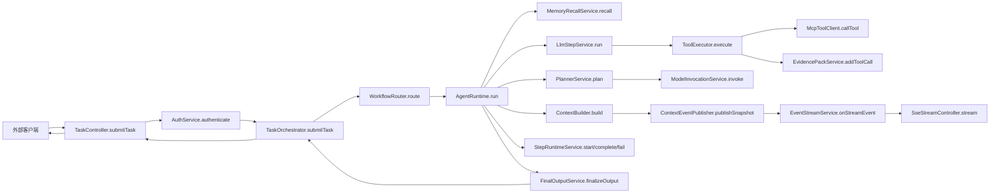
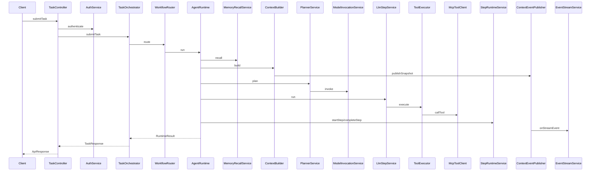
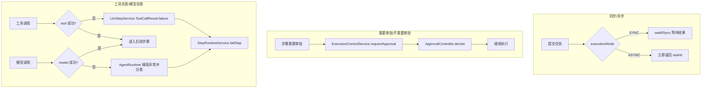

# fagent 系统总览

> 说明：本文覆盖入口、编排、规划、运行时、工具、模型、记忆/证据、预算裁剪、持久化、事件流与治理等链路。（`TaskController#submitTask`，`src/main/java/com/example/agent/gateway/controller/TaskController.java`；`TaskOrchestrator#submitTask`，`src/main/java/com/example/agent/orchestrator/TaskOrchestrator.java`；`PlannerService#plan`，`src/main/java/com/example/agent/planning/PlannerService.java`；`AgentRuntime#run`，`src/main/java/com/example/agent/runtime/AgentRuntime.java`；`ToolExecutor#execute`，`src/main/java/com/example/agent/agentcore/ToolExecutor.java`；`ModelInvocationService#invoke`，`src/main/java/com/example/agent/model/ModelInvocationService.java`；`MemoryStore#save`，`src/main/java/com/example/agent/memory/MemoryStore.java`；`DefaultContextBuilder#build`，`src/main/java/com/example/agent/context/DefaultContextBuilder.java`；`EventStreamService#stream`，`src/main/java/com/example/agent/streaming/EventStreamService.java`；`PolicyEngine#evaluate`，`src/main/java/com/example/agent/policy/PolicyEngine.java`）

## 1) 架构分层说明

### 1.1 入口与协议层
- 职责：接收 `HTTP` 请求与 `SSE` 订阅、解析参数并统一响应。（`TaskController#submitTask`，`src/main/java/com/example/agent/gateway/controller/TaskController.java`；`SseStreamController#stream`，`src/main/java/com/example/agent/streaming/SseStreamController.java`）
- 关键类/接口：任务与治理接口集中在 `TaskController`、`PolicyController`、`ApprovalController`，工具与记忆接口集中在 `McpController`、`MemoryController`，历史与订阅接口集中在 `TimelineController`、`SseStreamController`。（`TaskController#submitTask`，`src/main/java/com/example/agent/gateway/controller/TaskController.java`；`PolicyController#evaluate`，`src/main/java/com/example/agent/gateway/controller/PolicyController.java`；`McpController#callTool`，`src/main/java/com/example/agent/gateway/controller/McpController.java`；`MemoryController#search`，`src/main/java/com/example/agent/gateway/controller/MemoryController.java`；`TimelineController#listEvents`，`src/main/java/com/example/agent/gateway/controller/TimelineController.java`）
- 上下游关系：上游为外部客户端；下游依赖鉴权、编排、工具、记忆与预算服务。（`AuthService#authenticate`，`src/main/java/com/example/agent/auth/AuthService.java`；`TaskOrchestrator#submitTask`，`src/main/java/com/example/agent/orchestrator/TaskOrchestrator.java`；`McpToolClient#callTool`，`src/main/java/com/example/agent/tools/McpToolClient.java`；`MemoryStore#save`，`src/main/java/com/example/agent/memory/MemoryStore.java`；`TokenBudgetManager#recordUsage`，`src/main/java/com/example/agent/budget/TokenBudgetManager.java`）

### 1.2 鉴权与租户上下文层
- 职责：执行 `API` Key 鉴权并产出用户/租户上下文。（`AuthService#authenticate`，`src/main/java/com/example/agent/auth/AuthService.java`）
- 上下游关系：入口控制器调用鉴权并把 `UserContext` 写入 `TenantContext`，后续链路以此作为日志与事件归属依据。（`TaskController#submitTask`，`src/main/java/com/example/agent/gateway/controller/TaskController.java`；`SseStreamController#stream`，`src/main/java/com/example/agent/streaming/SseStreamController.java`）

### 1.3 编排层
- 职责：创建任务记录、路由执行、处理同步/异步等待与任务查询。（`TaskOrchestrator#submitTask`，`src/main/java/com/example/agent/orchestrator/TaskOrchestrator.java`；`TaskOrchestrator#waitIfSync`，`src/main/java/com/example/agent/orchestrator/TaskOrchestrator.java`；`TaskOrchestrator#getTask`，`src/main/java/com/example/agent/orchestrator/TaskOrchestrator.java`；`WorkflowRouter#route`，`src/main/java/com/example/agent/orchestrator/WorkflowRouter.java`）
- 关键类/接口：`TaskOrchestrator` 作为编排实现，依赖 `TaskExecutionService` 进行异步投递并调用任务仓储。（`TaskOrchestrator#submitTask`，`src/main/java/com/example/agent/orchestrator/TaskOrchestrator.java`；`TaskExecutionService#submit`，`src/main/java/com/example/agent/orchestrator/TaskExecutionService.java`；`TaskRepository#save`，`src/main/java/com/example/agent/orchestrator/TaskRepository.java`）
- 上下游关系：上游来自入口层提交；下游进入运行时执行并把状态落库。（`TaskController#submitTask`，`src/main/java/com/example/agent/gateway/controller/TaskController.java`；`AgentRuntime#run`，`src/main/java/com/example/agent/runtime/AgentRuntime.java`；`TaskRepository#save`，`src/main/java/com/example/agent/orchestrator/TaskRepository.java`）

### 1.4 规划层
- 职责：根据输入与上下文生成计划与步骤，必要时调用模型并注入工具配置。（`PlannerService#plan`，`src/main/java/com/example/agent/planning/PlannerService.java`；`ModelInvocationService#invoke`，`src/main/java/com/example/agent/model/ModelInvocationService.java`；`ModelToolResolver#applyTooling`，`src/main/java/com/example/agent/model/ModelToolResolver.java`）
- 关键类/接口：规划阶段使用上下文装配与提示词组装。（`ContextAssembler#assemble`，`src/main/java/com/example/agent/context/ContextAssembler.java`；`PromptAssembler#build`，`src/main/java/com/example/agent/model/PromptAssembler.java`）
- 上下游关系：上游由编排或运行时触发；下游交由运行时执行计划步骤。（`TaskOrchestrator#submitTask`，`src/main/java/com/example/agent/orchestrator/TaskOrchestrator.java`；`AgentRuntime#run`，`src/main/java/com/example/agent/runtime/AgentRuntime.java`）

### 1.5 运行时执行层
- 职责：执行计划步骤、驱动 `LLM` 与 `REACT` 分支、记录步骤状态并产出最终结果。（`AgentRuntime#run`，`src/main/java/com/example/agent/runtime/AgentRuntime.java`；`LlmStepService#run`，`src/main/java/com/example/agent/runtime/LlmStepService.java`；`ReactLoopService#run`，`src/main/java/com/example/agent/runtime/ReactLoopService.java`；`StepRuntimeService#startStep`，`src/main/java/com/example/agent/runtime/StepRuntimeService.java`；`FinalOutputService#finalizeOutput`，`src/main/java/com/example/agent/runtime/FinalOutputService.java`）
- 关键类/接口：运行时负责审批控制与暂停/恢复/取消。（`ExecutionControlService#requestApproval`，`src/main/java/com/example/agent/runtime/ExecutionControlService.java`；`ExecutionControlService#pause`，`src/main/java/com/example/agent/runtime/ExecutionControlService.java`）
- 上下游关系：上游接收编排层的任务；下游调用工具、模型、记忆、持久化与事件层。（`TaskOrchestrator#submitTask`，`src/main/java/com/example/agent/orchestrator/TaskOrchestrator.java`；`ToolExecutor#execute`，`src/main/java/com/example/agent/agentcore/ToolExecutor.java`；`ModelInvocationService#invoke`，`src/main/java/com/example/agent/model/ModelInvocationService.java`；`MemoryRecallService#recall`，`src/main/java/com/example/agent/memory/MemoryRecallService.java`；`StepRecordRepository#save`，`src/main/java/com/example/agent/runtime/StepRecordRepository.java`；`ContextEventPublisher#publishSnapshot`，`src/main/java/com/example/agent/streaming/ContextEventPublisher.java`）

### 1.6 上下文构建与预算裁剪层
- 职责：构建 `ContextSnapshot`，进行预算分配、剪枝、裁剪与压缩，并发布阶段事件。（`DefaultContextBuilder#build`，`src/main/java/com/example/agent/context/DefaultContextBuilder.java`；`ContextBudgetAllocator#allocate`，`src/main/java/com/example/agent/budget/ContextBudgetAllocator.java`；`ContextPruner#prune`，`src/main/java/com/example/agent/budget/ContextPruner.java`；`ContextTrimmer#trim`，`src/main/java/com/example/agent/budget/ContextTrimmer.java`；`ContextCompressionController#compressIfNeeded`，`src/main/java/com/example/agent/budget/ContextCompressionController.java`；`ContextEventPublisher#publishSnapshotStage`，`src/main/java/com/example/agent/streaming/ContextEventPublisher.java`）
- 上下游关系：上游由运行时触发构建；下游提供给提示词组装与事件流。（`AgentRuntime#run`，`src/main/java/com/example/agent/runtime/AgentRuntime.java`；`PromptAssembler#build`，`src/main/java/com/example/agent/model/PromptAssembler.java`；`ContextEventPublisher#publishSnapshot`，`src/main/java/com/example/agent/streaming/ContextEventPublisher.java`）

### 1.7 工具执行层
- 职责：执行工具调用、维护工具定义与路由、对接 `MCP` 并产出证据。（`ToolExecutor#execute`，`src/main/java/com/example/agent/agentcore/ToolExecutor.java`；`ToolRegistry#registerDefinitions`，`src/main/java/com/example/agent/agentcore/ToolRegistry.java`；`McpToolClient#callTool`，`src/main/java/com/example/agent/tools/McpToolClient.java`；`EvidencePackService#addToolCall`，`src/main/java/com/example/agent/context/EvidencePackService.java`）
- 上下游关系：上游来自运行时的步骤执行；下游对接远端 `MCP` 服务并回写证据包。（`LlmStepService#run`，`src/main/java/com/example/agent/runtime/LlmStepService.java`；`McpToolClient#callTool`，`src/main/java/com/example/agent/tools/McpToolClient.java`；`ToolExecutor#syncSnapshotEvidence`，`src/main/java/com/example/agent/agentcore/ToolExecutor.java`）

### 1.8 模型调用层
- 职责：路由模型配置并执行模型调用。（`ModelRouter#route`，`src/main/java/com/example/agent/model/ModelRouter.java`；`ModelInvocationService#invoke`，`src/main/java/com/example/agent/model/ModelInvocationService.java`；`DefaultModelProvider#invoke`，`src/main/java/com/example/agent/model/DefaultModelProvider.java`；`LlmClient#generate`，`src/main/java/com/example/agent/model/LlmClient.java`）
- 上下游关系：上游来自规划与运行时步骤；下游对接外部模型服务。（`PlannerService#plan`，`src/main/java/com/example/agent/planning/PlannerService.java`；`LlmStepService#run`，`src/main/java/com/example/agent/runtime/LlmStepService.java`；`DefaultModelProvider#invoke`，`src/main/java/com/example/agent/model/DefaultModelProvider.java`）

### 1.9 记忆/证据层
- 职责：记忆写入/检索/压缩与召回，并维护证据包。（`MemoryStore#save`，`src/main/java/com/example/agent/memory/MemoryStore.java`；`MemoryStore#search`，`src/main/java/com/example/agent/memory/MemoryStore.java`；`MemoryStore#compress`，`src/main/java/com/example/agent/memory/MemoryStore.java`；`MemoryRecallService#recall`，`src/main/java/com/example/agent/memory/MemoryRecallService.java`；`EvidencePackService#getOrCreatePack`，`src/main/java/com/example/agent/context/EvidencePackService.java`）
- 上下游关系：上游来自运行时与工具执行；下游落入记忆持久化与上下文快照。（`AgentRuntime#run`，`src/main/java/com/example/agent/runtime/AgentRuntime.java`；`ToolExecutor#execute`，`src/main/java/com/example/agent/agentcore/ToolExecutor.java`；`MemoryRepository#save`，`src/main/java/com/example/agent/memory/MemoryRepository.java`；`ContextSnapshot#setWorkingMemory`，`src/main/java/com/example/agent/context/ContextSnapshot.java`）

### 1.10 持久化层
- 职责：任务、步骤、记忆、事件与预算等数据持久化与查询。（`TaskRepository#save`，`src/main/java/com/example/agent/orchestrator/TaskRepository.java`；`StepRecordRepository#save`，`src/main/java/com/example/agent/runtime/StepRecordRepository.java`；`MemoryRepository#save`，`src/main/java/com/example/agent/memory/MemoryRepository.java`；`EventLogRepository#saveIfAbsent`，`src/main/java/com/example/agent/history/EventLogRepository.java`；`TokenUsageRepository#saveIfAbsent`，`src/main/java/com/example/agent/budget/TokenUsageRepository.java`）
- 上下游关系：上游来自编排、运行时与事件监听；下游为具体持久化实现。（`TaskOrchestrator#submitTask`，`src/main/java/com/example/agent/orchestrator/TaskOrchestrator.java`；`StepRuntimeService#completeStep`，`src/main/java/com/example/agent/runtime/StepRuntimeService.java`；`EventLogService#onStreamEvent`，`src/main/java/com/example/agent/history/EventLogService.java`；`JdbcTaskRepository#save`，`src/main/java/com/example/agent/orchestrator/JdbcTaskRepository.java`）

### 1.11 事件与流式层
- 职责：发布上下文与工具/审批事件、维护序列并输出 `SSE`，同时落盘事件日志。（`ContextEventPublisher#publishSnapshot`，`src/main/java/com/example/agent/streaming/ContextEventPublisher.java`；`McpController#callTool`，`src/main/java/com/example/agent/gateway/controller/McpController.java`；`ApprovalController#decide`，`src/main/java/com/example/agent/gateway/controller/ApprovalController.java`；`EventStreamService#onStreamEvent`，`src/main/java/com/example/agent/streaming/EventStreamService.java`；`SseStreamController#stream`，`src/main/java/com/example/agent/streaming/SseStreamController.java`；`EventLogService#onStreamEvent`，`src/main/java/com/example/agent/history/EventLogService.java`）
- 上下游关系：上游来自运行时与治理事件；下游为 `SSE` 客户端与事件日志查询。（`AgentRuntime#run`，`src/main/java/com/example/agent/runtime/AgentRuntime.java`；`ApprovalController#decide`，`src/main/java/com/example/agent/gateway/controller/ApprovalController.java`；`TimelineController#listEvents`，`src/main/java/com/example/agent/gateway/controller/TimelineController.java`；`SseStreamController#stream`，`src/main/java/com/example/agent/streaming/SseStreamController.java`）

### 1.12 治理与策略层
- 职责：策略评估、审批与执行控制，并向外暴露决策接口。（`PolicyEngine#evaluate`，`src/main/java/com/example/agent/policy/PolicyEngine.java`；`ApprovalService#requestApproval`，`src/main/java/com/example/agent/approval/ApprovalService.java`；`ExecutionControlService#requestApproval`，`src/main/java/com/example/agent/runtime/ExecutionControlService.java`；`ApprovalController#decide`，`src/main/java/com/example/agent/gateway/controller/ApprovalController.java`；`ToolApprovalController#decide`，`src/main/java/com/example/agent/gateway/controller/ToolApprovalController.java`；`EnforcementGateway#execute`，`src/main/java/com/example/agent/agentcore/EnforcementGateway.java`）
- 上下游关系：上游来自入口与运行时；下游影响运行时执行与事件流。（`PolicyController#evaluate`，`src/main/java/com/example/agent/gateway/controller/PolicyController.java`；`AgentRuntime#requestApprovalIfNeeded`，`src/main/java/com/example/agent/runtime/AgentRuntime.java`；`ReactLoopService#requestApprovalIfNeeded`，`src/main/java/com/example/agent/runtime/ReactLoopService.java`；`ExecutionControlService#decideApproval`，`src/main/java/com/example/agent/runtime/ExecutionControlService.java`）

## 2) 端到端数据流

数据流从入口层接收请求开始，经鉴权后进入编排与路由，再由运行时完成记忆召回、上下文构建、规划与步骤执行。（`TaskController#submitTask`，`src/main/java/com/example/agent/gateway/controller/TaskController.java`；`AuthService#authenticate`，`src/main/java/com/example/agent/auth/AuthService.java`；`TaskOrchestrator#submitTask`，`src/main/java/com/example/agent/orchestrator/TaskOrchestrator.java`；`WorkflowRouter#route`，`src/main/java/com/example/agent/orchestrator/WorkflowRouter.java`；`AgentRuntime#run`，`src/main/java/com/example/agent/runtime/AgentRuntime.java`；`MemoryRecallService#recall`，`src/main/java/com/example/agent/memory/MemoryRecallService.java`；`ContextBuilder#build`，`src/main/java/com/example/agent/context/ContextBuilder.java`；`PlannerService#plan`，`src/main/java/com/example/agent/planning/PlannerService.java`）

工具调用路径由运行时进入工具执行并通过 `McpToolClient` 调远端，同时写入证据包；模型调用路径由规划或步骤调用模型服务。（`LlmStepService#run`，`src/main/java/com/example/agent/runtime/LlmStepService.java`；`ToolExecutor#execute`，`src/main/java/com/example/agent/agentcore/ToolExecutor.java`；`McpToolClient#callTool`，`src/main/java/com/example/agent/tools/McpToolClient.java`；`EvidencePackService#addToolCall`，`src/main/java/com/example/agent/context/EvidencePackService.java`；`ModelInvocationService#invoke`，`src/main/java/com/example/agent/model/ModelInvocationService.java`）

上下文与工具事件通过事件流发布并进入 `SSE` 订阅与事件日志。（`ContextEventPublisher#publishSnapshot`，`src/main/java/com/example/agent/streaming/ContextEventPublisher.java`；`EventStreamService#onStreamEvent`，`src/main/java/com/example/agent/streaming/EventStreamService.java`；`SseStreamController#stream`，`src/main/java/com/example/agent/streaming/SseStreamController.java`；`EventLogService#onStreamEvent`，`src/main/java/com/example/agent/history/EventLogService.java`）

## 3) 调用时序

时序上，入口调用 `TaskController#submitTask` 完成鉴权与编排提交，编排层路由到 `AgentRuntime#run`，运行时先召回记忆与构建上下文，再规划并执行步骤，必要时通过工具或模型调用外部能力。（`TaskController#submitTask`，`src/main/java/com/example/agent/gateway/controller/TaskController.java`；`AuthService#authenticate`，`src/main/java/com/example/agent/auth/AuthService.java`；`TaskOrchestrator#submitTask`，`src/main/java/com/example/agent/orchestrator/TaskOrchestrator.java`；`WorkflowRouter#route`，`src/main/java/com/example/agent/orchestrator/WorkflowRouter.java`；`AgentRuntime#run`，`src/main/java/com/example/agent/runtime/AgentRuntime.java`；`MemoryRecallService#recall`，`src/main/java/com/example/agent/memory/MemoryRecallService.java`；`ContextBuilder#build`，`src/main/java/com/example/agent/context/ContextBuilder.java`；`PlannerService#plan`，`src/main/java/com/example/agent/planning/PlannerService.java`；`LlmStepService#run`，`src/main/java/com/example/agent/runtime/LlmStepService.java`；`ToolExecutor#execute`，`src/main/java/com/example/agent/agentcore/ToolExecutor.java`；`ModelInvocationService#invoke`，`src/main/java/com/example/agent/model/ModelInvocationService.java`）

上下文事件在构建阶段发布并进入事件流，供 `SSE` 订阅消费。（`ContextEventPublisher#publishSnapshot`，`src/main/java/com/example/agent/streaming/ContextEventPublisher.java`；`EventStreamService#onStreamEvent`，`src/main/java/com/example/agent/streaming/EventStreamService.java`；`SseStreamController#stream`，`src/main/java/com/example/agent/streaming/SseStreamController.java`）

## 4) 接口职责关系

```mermaid
classDiagram
    class TaskSubmissionService
    class TaskQueryService
    class TaskOrchestrator
    TaskSubmissionService <|.. TaskOrchestrator
    TaskQueryService <|.. TaskOrchestrator

    class ContextBuilder
    class DefaultContextBuilder
    ContextBuilder <|.. DefaultContextBuilder

    class ContextAssembler
    class DefaultContextAssembler
    ContextAssembler <|.. DefaultContextAssembler

    class PromptAssembler
    class DefaultPromptAssembler
    PromptAssembler <|.. DefaultPromptAssembler

    class ContextTrimmer
    class DefaultContextTrimmer
    ContextTrimmer <|.. DefaultContextTrimmer

    class ContextPruner
    class DefaultContextPruner
    ContextPruner <|.. DefaultContextPruner

    class ContextBudgetAllocator
    class DefaultContextBudgetAllocator
    ContextBudgetAllocator <|.. DefaultContextBudgetAllocator

    class ToolCatalog
    class DefaultToolCatalog
    ToolCatalog <|.. DefaultToolCatalog

    class ModelProvider
    class DefaultModelProvider
    ModelProvider <|.. DefaultModelProvider

    class LlmClient
    class DefaultLlmClient
    LlmClient <|.. DefaultLlmClient

    class TaskRepository
    class JdbcTaskRepository
    class InMemoryTaskRepository
    TaskRepository <|.. JdbcTaskRepository
    TaskRepository <|.. InMemoryTaskRepository

    class StepRecordRepository
    class JdbcStepRecordRepository
    class InMemoryStepRecordRepository
    StepRecordRepository <|.. JdbcStepRecordRepository
    StepRecordRepository <|.. InMemoryStepRecordRepository

    class MemoryRepository
    class JdbcMemoryRepository
    class InMemoryMemoryRepository
    MemoryRepository <|.. JdbcMemoryRepository
    MemoryRepository <|.. InMemoryMemoryRepository
```

接口关系以编排、上下文、模型与持久化为核心：`TaskOrchestrator` 实现提交与查询接口，`DefaultContextBuilder`/`DefaultContextAssembler`/`DefaultPromptAssembler` 作为上下文与提示词实现，`DefaultModelProvider` 与 `DefaultLlmClient` 分别实现模型提供与调用接口。（`TaskOrchestrator#submitTask`，`src/main/java/com/example/agent/orchestrator/TaskOrchestrator.java`；`DefaultContextBuilder#build`，`src/main/java/com/example/agent/context/DefaultContextBuilder.java`；`DefaultContextAssembler#assemble`，`src/main/java/com/example/agent/context/DefaultContextAssembler.java`；`DefaultPromptAssembler#build`，`src/main/java/com/example/agent/model/DefaultPromptAssembler.java`；`DefaultModelProvider#invoke`，`src/main/java/com/example/agent/model/DefaultModelProvider.java`；`DefaultLlmClient#generate`，`src/main/java/com/example/agent/model/DefaultLlmClient.java`）

持久化相关接口均有 `JDBC` 与内存实现，方便运行模式切换。（`TaskRepository#save`，`src/main/java/com/example/agent/orchestrator/TaskRepository.java`；`JdbcTaskRepository#save`，`src/main/java/com/example/agent/orchestrator/JdbcTaskRepository.java`；`InMemoryTaskRepository#save`，`src/main/java/com/example/agent/orchestrator/InMemoryTaskRepository.java`；`StepRecordRepository#save`，`src/main/java/com/example/agent/runtime/StepRecordRepository.java`；`JdbcStepRecordRepository#save`，`src/main/java/com/example/agent/runtime/JdbcStepRecordRepository.java`；`InMemoryStepRecordRepository#save`，`src/main/java/com/example/agent/runtime/InMemoryStepRecordRepository.java`）

## 5) 对象/参数流转

| 对象 | 创建点 | 填充点 | 裁剪点 | 持久化/事件输出点 |
| --- | --- | --- | --- | --- |
| `TaskRequest` | `TaskController#submitTask` 解析请求体创建（`src/main/java/com/example/agent/gateway/controller/TaskController.java`） | `TaskOrchestrator#resolveExecutionMode` 归一化执行模式（`src/main/java/com/example/agent/orchestrator/TaskOrchestrator.java`） | `TaskOrchestrator#normalizeIdempotencyKey` 去空白与非法值（`src/main/java/com/example/agent/orchestrator/TaskOrchestrator.java`） | 转换为 `TaskRecord` 并通过 `TaskRepository#save` 持久化（`TaskOrchestrator#createTask`，`src/main/java/com/example/agent/orchestrator/TaskOrchestrator.java`；`TaskRepository#save`，`src/main/java/com/example/agent/orchestrator/TaskRepository.java`） |
| `TaskResponse` | `TaskOrchestrator#submitTask` 创建并返回（`src/main/java/com/example/agent/orchestrator/TaskOrchestrator.java`） | `TaskOrchestrator#waitIfSync` 填充同步结果（`src/main/java/com/example/agent/orchestrator/TaskOrchestrator.java`） | 无 | 由 `TaskController#submitTask` 封装并返回客户端（`src/main/java/com/example/agent/gateway/controller/TaskController.java`） |
| `PlanResult` / `StepRequest` | `PlannerService#plan` 生成计划与步骤（`src/main/java/com/example/agent/planning/PlannerService.java`） | `PlannerService#plan` 内部应用审批标记（`src/main/java/com/example/agent/planning/PlannerService.java`） | 无 | 步骤执行由 `StepRuntimeService#startStep` 生成记录并进入运行时（`src/main/java/com/example/agent/runtime/StepRuntimeService.java`） |
| `ContextSnapshot` | `DefaultContextBuilder#build` 创建并填充基础结构（`src/main/java/com/example/agent/context/DefaultContextBuilder.java`） | `DefaultContextBuilder#build` 填充运行时信息与工作记忆（`src/main/java/com/example/agent/context/DefaultContextBuilder.java`） | `ContextPruner#prune`、`ContextTrimmer#trim`、`ContextCompressionController#compressIfNeeded` 依预算裁剪（`src/main/java/com/example/agent/budget/ContextPruner.java`；`src/main/java/com/example/agent/budget/ContextTrimmer.java`；`src/main/java/com/example/agent/budget/ContextCompressionController.java`） | `ContextEventPublisher#publishSnapshot` 与阶段事件输出（`src/main/java/com/example/agent/streaming/ContextEventPublisher.java`） |
| `EvidencePack` | `EvidencePackService#getOrCreatePack` 创建或复用（`src/main/java/com/example/agent/context/EvidencePackService.java`） | `EvidencePackService#addToolCall`/`addMemoriesUsed` 填充证据（`src/main/java/com/example/agent/context/EvidencePackService.java`） | 证据包在 `DefaultContextPruner#prune` 与 `DefaultContextTrimmer#trim` 内被裁剪（`src/main/java/com/example/agent/budget/DefaultContextPruner.java`；`src/main/java/com/example/agent/budget/DefaultContextTrimmer.java`） | `ToolExecutor#syncSnapshotEvidence` 写入工作记忆，事件中输出统计字段（`src/main/java/com/example/agent/agentcore/ToolExecutor.java`；`src/main/java/com/example/agent/streaming/ContextEventPayload.java`） |
| `ToolCallEvidence` | `ToolExecutor#execute` 构建单次工具证据（`src/main/java/com/example/agent/agentcore/ToolExecutor.java`） | `EvidencePackService#addToolCall` 写入证据包（`src/main/java/com/example/agent/context/EvidencePackService.java`） | 作为证据包的一部分被 `DefaultContextTrimmer#trim` 裁剪（`src/main/java/com/example/agent/budget/DefaultContextTrimmer.java`） | 通过证据包统计字段进入事件载荷（`src/main/java/com/example/agent/streaming/ContextEventPayload.java`） |
| `McpToolCallRequest` / `McpToolCallResponse` | `ToolExecutor#buildCallRequest` 构建调用请求（`src/main/java/com/example/agent/agentcore/ToolExecutor.java`） | `McpToolClient#callTool` 返回调用结果（`src/main/java/com/example/agent/tools/McpToolClient.java`） | 无 | `McpController#callTool` 触发工具事件输出（`src/main/java/com/example/agent/gateway/controller/McpController.java`） |
| `StepRecord` | `StepRuntimeService#startStep` 创建并记录开始状态（`src/main/java/com/example/agent/runtime/StepRuntimeService.java`） | `StepRuntimeService#completeStep`/`failStep` 写入结束状态（`src/main/java/com/example/agent/runtime/StepRuntimeService.java`） | 无 | `StepRecordRepository#save` 持久化，`StepRuntimeService#listSteps` 输出时间线（`src/main/java/com/example/agent/runtime/StepRecordRepository.java`；`src/main/java/com/example/agent/runtime/StepRuntimeService.java`） |
| `StreamEvent` / `ContextSnapshotEventPayload` | `ContextEventPublisher#publishSnapshot`/`publishSnapshotStage` 生成上下文事件载荷（`src/main/java/com/example/agent/streaming/ContextEventPublisher.java`；`src/main/java/com/example/agent/streaming/ContextSnapshotEventPayload.java`） | `EventStreamService#nextSequence` 生成序列号（`src/main/java/com/example/agent/streaming/EventStreamService.java`） | 无 | `EventLogService#onStreamEvent` 落盘，`SseStreamController#stream` 输出订阅（`src/main/java/com/example/agent/history/EventLogService.java`；`src/main/java/com/example/agent/streaming/SseStreamController.java`） |
| `TokenUsageRecord` / `TokenUsageSummary` | `BudgetController#recordUsage`/`summary` 创建输入与响应（`src/main/java/com/example/agent/gateway/controller/BudgetController.java`） | `TokenBudgetManager#recordUsage` 填充租户与任务信息（`src/main/java/com/example/agent/budget/TokenBudgetManager.java`） | 无 | `TokenUsageRepository#saveIfAbsent` 持久化预算使用（`src/main/java/com/example/agent/budget/TokenUsageRepository.java`） |

说明：当前代码范围内未发现 `PlanContext` 与 `StepInput` 类定义，计划与步骤输入由 `PlanResult` 与 `StepRequest` 表达。（`PlanResult`，`src/main/java/com/example/agent/planning/PlanResult.java`；`StepRequest`，`src/main/java/com/example/agent/runtime/StepRequest.java`）

## 6) 常见变体

同步/异步分支由编排层解析执行模式并决定是否等待结果，入口控制器据此选择返回状态。（`TaskOrchestrator#resolveExecutionMode`，`src/main/java/com/example/agent/orchestrator/TaskOrchestrator.java`；`TaskOrchestrator#waitIfSync`，`src/main/java/com/example/agent/orchestrator/TaskOrchestrator.java`；`TaskController#submitTask`，`src/main/java/com/example/agent/gateway/controller/TaskController.java`）

审批分支由运行时或 `REACT` 循环判断并请求审批，审批接口写回决定后继续执行。（`AgentRuntime#requestApprovalIfNeeded`，`src/main/java/com/example/agent/runtime/AgentRuntime.java`；`ReactLoopService#requestApprovalIfNeeded`，`src/main/java/com/example/agent/runtime/ReactLoopService.java`；`ExecutionControlService#requestApproval`，`src/main/java/com/example/agent/runtime/ExecutionControlService.java`；`ApprovalController#decide`，`src/main/java/com/example/agent/gateway/controller/ApprovalController.java`）

工具失败与模型失败分别在工具执行与模型调用处产生失败结果或异常，运行时统一进入失败步骤记录。（`LlmStepService#run`，`src/main/java/com/example/agent/runtime/LlmStepService.java`；`ToolExecutor#execute`，`src/main/java/com/example/agent/agentcore/ToolExecutor.java`；`ModelInvocationService#invoke`，`src/main/java/com/example/agent/model/ModelInvocationService.java`；`AgentRuntime#run`，`src/main/java/com/example/agent/runtime/AgentRuntime.java`；`StepRuntimeService#failStep`，`src/main/java/com/example/agent/runtime/StepRuntimeService.java`；`FailureClassifier#classify`，`src/main/java/com/example/agent/runtime/FailureClassifier.java`）

## 7) 可观测性与治理

- 日志：入口、编排、运行时、工具执行与上下文构建均记录关键日志，覆盖开始、分支与结束。（`TaskController#submitTask`，`src/main/java/com/example/agent/gateway/controller/TaskController.java`；`TaskOrchestrator#submitTask`，`src/main/java/com/example/agent/orchestrator/TaskOrchestrator.java`；`AgentRuntime#run`，`src/main/java/com/example/agent/runtime/AgentRuntime.java`；`ToolExecutor#execute`，`src/main/java/com/example/agent/agentcore/ToolExecutor.java`；`McpToolClient#callTool`，`src/main/java/com/example/agent/tools/McpToolClient.java`；`DefaultContextBuilder#build`，`src/main/java/com/example/agent/context/DefaultContextBuilder.java`）
- traceId：由 `TracingPublisher#currentTraceId` 提供，在控制器响应与 `SSE` 流中使用并写入事件载荷。（`TracingPublisher#currentTraceId`，`src/main/java/com/example/agent/observability/TracingPublisher.java`；`TaskController#submitTask`，`src/main/java/com/example/agent/gateway/controller/TaskController.java`；`SseStreamController#stream`，`src/main/java/com/example/agent/streaming/SseStreamController.java`；`ContextEventPayload#getTraceId`，`src/main/java/com/example/agent/streaming/ContextEventPayload.java`）
- 事件：工具调用与审批决策会发布 `StreamEvent`，上下文构建与裁剪会发布快照事件，事件流维护序列并支持查询。（`McpController#callTool`，`src/main/java/com/example/agent/gateway/controller/McpController.java`；`ApprovalController#decide`，`src/main/java/com/example/agent/gateway/controller/ApprovalController.java`；`ContextEventPublisher#publishSnapshot`，`src/main/java/com/example/agent/streaming/ContextEventPublisher.java`；`EventStreamService#nextSequence`，`src/main/java/com/example/agent/streaming/EventStreamService.java`；`EventLogService#listEvents`，`src/main/java/com/example/agent/history/EventLogService.java`）
- EvidencePack：证据包由 `EvidencePackService` 创建与汇总，工具与记忆证据写入后在事件载荷中输出统计字段。（`EvidencePackService#getOrCreatePack`，`src/main/java/com/example/agent/context/EvidencePackService.java`；`EvidencePackService#addToolCall`，`src/main/java/com/example/agent/context/EvidencePackService.java`；`EvidencePackService#addMemoriesUsed`，`src/main/java/com/example/agent/context/EvidencePackService.java`；`ContextEventPayload#getEvidenceToolCallsCount`，`src/main/java/com/example/agent/streaming/ContextEventPayload.java`；`ContextSnapshotEventPayload#getEvidenceApproxChars`，`src/main/java/com/example/agent/streaming/ContextSnapshotEventPayload.java`）
- 预算与裁剪：上下文预算在构建时分配，剪枝/裁剪/压缩会产生统计字段并随事件输出。（`DefaultContextBuilder#build`，`src/main/java/com/example/agent/context/DefaultContextBuilder.java`；`ContextBudgetSummary`，`src/main/java/com/example/agent/streaming/ContextBudgetSummary.java`；`ContextTrimSummary`，`src/main/java/com/example/agent/streaming/ContextTrimSummary.java`；`ContextCompressionSummary`，`src/main/java/com/example/agent/streaming/ContextCompressionSummary.java`）
- 指标：关键路径通过 `MetricsPublisher` 写入计数与耗时指标，例如审批与事件持久化指标。（`MetricsPublisher#increment`，`src/main/java/com/example/agent/observability/MetricsPublisher.java`；`ApprovalService#requestApproval`，`src/main/java/com/example/agent/approval/ApprovalService.java`；`EventLogService#onStreamEvent`，`src/main/java/com/example/agent/history/EventLogService.java`）