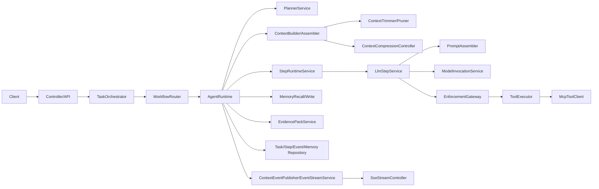
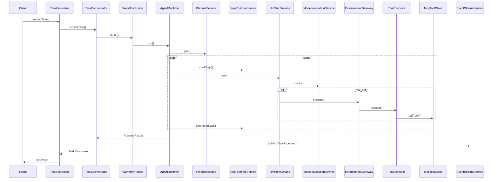

# 流程 `v2` 索引

## 1. 入口清单

### 1.1 控制器入口
- `TaskController#submitTask` POST `/api/v1/tasks`（`src/main/java/com/example/agent/gateway/controller/TaskController.java`）
- `TaskController#getTask` GET `/api/v1/tasks/{taskId}`（`src/main/java/com/example/agent/gateway/controller/TaskController.java`）
- `TaskController#listTasks` GET `/api/v1/tasks`（`src/main/java/com/example/agent/gateway/controller/TaskController.java`）
- `McpController#listTools` POST `/api/v1/mcp/tools/list`（`src/main/java/com/example/agent/gateway/controller/McpController.java`）
- `McpController#callTool` POST `/api/v1/mcp/tools/call`（`src/main/java/com/example/agent/gateway/controller/McpController.java`）
- `MemoryController#save` POST `/api/v1/memory/save`（`src/main/java/com/example/agent/gateway/controller/MemoryController.java`）
- `MemoryController#search` POST `/api/v1/memory/search`（`src/main/java/com/example/agent/gateway/controller/MemoryController.java`）
- `MemoryController#compress` POST `/api/v1/memory/compress`（`src/main/java/com/example/agent/gateway/controller/MemoryController.java`）
- `BudgetController#recordUsage` POST `/api/v1/budget/usage`（`src/main/java/com/example/agent/gateway/controller/BudgetController.java`）
- `BudgetController#summary` GET `/api/v1/budget/summary`（`src/main/java/com/example/agent/gateway/controller/BudgetController.java`）
- `ApprovalController#decide` POST `/api/v1/workflows/{workflowId}/approval/decision`（`src/main/java/com/example/agent/gateway/controller/ApprovalController.java`）
- `ToolApprovalController#decide` POST `/api/approvals/decide`（`src/main/java/com/example/agent/gateway/controller/ToolApprovalController.java`）
- `TimelineController#listEvents` GET `/api/v1/events`（`src/main/java/com/example/agent/gateway/controller/TimelineController.java`）
- `TimelineController#getTimeline` GET `/api/v1/timeline`（`src/main/java/com/example/agent/gateway/controller/TimelineController.java`）
- `TimelineController#listSteps` GET `/api/v1/timeline/steps`（`src/main/java/com/example/agent/gateway/controller/TimelineController.java`）
- `ScheduleController#create` POST `/api/v1/schedules`（`src/main/java/com/example/agent/gateway/controller/ScheduleController.java`）
- `ScheduleController#update` PUT `/api/v1/schedules`（`src/main/java/com/example/agent/gateway/controller/ScheduleController.java`）
- `ScheduleController#list` GET `/api/v1/schedules`（`src/main/java/com/example/agent/gateway/controller/ScheduleController.java`）
- `ScheduleController#pause` POST `/api/v1/schedules/{scheduleId}/pause`（`src/main/java/com/example/agent/gateway/controller/ScheduleController.java`）
- `ScheduleController#resume` POST `/api/v1/schedules/{scheduleId}/resume`（`src/main/java/com/example/agent/gateway/controller/ScheduleController.java`）
- `ScheduleController#cancel` POST `/api/v1/schedules/{scheduleId}/cancel`（`src/main/java/com/example/agent/gateway/controller/ScheduleController.java`）
- `ScheduleController#delete` DELETE `/api/v1/schedules/{scheduleId}`（`src/main/java/com/example/agent/gateway/controller/ScheduleController.java`）
- `PolicyController#evaluate` POST `/api/v1/policy/evaluate`（`src/main/java/com/example/agent/gateway/controller/PolicyController.java`）
- `ReplayController#replay` POST `/api/v1/replay`（`src/main/java/com/example/agent/gateway/controller/ReplayController.java`）
- `OpenApiController#getOpenApi` GET `/v3/api-docs`（`src/main/java/com/example/agent/contracts/OpenApiController.java`）

### 1.2 `SSE` 入口
- `SseStreamController#stream` GET `/api/v1/stream/sse`（`src/main/java/com/example/agent/streaming/SseStreamController.java`）

### 1.3 `StdIO` / `CLI` 入口
- unknown（`rg "stdio|StdIO|Stdio|CommandLineRunner|ApplicationRunner"` 未命中 `src/main/java`）

## 2. 核心链路节点清单

### 2.1 能力评估与路由
- `PlannerService#evaluateCapability`（`src/main/java/com/example/agent/planning/PlannerService.java`）
- `CapabilityBoundaryEvaluator#evaluate`（`src/main/java/com/example/agent/evaluation/CapabilityBoundaryEvaluator.java`）
- `WorkflowRouter#route`（`src/main/java/com/example/agent/orchestrator/WorkflowRouter.java`）
- `ModelRouter#route`（`src/main/java/com/example/agent/model/ModelRouter.java`）
- `PolicyEngine#evaluate`（`src/main/java/com/example/agent/policy/PolicyEngine.java`）

### 2.2 上下文构建、裁剪、压缩与预算
- `DefaultContextBuilder#build`（`src/main/java/com/example/agent/context/DefaultContextBuilder.java`）
- `DefaultContextBudgetAllocator#allocate`（`src/main/java/com/example/agent/budget/DefaultContextBudgetAllocator.java`）
- `DefaultContextPruner#prune`（`src/main/java/com/example/agent/budget/DefaultContextPruner.java`）
- `DefaultContextTrimmer#trim`（`src/main/java/com/example/agent/budget/DefaultContextTrimmer.java`）
- `ContextCompressionController#compressIfNeeded`（`src/main/java/com/example/agent/budget/ContextCompressionController.java`）
- `DefaultContextAssembler#assemble`（`src/main/java/com/example/agent/context/DefaultContextAssembler.java`）
- `PromptAssembler#build` / `DefaultPromptAssembler#build`（`src/main/java/com/example/agent/model/PromptAssembler.java`，`src/main/java/com/example/agent/model/DefaultPromptAssembler.java`）
- `PromptTemplate#render` / `DefaultPromptTemplate#render`（`src/main/java/com/example/agent/model/PromptTemplate.java`，`src/main/java/com/example/agent/model/DefaultPromptTemplate.java`）
- `TokenBudgetManager#recordUsage` / `TokenBudgetManager#summarize`（`src/main/java/com/example/agent/budget/TokenBudgetManager.java`）

### 2.3 规划、编排、运行时与步骤执行
- `TaskOrchestrator#submitTask` / `TaskOrchestrator#getTask` / `TaskOrchestrator#listTasks`（`src/main/java/com/example/agent/orchestrator/TaskOrchestrator.java`）
- `TaskExecutionService#submit`（`src/main/java/com/example/agent/orchestrator/TaskExecutionService.java`）
- `WorkflowRouter#route`（`src/main/java/com/example/agent/orchestrator/WorkflowRouter.java`）
- `AgentRuntime#run`（`src/main/java/com/example/agent/runtime/AgentRuntime.java`）
- `StepRuntimeService#startStep` / `StepRuntimeService#completeStep` / `StepRuntimeService#failStep`（`src/main/java/com/example/agent/runtime/StepRuntimeService.java`）
- `LlmStepService#run`（`src/main/java/com/example/agent/runtime/LlmStepService.java`）
- `FinalOutputService#finalizeOutput`（`src/main/java/com/example/agent/runtime/FinalOutputService.java`）
- `ReactLoopService#run`（`src/main/java/com/example/agent/runtime/ReactLoopService.java`）

### 2.4 工具执行与 `MCP` 调用
- `EnforcementGateway#execute` / `EnforcementGateway#executeWithArguments`（`src/main/java/com/example/agent/agentcore/EnforcementGateway.java`）
- `ToolExecutor#execute` / `ToolExecutor#executeWithArguments` / `ToolExecutor#buildCallRequest`（`src/main/java/com/example/agent/agentcore/ToolExecutor.java`）
- `McpToolClient#callTool` / `McpToolClient#listTools`（`src/main/java/com/example/agent/tools/McpToolClient.java`）
- `HookManager#preTool` / `HookManager#postTool`（`src/main/java/com/example/agent/tools/hook/HookManager.java`）
- `McpController#callTool` / `McpController#listTools`（`src/main/java/com/example/agent/gateway/controller/McpController.java`）

### 2.5 证据包与引用写入
- `EvidencePackService#createPack` / `EvidencePackService#getOrCreatePack`（`src/main/java/com/example/agent/context/EvidencePackService.java`）
- `EvidencePackService#addToolCall` / `EvidencePackService#addCitations` / `EvidencePackService#addResearchCitations` / `EvidencePackService#finalizePack`（`src/main/java/com/example/agent/context/EvidencePackService.java`）
- `ResearchPipeline#run`（`src/main/java/com/example/agent/research/ResearchPipeline.java`）
- `ToolExecutor#appendToolEvidence`（`src/main/java/com/example/agent/agentcore/ToolExecutor.java`）
- `ContextEventPublisher#publishSnapshot` / `ContextEventPublisher#publishSnapshotStage`（`src/main/java/com/example/agent/streaming/ContextEventPublisher.java`）

### 2.6 持久化
- `TaskRepository#save`（`src/main/java/com/example/agent/orchestrator/TaskRepository.java`），`JdbcTaskRepository#save` / `InMemoryTaskRepository#save`（`src/main/java/com/example/agent/orchestrator/JdbcTaskRepository.java`，`src/main/java/com/example/agent/orchestrator/InMemoryTaskRepository.java`）
- `StepRecordRepository#save`（`src/main/java/com/example/agent/runtime/StepRecordRepository.java`），`JdbcStepRecordRepository#save` / `InMemoryStepRecordRepository#save`（`src/main/java/com/example/agent/runtime/JdbcStepRecordRepository.java`，`src/main/java/com/example/agent/runtime/InMemoryStepRecordRepository.java`）
- `EventLogRepository#saveIfAbsent`（`src/main/java/com/example/agent/history/EventLogRepository.java`），`EventLogService#onStreamEvent`（`src/main/java/com/example/agent/history/EventLogService.java`）
- `MemoryRepository#save`（`src/main/java/com/example/agent/memory/MemoryRepository.java`），`MemoryStore#save`（`src/main/java/com/example/agent/memory/MemoryStore.java`）
- `TokenUsageRepository#saveIfAbsent`（`src/main/java/com/example/agent/budget/TokenUsageRepository.java`），`TokenBudgetManager#recordUsage`（`src/main/java/com/example/agent/budget/TokenBudgetManager.java`）
- `ScheduleRepository#save` / `ScheduleExecutionRepository#save`（`src/main/java/com/example/agent/scheduler/ScheduleRepository.java`，`src/main/java/com/example/agent/scheduler/ScheduleExecutionRepository.java`），`ScheduleManager#recordExecution`（`src/main/java/com/example/agent/scheduler/ScheduleManager.java`）

### 2.7 事件发布与 `SSE`
- `EventStreamService#stream` / `EventStreamService#onStreamEvent`（`src/main/java/com/example/agent/streaming/EventStreamService.java`）
- `ContextEventPublisher#publishSnapshot` / `ContextEventPublisher#publishSnapshotStage`（`src/main/java/com/example/agent/streaming/ContextEventPublisher.java`）
- `SseStreamController#stream`（`src/main/java/com/example/agent/streaming/SseStreamController.java`）
- `EventLogService#onStreamEvent`（`src/main/java/com/example/agent/history/EventLogService.java`）
- `TaskOrchestrator#publishTaskAccepted`（`src/main/java/com/example/agent/orchestrator/TaskOrchestrator.java`）

## 3. 关键数据对象清单

| 对象 | 定义路径 | 主要字段 | 
| --- | --- | --- |
| `TaskRequest` | `src/main/java/com/example/agent/common/TaskRequest.java` | query, sessionId, skillName, context, idempotencyKey, toolChoice, executionMode, waitTimeoutMs |
| `TaskResponse` | `src/main/java/com/example/agent/common/TaskResponse.java` | taskId, workflowId, status, streamUrl, result |
| `PlanResult` | `src/main/java/com/example/agent/planning/PlanResult.java` | planId, summary, steps |
| `Plan` | `src/main/java/com/example/agent/planning/Plan.java` | planId, steps |
| `StepRequest` | `src/main/java/com/example/agent/runtime/StepRequest.java` | stepType, input, requiresApproval, approvalSource |
| `McpToolCallRequest` | `src/main/java/com/example/agent/tools/McpToolCallRequest.java` | callId, serverId, toolName, arguments, timeoutMs |
| `McpToolCallResponse` | `src/main/java/com/example/agent/tools/McpToolCallResponse.java` | callId, status, result, error |
| `ContextSnapshot` | `src/main/java/com/example/agent/context/ContextSnapshot.java` | snapshotId, runtimeMeta, roleBoundary, taskIntent, workingMemory, domainKnowledge, longTermMemory, toolState, budgetState, auditMetadata |
| `ContextTrimReport` | `src/main/java/com/example/agent/budget/ContextTrimReport.java` | version, totalBeforeTokens, totalAfterTokens, sectionTokensBefore, sectionTokensAfter, removedItemsBySection, reasons |
| `EvidencePack` | `src/main/java/com/example/agent/context/EvidencePack.java` | version, tenantId, workflowId, snapshotId, createdAt, toolCalls, memoriesUsed, citations, stats, items |
| `PromptBundle` | `src/main/java/com/example/agent/model/PromptBundle.java` | messages, templateId, estimatedTokens, truncatedSections |
| `PromptMessage` | `src/main/java/com/example/agent/model/PromptMessage.java` | role, content |

## 4. `v2` 流程增强点相关实现与缺口

### 4.1 现有实现
- 上下文构建、裁剪、压缩与预算：`DefaultContextBuilder#build` 组织流程，调用 `DefaultContextPruner#prune`、`DefaultContextTrimmer#trim`、`ContextCompressionController#compressIfNeeded`、`DefaultContextBudgetAllocator#allocate`（`src/main/java/com/example/agent/context/DefaultContextBuilder.java`，`src/main/java/com/example/agent/budget/DefaultContextPruner.java`，`src/main/java/com/example/agent/budget/DefaultContextTrimmer.java`，`src/main/java/com/example/agent/budget/ContextCompressionController.java`，`src/main/java/com/example/agent/budget/DefaultContextBudgetAllocator.java`）
- `Token` 预算统计：`TokenBudgetManager#recordUsage` / `TokenBudgetManager#summarize`（`src/main/java/com/example/agent/budget/TokenBudgetManager.java`）
- 能力评估与策略建议：`PlannerService#evaluateCapability` -> `CapabilityBoundaryEvaluator#evaluate`（`src/main/java/com/example/agent/planning/PlannerService.java`，`src/main/java/com/example/agent/evaluation/CapabilityBoundaryEvaluator.java`）
- 规划与计划修复：`PlannerService#plan`，`JsonOutputRepairService#repair`（`src/main/java/com/example/agent/planning/PlannerService.java`，`src/main/java/com/example/agent/repair/JsonOutputRepairService.java`）
- 提示词组装：`DefaultContextAssembler#assemble`、`DefaultPromptAssembler#build`、`DefaultPromptTemplate#render`（`src/main/java/com/example/agent/context/DefaultContextAssembler.java`，`src/main/java/com/example/agent/model/DefaultPromptAssembler.java`，`src/main/java/com/example/agent/model/DefaultPromptTemplate.java`）
- 模型调用与输出修复：`ModelInvocationService#invoke`，`JsonOutputRepairService#repair`（`src/main/java/com/example/agent/model/ModelInvocationService.java`，`src/main/java/com/example/agent/repair/JsonOutputRepairService.java`）
- 审批与执行控制：`ExecutionControlService#requestApproval` / `ExecutionControlService#decideApproval`，`ApprovalController#decide`，`ToolApprovalController#decide`（`src/main/java/com/example/agent/runtime/ExecutionControlService.java`，`src/main/java/com/example/agent/gateway/controller/ApprovalController.java`，`src/main/java/com/example/agent/gateway/controller/ToolApprovalController.java`）
- 证据与引用写入：`EvidencePackService#addToolCall` / `EvidencePackService#addResearchCitations`，`ResearchPipeline#run`（`src/main/java/com/example/agent/context/EvidencePackService.java`，`src/main/java/com/example/agent/research/ResearchPipeline.java`）
- 事件与 `SSE`：`EventStreamService#onStreamEvent`，`SseStreamController#stream`，`ContextEventPublisher#publishSnapshotStage`（`src/main/java/com/example/agent/streaming/EventStreamService.java`，`src/main/java/com/example/agent/streaming/SseStreamController.java`，`src/main/java/com/example/agent/streaming/ContextEventPublisher.java`）

### 4.2 缺口
- `PlanContext` / `PlannerContext` / `ExecutionContext`：unknown（`rg "PlanContext|PlannerContext|ExecutionContext"` 未命中 `src/main/java`）
- `StdIO` / `CLI` 入口：unknown（`rg "stdio|StdIO|Stdio|CommandLineRunner|ApplicationRunner"` 未命中 `src/main/java`）

## 5. `Mermaid` 图骨架

```mermaid
classDiagram
  class ContextBuilder
  class DefaultContextBuilder
  ContextBuilder <|.. DefaultContextBuilder

  class ContextAssembler
  class DefaultContextAssembler
  ContextAssembler <|.. DefaultContextAssembler

  class ContextTrimmer
  class DefaultContextTrimmer
  ContextTrimmer <|.. DefaultContextTrimmer

  class ContextPruner
  class DefaultContextPruner
  ContextPruner <|.. DefaultContextPruner

  class TaskRepository
  class JdbcTaskRepository
  class InMemoryTaskRepository
  TaskRepository <|.. JdbcTaskRepository
  TaskRepository <|.. InMemoryTaskRepository

  class StepRecordRepository
  class JdbcStepRecordRepository
  class InMemoryStepRecordRepository
  StepRecordRepository <|.. JdbcStepRecordRepository
  StepRecordRepository <|.. InMemoryStepRecordRepository

  class EventLogRepository
  class JdbcEventLogRepository
  class InMemoryEventLogRepository
  EventLogRepository <|.. JdbcEventLogRepository
  EventLogRepository <|.. InMemoryEventLogRepository

  class MemoryRepository
  class JdbcMemoryRepository
  class InMemoryMemoryRepository
  MemoryRepository <|.. JdbcMemoryRepository
  MemoryRepository <|.. InMemoryMemoryRepository

  class ModelProvider
  class DefaultModelProvider
  ModelProvider <|.. DefaultModelProvider

  class LlmClient
  class DefaultLlmClient
  LlmClient <|.. DefaultLlmClient

  class PromptTemplate
  class DefaultPromptTemplate
  PromptTemplate <|.. DefaultPromptTemplate
```

## 6. 对象流转表

| 对象名 | 创建位置（类#方法 路径） | 主要字段来源 | 写入/变更位置（类#方法） | 被裁剪/压缩位置 | 输出位置（返回/落库/事件） | 备注（失败分支/重试） |
| --- | --- | --- | --- | --- | --- | --- |
| `TaskRequest` | `TaskController#submitTask`（`src/main/java/com/example/agent/gateway/controller/TaskController.java`） | 字段来自 `TaskRequest`（`src/main/java/com/example/agent/common/TaskRequest.java`），由 `@RequestBody` 反序列化 | `TaskOrchestrator#normalizeIdempotencyKey`、`TaskOrchestrator#resolveExecutionMode`（`src/main/java/com/example/agent/orchestrator/TaskOrchestrator.java`），`AgentRuntime#buildRequestWithContext`（`src/main/java/com/example/agent/runtime/AgentRuntime.java`） | unknown（未发现针对 `TaskRequest` 的裁剪/压缩逻辑） | `TaskOrchestrator#createTask` 写入 `TaskRecord.request`（`src/main/java/com/example/agent/orchestrator/TaskOrchestrator.java`） | 同步模式可能触发 `SyncWaitTimeoutException`（`TaskOrchestrator#waitIfSync`） |
| 计划（`PlanResult`） | `PlannerService#plan`（`src/main/java/com/example/agent/planning/PlannerService.java`） | 字段来自 `PlanResult`（`src/main/java/com/example/agent/planning/PlanResult.java`），步骤来源于 `PlannerService#parsePlan` / `PlannerService#buildHeuristicPlan` | `PlannerService#applyApprovalRequirement` / `PlannerService#markStepRequiresApproval`（`src/main/java/com/example/agent/planning/PlannerService.java`） | unknown | `AgentRuntime#publishPlanEvent` 事件输出（`src/main/java/com/example/agent/runtime/AgentRuntime.java`） | 计划为空时 `AgentRuntime#run` 直接返回 |
| 步骤（`StepRequest`） | `PlannerService#parsePlan` / `PlannerService#buildHeuristicPlan`（`src/main/java/com/example/agent/planning/PlannerService.java`） | 字段来自 `StepRequest`（`src/main/java/com/example/agent/runtime/StepRequest.java`） | `AgentRuntime#mergeStepInput`（`src/main/java/com/example/agent/runtime/AgentRuntime.java`），`PlannerService#markStepRequiresApproval`（`src/main/java/com/example/agent/planning/PlannerService.java`） | unknown | `StepRuntimeService#startStep` 生成 `StepRecord`（`src/main/java/com/example/agent/runtime/StepRuntimeService.java`） | 审批字段在 `AgentRuntime#requestApprovalIfNeeded` 触发等待 |
| 步骤输入（`StepRequest.input`） | 同上 | 来自 `Plan` JSON 或规则计划输入 | `AgentRuntime#mergeStepInput`（`src/main/java/com/example/agent/runtime/AgentRuntime.java`），`LlmStepService#updateToolContext`（`src/main/java/com/example/agent/runtime/LlmStepService.java`） | unknown | 传入 `LlmStepService#run` 或 `EnforcementGateway#executeWithArguments`（`src/main/java/com/example/agent/runtime/LlmStepService.java`，`src/main/java/com/example/agent/agentcore/EnforcementGateway.java`） | 内部字段由 `ToolExecutor#removeInternalArguments` 过滤（`src/main/java/com/example/agent/agentcore/ToolExecutor.java`） |
| 工具调用（`McpToolCallRequest`） | `ToolExecutor#buildCallRequest`（`src/main/java/com/example/agent/agentcore/ToolExecutor.java`） | 字段来自 `McpToolCallRequest`（`src/main/java/com/example/agent/tools/McpToolCallRequest.java`），参数由 `ToolExecutor#buildMergedArguments` | `ToolExecutor#buildMergedArguments`、`ToolExecutor#removeInternalArguments`（`src/main/java/com/example/agent/agentcore/ToolExecutor.java`） | unknown | `McpToolClient#callTool` 发起调用（`src/main/java/com/example/agent/tools/McpToolClient.java`） | `ToolExecutor` 内部 `RetryPolicy` 进行重试（`src/main/java/com/example/agent/agentcore/ToolExecutor.java`） |
| 工具结果（`McpToolCallResponse` / `ToolCallResult`） | `McpToolClient#callToolLocal` / `McpToolClient#callToolRemote`，`LlmStepService#executeToolCall`（`src/main/java/com/example/agent/tools/McpToolClient.java`，`src/main/java/com/example/agent/runtime/LlmStepService.java`） | `McpToolCallResponse` 字段来自 `McpToolCallResponse`（`src/main/java/com/example/agent/tools/McpToolCallResponse.java`） | `ToolExecutor#executeInternal` 合并结果并写入 `tokenUsage`（`src/main/java/com/example/agent/agentcore/ToolExecutor.java`） | unknown | `LlmStepService#summarizeToolResult` / `StepRuntimeService#completeStep` 输出（`src/main/java/com/example/agent/runtime/LlmStepService.java`，`src/main/java/com/example/agent/runtime/StepRuntimeService.java`） | `LlmStepService` 对失败进行重试并生成失败输出 |
| `ContextSnapshot` | `DefaultContextBuilder#build`（`src/main/java/com/example/agent/context/DefaultContextBuilder.java`） | 字段来自 `ContextSnapshot`（`src/main/java/com/example/agent/context/ContextSnapshot.java`）与 `ContextBuildRequest` | `DefaultContextBuilder#build`、`ContextCompressionController#applyCompressedSummary`、`ToolExecutor#syncSnapshotEvidence`（`src/main/java/com/example/agent/context/DefaultContextBuilder.java`，`src/main/java/com/example/agent/budget/ContextCompressionController.java`，`src/main/java/com/example/agent/agentcore/ToolExecutor.java`） | `DefaultContextPruner#prune`、`DefaultContextTrimmer#trim`、`ContextCompressionController#compressIfNeeded`（`src/main/java/com/example/agent/budget/DefaultContextPruner.java`，`src/main/java/com/example/agent/budget/DefaultContextTrimmer.java`，`src/main/java/com/example/agent/budget/ContextCompressionController.java`） | `ContextEventPublisher#publishSnapshot` / `ContextEventPublisher#publishSnapshotStage`（`src/main/java/com/example/agent/streaming/ContextEventPublisher.java`） | `AgentRuntime#applyContextSnapshot` 写回运行时上下文 |
| `ContextTrimReport` | `DefaultContextTrimmer#trim`（`src/main/java/com/example/agent/budget/DefaultContextTrimmer.java`） | 字段来自 `ContextTrimReport`（`src/main/java/com/example/agent/budget/ContextTrimReport.java`） | `DefaultContextTrimmer#trim`（`src/main/java/com/example/agent/budget/DefaultContextTrimmer.java`） | unknown | `DefaultContextBuilder#publishTrimStage` -> `ContextEventPublisher#publishSnapshotStage`（`src/main/java/com/example/agent/context/DefaultContextBuilder.java`，`src/main/java/com/example/agent/streaming/ContextEventPublisher.java`） | 报告为空时不发布事件 |
| `EvidencePack` | `EvidencePackService#createPack` / `EvidencePackService#getOrCreatePack`（`src/main/java/com/example/agent/context/EvidencePackService.java`） | 字段来自 `EvidencePack`（`src/main/java/com/example/agent/context/EvidencePack.java`） | `EvidencePackService#addToolCall` / `EvidencePackService#addCitations` / `EvidencePackService#addResearchCitations` / `EvidencePackService#finalizePack`，`ToolExecutor#appendToolEvidence`（`src/main/java/com/example/agent/context/EvidencePackService.java`，`src/main/java/com/example/agent/agentcore/ToolExecutor.java`） | `DefaultContextPruner#pruneEvidencePack`、`DefaultContextTrimmer#trimEvidencePack`（`src/main/java/com/example/agent/budget/DefaultContextPruner.java`，`src/main/java/com/example/agent/budget/DefaultContextTrimmer.java`） | `ContextEventPublisher#publishSnapshot` 统计输出（`src/main/java/com/example/agent/streaming/ContextEventPublisher.java`） | `EvidencePack#recomputeStats` 重算统计 |
