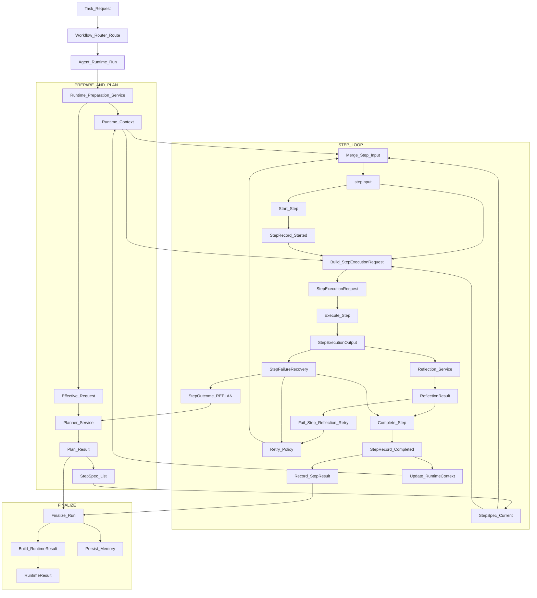

# 运行时对象流转 Mermaid 严格兼容版

> 目标：提供一版对 Mermaid 解析器更“保守友好”的流程图，避免以下高风险写法：
> - 节点文本中出现 `<` `>` `->` `<-` ` `
> - 节点文本中出现复杂泛型表达式
> - 节点文本里混入可能被误判为语法的符号组合

---

## 一、对象流程图（Strict Graph TB）

---

## 二、中间对象流转图（Strict Graph TB）

```mermaid
graph TB
    subgraph INPUT_BUILD
        S1[StepSpec]
        S2[RuntimeContext_Map]
        S3[MergeStepInput]
        S4[stepInput]
        S5[Promote_Approval_Fields]
    end

    S1 --> S3
    S2 --> S3
    S3 --> S5
    S5 --> S4

    subgraph RECORD_START
        R1[StartStep_Service]
        R2[StepRecord]
        R3[StepRecord_Field_Set_Started]
    end

    S4 --> R1
    R1 --> R2
    R2 --> R3

    subgraph EXEC_REQUEST
        Q1[StepExecutionRequest]
        Q2[StepExecutionRequest_Fields]
    end

    S1 --> Q1
    S4 --> Q1
    S2 --> Q1
    R2 --> Q1
    Q1 --> Q2

    subgraph EXEC_OUTPUT
        E1[StepExecutionDelegate]
        E2[StepExecutionOutput]
        E3[Payload]
        E4[ToolName]
        E5[RawRef_Text]
        E6[Refs_Map]
        E7[Summary_Map]
    end

    Q1 --> E1
    E1 --> E2
    E2 --> E3
    E2 --> E4
    E2 --> E5
    E2 --> E6
    E2 --> E7

    subgraph REFLECTION
        RF1[Reflection_Service]
        RF2[ReflectionResult]
        RF3[RetryRequested]
    end

    E2 --> RF1
    RF1 --> RF2
    RF2 --> RF3

    subgraph BUILD_STEP_RESULT
        B1[BuildStepResult]
        B2[StepResult]
        B3[StepResultMeta]
        B4[RawRef]
        B5[StepResultRaw]
        B6[StructuredResult]
        B7[StepResultSummary]
        B8[StepResultRefSet]
    end

    R2 --> B1
    E2 --> B1
    E7 --> B1
    B1 --> B2
    B2 --> B3
    B2 --> B4
    B2 --> B5
    B2 --> B6
    B2 --> B7
    B2 --> B8

    subgraph META_SOURCE
        M1[Meta_From_StepRecord]
        M2[Meta_From_StepExecutionOutput]
    end

    R2 --> M1
    E2 --> M2
    M1 --> B3
    M2 --> B3

    subgraph RAW_REF_SOURCE
        RR1[RawRef_From_Output_RawRef_Text]
        RR2[Use_refId_When_Prefix_Rawref]
        RR3[Use_key_When_Legacy]
    end

    E5 --> RR1
    RR1 --> RR2
    RR1 --> RR3
    RR2 --> B4
    RR3 --> B4

    subgraph RAW_SOURCE
        RW1[Raw_From_Output_Payload]
        RW2[RawOutputEnvelope_Builder]
        RW3[Raw_Data]
        RW4[Raw_Truncated]
    end

    E3 --> RW1
    RW1 --> RW2
    RW2 --> RW3
    RW2 --> RW4
    RW3 --> B5
    RW4 --> B5

    subgraph STRUCTURED_SOURCE
        ST1[Extract_Structured_By_Type_Tool_Result_RawRef]
        ST2[StructuredExtractorRegistry]
        ST3[StructuredResult_Generic]
        ST4[StructuredResult_RecordsetData]
        ST5[StructuredResult_SqlData]
        ST6[StructuredResult_DefaultStructuredData]
    end

    E3 --> ST1
    E4 --> ST1
    B4 --> ST1
    ST1 --> ST2
    ST2 --> ST3
    ST3 --> ST4
    ST3 --> ST5
    ST3 --> ST6
    ST3 --> B6

    subgraph SUMMARY_SOURCE
        SM1[Summary_From_Output_Summary_First]
        SM2[Rebuild_By_SummaryBuilder_If_Missing]
    end

    E7 --> SM1
    SM1 --> SM2
    SM2 --> B7

    subgraph REFSET_SOURCE
        RS1[RefSet_RawRef_Prefer_refId_Fallback_key]
        RS2[RefSet_Decision_Summary_Tool_Model_From_Output_Refs]
    end

    B4 --> RS1
    E6 --> RS2
    RS1 --> B8
    RS2 --> B8

    subgraph CONTEXT_ADVANCE
        C1[Write_StepResult_To_StepRecord]
        C2[Append_StepResult_To_stepOutputs]
        C3[Update_RuntimeContext_LastStep]
        C4[Update_RuntimeContext_RawRef_and_RawData]
        C5[Update_RuntimeContext_steps_History]
    end

    B2 --> C1
    C1 --> C2
    C1 --> C3
    C1 --> C4
    C1 --> C5

    subgraph FINAL_RESULT
        F1[RuntimeFinalizationService]
        F2[Build_RuntimeResult]
        F3[RuntimeResult]
    end

    C2 --> F1
    F1 --> F2
    F2 --> F3
```

---

## 三、图中英文节点与对象名映射

- `Runtime_Context` / `RuntimeContext_Map`：`RuntimeContext`
- `StepSpec` / `StepSpec_List`：`StepSpec`
- `stepInput`：`stepInput`
- `StepRecord` / `StepRecord_Started` / `StepRecord_Completed`：`StepRecord`
- `StepExecutionRequest`：`StepExecutionRequest`
- `StepExecutionOutput`：`StepExecutionOutput`
- `ReflectionResult`：`ReflectionResult`
- `StepResult`：`StepResult`
- `StepResultMeta`：`StepResultMeta`
- `RawRef`：`RawRef`
- `StepResultRaw`：`StepResultRaw`
- `StructuredResult_Generic` 等：`StructuredResult`
- `StepResultSummary`：`StepResultSummary`
- `StepResultRefSet`：`StepResultRefSet`
- `RuntimeResult`：`RuntimeResult`

---

## 四、严格兼容写法约束（后续扩图建议）

- 节点标签仅使用字母、数字、下划线、空格。
- 不在节点标签中使用尖括号、HTML 标签、箭头字符组合。
- 泛型表达式改写为语义名，例如 `StructuredResult_Generic`。
- 如需中文解释，放在图外正文，不放在复杂节点标签里。

