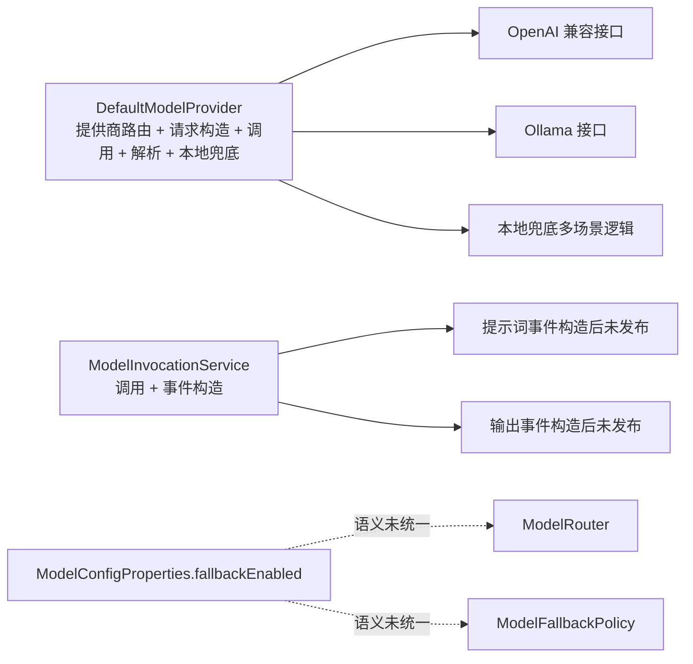
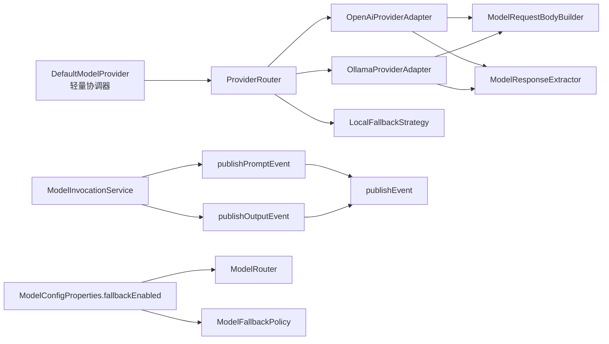

# `llm` 包 P0 第一刀拆分方案

## 1. 目标与范围

## 1.1 目标

本方案仅覆盖评审文档中的 P0 三项问题，目标是用最小改动实现以下效果：

1. 拆解 `DefaultModelProvider` 的核心职责，降低单类复杂度。
2. 修复 `ModelInvocationService` 中事件发布“已构造未发布”的行为偏差。
3. 统一 `fallbackEnabled` 配置语义，保证路由与降级策略一致。

## 1.2 非目标

1. 本次不做跨包大规模重命名。
2. 本次不一次性完成 `Map<String, Object>` 全量强类型改造。
3. 本次不调整业务协议字段，仅在等价语义下重构实现。

## 2. 第一刀拆分原则

1. **保接口不破调用**：`ModelProvider`、`LlmClient` 对外接口保持不变。
2. **先抽再移**：先把逻辑抽到新类，再逐步迁移调用，降低回归风险。
3. **先可观测后优化**：先补齐日志和测试，再做深层优化。
4. **可回滚**：每一刀独立可回滚，避免大批量耦合变更。

## 3. 第一刀拆分类图

## 3.1 现状图（问题聚合点）

## 3.2 第一刀目标图（落地后）

## 4. 类与文件落位建议

为控制改动面，第一刀新增类尽量放在 `llm` 包下的子包中：

1. `src/main/java/com/example/agent/capabilities/llm/provider/ProviderRouter.java`
2. `src/main/java/com/example/agent/capabilities/llm/provider/OpenAiProviderAdapter.java`
3. `src/main/java/com/example/agent/capabilities/llm/provider/OllamaProviderAdapter.java`
4. `src/main/java/com/example/agent/capabilities/llm/provider/LocalFallbackStrategy.java`
5. `src/main/java/com/example/agent/capabilities/llm/provider/ModelRequestBodyBuilder.java`
6. `src/main/java/com/example/agent/capabilities/llm/provider/ModelResponseExtractor.java`

保留并瘦身：

1. `src/main/java/com/example/agent/capabilities/llm/DefaultModelProvider.java`

改造现有服务：

1. `src/main/java/com/example/agent/capabilities/llm/ModelInvocationService.java`
2. `src/main/java/com/example/agent/capabilities/llm/ModelRouter.java`
3. `src/main/java/com/example/agent/capabilities/llm/ModelFallbackPolicy.java`
4. `src/main/java/com/example/agent/capabilities/llm/ModelConfigProperties.java`

## 5. 具体改造任务清单

## 5.1 批次一：`DefaultModelProvider` 第一刀拆分

### 任务 1：抽取请求构造器

1. 从 `DefaultModelProvider` 抽出 `buildOpenAiRequestBody`、`buildOllamaRequestBody`、工具列表构造相关逻辑到 `ModelRequestBodyBuilder`。
2. 保留原方法壳，先委托调用新类，确保行为一致。

**完成标准**

1. `DefaultModelProvider` 行数下降到 900 行以内。
2. 现有 `DefaultModelProviderTest` 全部通过。

### 任务 2：抽取响应解析器

1. 抽出 `extractContent`、`extractTokens`、`extractOllamaContent`、`extractOllamaTokens` 到 `ModelResponseExtractor`。
2. 保留错误映射策略在上层，解析器只负责解析。

**完成标准**

1. 解析逻辑单元测试新增并覆盖主分支。
2. 上下游返回值保持兼容。

### 任务 3：抽取提供商适配器

1. 新建 `OpenAiProviderAdapter`，承接兼容接口调用链路。
2. 新建 `OllamaProviderAdapter`，承接原生接口调用链路。
3. 新建 `LocalFallbackStrategy`，承接本地兜底与场景输出逻辑。
4. 新建 `ProviderRouter`，按 `provider` 分发到对应适配器。

**完成标准**

1. `DefaultModelProvider` 只保留“委托 + 最外层异常兜底”。
2. `DefaultModelProvider` 行数下降到 450 行以内。
3. 原有测试通过，新增适配器测试。

## 5.2 批次二：修复事件发布失活

### 任务 4：恢复事件真实发布

1. `publishPromptEvent` 中恢复调用 `publishEvent`。
2. `publishOutputEvent` 中恢复调用 `publishEvent`。
3. 增加配置开关：`agent.llm.event.publish-enabled`。
4. 当开关关闭时输出 `info` 日志，显式声明“跳过发布”。

**完成标准**

1. 事件开关开启时能发布 `LLM_PROMPT`、`LLM_PARSE`。
2. 事件开关关闭时无发布动作但有明确日志。
3. 增加 `ModelInvocationService` 单元测试覆盖开启/关闭两条路径。

## 5.3 批次三：统一 `fallbackEnabled` 语义

### 任务 5：路由与策略统一使用开关

1. `ModelRouter.route` 在回退前判断 `fallbackEnabled`。
2. `ModelFallbackPolicy.evaluate` 保持同语义，避免“策略开关与路由行为不一致”。
3. 增加配置缺失时的防御性日志，避免静默兜底。

**完成标准**

1. `fallbackEnabled=false` 时，不发生任何回退模型选取。
2. `fallbackEnabled=true` 时，行为与当前兼容。
3. 新增路由与回退策略单测。

## 6. 任务分解到提交批次

建议按三次提交推进，每次都可独立合并：

1. **提交一**：提供商拆分（任务 1~3）。
2. **提交二**：事件发布修复（任务 4）。
3. **提交三**：回退语义统一（任务 5）。

每个提交都要求：

1. 变更说明。
2. 单测结果。
3. 回滚说明。

## 7. 验收清单

1. `DefaultModelProvider` 行数显著下降，且仅保留协调职责。
2. 事件链路在开关开启时真实发布，关闭时显式日志可追踪。
3. `fallbackEnabled` 在路由和降级策略上语义一致。
4. `llm` 包相关核心测试通过，新增测试全部通过。

## 8. 风险与回滚

## 8.1 主要风险

1. 拆分后 Bean 注入冲突或循环依赖。
2. 适配器行为与原实现微差异导致回归。
3. 事件发布恢复后对下游订阅方产生流量冲击。

## 8.2 回滚策略

1. 每个提交单独回滚，不跨提交混回。
2. 事件发布通过开关可快速止血。
3. 若提供商拆分出现回归，可临时回切到旧委托路径。

## 9. 预估工时

1. 提供商拆分：1.5~2.0 天。
2. 事件发布修复：0.5 天。
3. 回退语义统一与测试：0.5~1.0 天。

总计：**2.5~3.5 天**。

