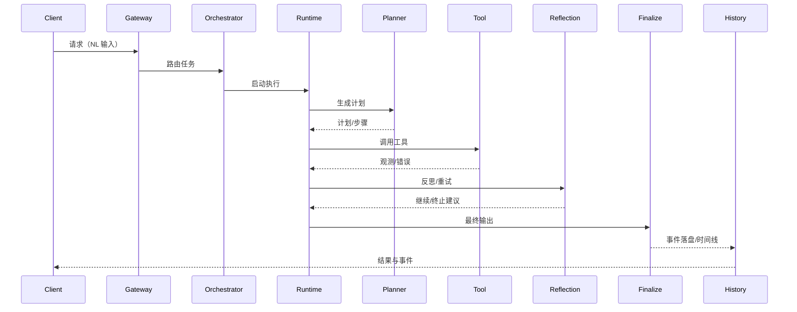

# Shannon 对齐复核报告（Post-fix Verification）- 20260127

## 说明与范围
- 约束：本次仅做分析与产出文档，不修改代码、不运行命令、不执行测试。
- 证据范围：仅基于已读取文件与历史报告摘要，未进行全量检索；标注为“需运行验证”的结论不作为确定性结论。

## A. 端到端主链路叙述（自然语言输入到最终输出）
1) 入口接收请求后进入编排路径，由 `TaskOrchestrator.handleWorkflowRoute` 调用 `WorkflowRouter.route` 触发具体工作流路由。  
   - 本项目证据：`src/main/java/com/example/agent/orchestrator/TaskOrchestrator.java`  
   - Shannon 证据：`vendor/Shannon/go/orchestrator/internal/activities/agent.go#ExecuteAgent`
2) 运行时进入决策循环，调用规划服务生成计划并产生事件。  
   - 本项目证据：`src/main/java/com/example/agent/runtime/AgentRuntime.java`；`src/main/java/com/example/agent/planning/PlannerService.java`；事件 `PLAN_GENERATED`/`PLAN_REVISED`  
   - Shannon 证据：`vendor/Shannon/go/orchestrator/internal/activities/decompose.go#DecomposeTask`
3) 按步骤执行工具调用，经 `ToolExecutor`/`McpToolClient` 触发外部工具，并由 `EnforcementGateway` 统一发布工具事件与观测结果。  
   - 本项目证据：`src/main/java/com/example/agent/agentcore/ToolExecutor.java`；`src/main/java/com/example/agent/tools/McpToolClient.java`；`src/main/java/com/example/agent/agentcore/EnforcementGateway.java`；事件 `TOOL_INVOKED`/`TOOL_OBSERVATION`/`TOOL_ERROR`  
   - Shannon 证据：`vendor/Shannon/go/orchestrator/internal/activities/stream_events.go` 中工具与观测事件发布
4) 执行后进行反思与必要的重试或分解；最终由输出服务生成终态结果并写入事件流。  
   - 本项目证据：`src/main/java/com/example/agent/reflection/ReflectionService.java`；`src/main/java/com/example/agent/runtime/FinalOutputService.java`；`src/main/java/com/example/agent/model/ModelInvocationService.java`（事件 `LLM_PROMPT`/`LLM_OUTPUT`）  
   - Shannon 证据：`vendor/Shannon/go/orchestrator/internal/workflows/patterns/reflection.go#ReflectOnResult`
5) 事件落盘与时间线聚合用于后续查询与回放（需运行验证其与接口契约一致性）。  
   - 本项目证据：`src/main/java/com/example/agent/history/EventLogService.java`；`src/main/java/com/example/agent/history/TimelineService.java`  
   - Shannon 证据：`vendor/Shannon/docs/task-history-and-timeline.md`

### Mermaid 时序图

## B. 16 模块对齐矩阵（状态：`Aligned` / `Partially` / `Missing`）
| 模块 | 状态 | 本项目证据 | Shannon 证据 | 说明 |
| --- | --- | --- | --- | --- |
| gateway | `Partially` | `TaskOrchestrator` 路由入口 | `agent.go#ExecuteAgent` | 入口控制器未在已读文件中出现，需运行验证 |
| orchestrator | `Partially` | `TaskOrchestrator` | `agent.go#ExecuteAgent` | 编排存在但与工作流持久化一致性需验证 |
| streaming api | `Partially` | 未见流式接口实现证据（需运行验证） | `stream_events.go`、`streaming/manager.go#ReplaySince` | 回放与断线续传是否对齐需验证 |
| task history & timeline | `Partially` | `EventLogService`/`TimelineService` | `docs/task-history-and-timeline.md` | 事件派生规则需验证 |
| memory system | `Partially` | 未见层次记忆实现证据（需运行验证） | `docs/memory-system-architecture.md` | 记忆层次化与压缩策略需验证 |
| scheduled tasks | `Partially` | `ScheduleEngine` | `docs/scheduled-tasks.md` | 定时任务与历史一致性需验证 |
| authentication & multitenancy | `Partially` | `ApiKeyAuthenticator`（未读全量） | `docs/authentication-and-multitenancy.md` | 多租户上下文与日志字段需验证 |
| token budget tracking | `Partially` | `TokenBudgetManager` | `docs/token-budget-tracking.md` | 预算阈值事件与聚合需验证 |
| observability | `Partially` | 事件日志与 LLM/工具事件 | `docs/agent-core-architecture.md` | 指标与追踪未见证据 |
| runtime | `Partially` | `AgentRuntime` | `agent.go#ExecuteAgent` | 步骤状态机与终止条件需验证 |
| planning/reflection | `Partially` | `PlannerService`/`ReflectionService` | `decompose.go#DecomposeTask`/`reflection.go#ReflectOnResult` | 计划质量自检与分解策略需验证 |
| tools | `Partially` | `ToolExecutor`/`McpToolClient`/`EnforcementGateway` | `docs/adding-custom-tools.md` | MCP 远端/本地一致性需验证 |
| multi-agent | `Partially` | `MultiAgentCoordinator` | `docs/multi-agent-workflow-architecture.md` | 与运行时主链路耦合需验证 |
| reasoning | `Partially` | `DebateCoordinator`/`ResearchPipeline` | `docs/agent-core-architecture.md` | 深度研究流程存在缺口，见缺陷清单 |
| governance | `Partially` | `TokenBudgetManager`/`McpToolClient` 限流与熔断 | `docs/agent-core-architecture.md` | 回放与背压矩阵需验证 |
| enterprise | `Partially` | `PolicyEngine`/`WasiSandboxExecutor` | `docs/agent-core-architecture.md` | OPA 侧集成与模型降级策略需验证 |

## C. 对齐证据（逐模块）
> 说明：每条结论均给出“本项目证据 + Shannon 证据”。未能覆盖的部分已标注“需运行验证”。

1) gateway  
本项目证据：`src/main/java/com/example/agent/orchestrator/TaskOrchestrator.java`  
Shannon 证据：`vendor/Shannon/go/orchestrator/internal/activities/agent.go#ExecuteAgent`  
结论：仅发现编排入口，网关控制器与鉴权入口需运行验证。

2) orchestrator  
本项目证据：`src/main/java/com/example/agent/orchestrator/TaskOrchestrator.java`  
Shannon 证据：`vendor/Shannon/go/orchestrator/internal/activities/agent.go#ExecuteAgent`  
结论：基础编排存在，但与持久化工作流一致性需验证。

3) streaming api  
本项目证据：未见流式接口/回放实现（需运行验证）  
Shannon 证据：`vendor/Shannon/go/orchestrator/internal/activities/stream_events.go`、`vendor/Shannon/go/orchestrator/internal/streaming/manager.go#ReplaySince`  
结论：流式发布与断线续传对齐状态需运行验证。

4) task history & timeline  
本项目证据：`src/main/java/com/example/agent/history/EventLogService.java`、`src/main/java/com/example/agent/history/TimelineService.java`  
Shannon 证据：`vendor/Shannon/docs/task-history-and-timeline.md`  
结论：事件落盘与时间线派生具备基础实现，但派生规则需验证。

5) memory system  
本项目证据：未见层次化记忆类（需运行验证）  
Shannon 证据：`vendor/Shannon/docs/memory-system-architecture.md`  
结论：记忆层次化与压缩策略是否实现需运行验证。

6) scheduled tasks  
本项目证据：`src/main/java/com/example/agent/scheduler/ScheduleEngine.java`  
Shannon 证据：`vendor/Shannon/docs/scheduled-tasks.md`  
结论：存在本地调度实现，持久化与历史对齐需验证。

7) authentication & multitenancy  
本项目证据：`src/main/java/com/example/agent/auth/ApiKeyAuthenticator.java`（未读全量）  
Shannon 证据：`vendor/Shannon/docs/authentication-and-multitenancy.md`  
结论：鉴权入口与租户上下文需运行验证。

8) token budget tracking  
本项目证据：`src/main/java/com/example/agent/budget/TokenBudgetManager.java`  
Shannon 证据：`vendor/Shannon/go/orchestrator/internal/activities/budget.go#ExecuteAgentWithBudget`  
结论：具备预算记录与阈值事件，聚合一致性需验证。

9) observability  
本项目证据：`src/main/java/com/example/agent/model/ModelInvocationService.java` 事件；`EventLogService`  
Shannon 证据：`vendor/Shannon/docs/agent-core-architecture.md`  
结论：日志与事件具备，但指标与追踪需运行验证。

10) runtime  
本项目证据：`src/main/java/com/example/agent/runtime/AgentRuntime.java`  
Shannon 证据：`vendor/Shannon/go/orchestrator/internal/activities/agent.go#ExecuteAgent`  
结论：决策循环存在，终止条件与状态机细节需验证。

11) planning/reflection  
本项目证据：`src/main/java/com/example/agent/planning/PlannerService.java`、`src/main/java/com/example/agent/reflection/ReflectionService.java`  
Shannon 证据：`vendor/Shannon/go/orchestrator/internal/activities/decompose.go#DecomposeTask`、`vendor/Shannon/go/orchestrator/internal/workflows/patterns/reflection.go#ReflectOnResult`  
结论：基础规划与反思存在，但计划自检与分解策略需验证。

12) tools  
本项目证据：`src/main/java/com/example/agent/agentcore/ToolExecutor.java`、`src/main/java/com/example/agent/tools/McpToolClient.java`、`src/main/java/com/example/agent/agentcore/EnforcementGateway.java`  
Shannon 证据：`vendor/Shannon/docs/adding-custom-tools.md`、`vendor/Shannon/go/orchestrator/internal/activities/stream_events.go`  
结论：工具调用闭环具备，但 MCP 行为一致性需验证。

13) multi-agent  
本项目证据：`src/main/java/com/example/agent/multiagent/MultiAgentCoordinator.java`  
Shannon 证据：`vendor/Shannon/docs/multi-agent-workflow-architecture.md`  
结论：存在协作生成与角色分配事件，编排深度需验证。

14) reasoning  
本项目证据：`src/main/java/com/example/agent/reasoning/DebateCoordinator.java`、`src/main/java/com/example/agent/research/ResearchPipeline.java`  
Shannon 证据：`vendor/Shannon/docs/agent-core-architecture.md`  
结论：辩论流程存在，深度研究流程存在缺口，见缺陷清单。

15) governance  
本项目证据：`src/main/java/com/example/agent/budget/TokenBudgetManager.java`；`src/main/java/com/example/agent/tools/McpToolClient.java`（限流/熔断）  
Shannon 证据：`vendor/Shannon/docs/agent-core-architecture.md`  
结论：预算与熔断存在，回放与背压矩阵需验证。

16) enterprise  
本项目证据：`src/main/java/com/example/agent/policy/PolicyEngine.java`、`src/main/java/com/example/agent/sandbox/WasiSandboxExecutor.java`  
Shannon 证据：`vendor/Shannon/docs/agent-core-architecture.md`  
结论：策略与沙箱存在，OPA 接入与模型降级需验证。

## D. 修复后效果对比（与上一版对齐报告相比）
### 已关闭 Gap
- `G-007`（证据：`doc/bugfix-report-20260127.md`）

### 仍存在或新增 Gap
- 见缺陷清单（本次新增 `VF-P1-001` 等）

## E. 缺陷清单（按优先级）
### P0
- 无已确认 P0（本次未运行验证，结论以已读证据为准）

### P1
#### `VF-P1-001` 深度研究流程未形成可执行闭环
- 复现路径：调用深度研究入口（需运行验证具体 API 或测试入口）
- 影响范围：`reasoning` 模块；复杂问题的多步检索与总结链路
- 现象与证据：`ResearchPipeline.run` 返回空结果，缺少完整流程执行  
  - 本项目证据：`src/main/java/com/example/agent/research/ResearchPipeline.java`  
  - Shannon 证据：`vendor/Shannon/docs/agent-core-architecture.md`（描述高级推理流程）
- 建议修复：将 `ResearchPipeline` 接入运行时主链路，补齐步骤执行与事件发布，补充集成测试覆盖深度研究路径。
- 关联规范：`specs/001-agent-core-spec/spec.md` 高级推理模块；`specs/001-agent-core-spec/tasks.md`（若涉及推理任务）

#### `VF-P1-002` 流式回放与断线续传对齐待验证
- 复现路径：调用流式事件订阅与回放接口（需运行验证具体 API）
- 影响范围：`streaming api`、`history/timeline`；客户端事件一致性
- 现象与证据：本次未读到流式回放实现类（需运行验证）  
  - 本项目证据：未见对应实现（需运行验证）  
  - Shannon 证据：`vendor/Shannon/go/orchestrator/internal/streaming/manager.go#ReplaySince`
- 建议修复：补齐回放与断线续传逻辑，并对齐事件序列号与过滤规则；补测试覆盖回放边界条件。
- 关联规范：`specs/001-agent-core-spec/spec.md` 事件流模块；`specs/001-agent-core-spec/contracts/openapi.yaml`（流式接口）

### P2
#### `VF-P2-001` 记忆系统层次化与压缩策略证据不足
- 复现路径：调用记忆写入/检索接口（需运行验证）
- 影响范围：`memory system`；长任务上下文一致性
- 现象与证据：未见层次记忆实现证据（需运行验证）  
  - 本项目证据：未见对应实现（需运行验证）  
  - Shannon 证据：`vendor/Shannon/docs/memory-system-architecture.md`
- 建议修复：补齐会话/语义/压缩记忆与检索策略，并补测试覆盖记忆检索与压缩触发。
- 关联规范：`specs/001-agent-core-spec/spec.md` 记忆模块

#### `VF-P2-002` 可观测性（指标/追踪）覆盖不足证据
- 复现路径：执行任务并检查指标/追踪输出（需运行验证）
- 影响范围：`observability`；问题排查与 SLA 监测
- 现象与证据：仅见事件日志与 LLM/工具事件，未见指标与追踪证据（需运行验证）  
  - 本项目证据：`src/main/java/com/example/agent/model/ModelInvocationService.java`、`src/main/java/com/example/agent/history/EventLogService.java`  
  - Shannon 证据：`vendor/Shannon/docs/agent-core-architecture.md`
- 建议修复：补齐指标与链路追踪埋点；补测试验证 traceId/requestId 贯通。
- 关联规范：`specs/001-agent-core-spec/spec.md` 观测模块

## F. 闭环判断（回答目标问题）
结论：本项目具备基本的“planner → step → tool → observation → reflection → finalize”的闭环能力，但在高级推理流程与流式回放等关键链路上仍存在对齐不确定或缺口。需补齐相应实现与测试，并通过 `quickstart.md` 与 `checklist.md` 验收用例验证闭环一致性。
