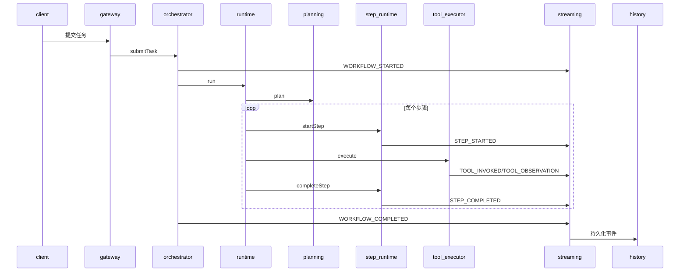
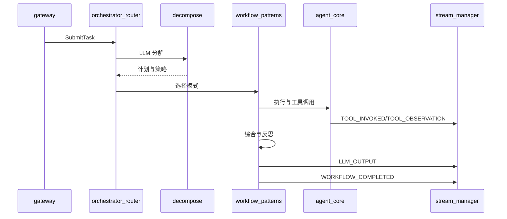
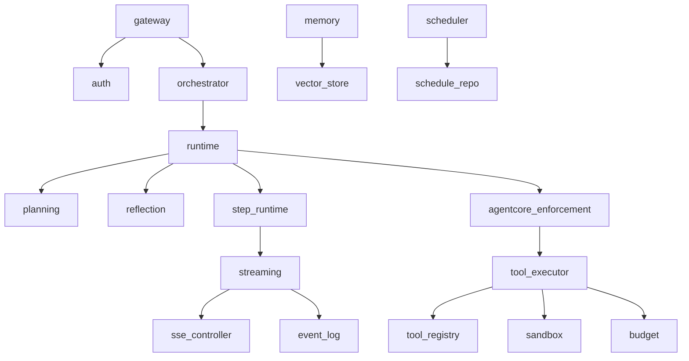

# Shannon 流程对齐分析报告
- 日期：2026-01-26
- 参考规范：`specs/001-agent-core-spec/spec.md`、`specs/001-agent-core-spec/contracts/openapi.yaml`、`specs/001-agent-core-spec/tasks.md`、`specs/001-agent-core-spec/quickstart.md`、`specs/001-agent-core-spec/checklists/checklist.md`
- 本项目代码：`src/main/java/com/example/agent/**`
- `Shannon` 参考：`vendor/Shannon/**`

## A. 端到端主链路时序

### A.1 主链路文字时序（本项目对照 `Shannon`）
1. 任务提交与鉴权：本项目由 `TaskController.submitTask` 调用 `AuthService.authenticate` 后进入 `TaskOrchestrator.submitTask`；`Shannon` 由 `TaskHandler.SubmitTask` 构造 `SubmitTaskRequest` 并通过 `OrchestratorService` 提交。  
   【本项目证据：`src/main/java/com/example/agent/gateway/controller/TaskController.java#submitTask`、`src/main/java/com/example/agent/orchestrator/TaskOrchestrator.java#submitTask`；`Shannon`证据：`vendor/Shannon/go/orchestrator/cmd/gateway/internal/handlers/task.go#SubmitTask`】
2. 编排启动与事件起点：本项目在 `TaskOrchestrator.createTask` 内创建 `workflowId` 并发布 `WORKFLOW_STARTED`；`Shannon` 在策略工作流中通过 `EmitTaskUpdate` 发出 `WORKFLOW_STARTED`。  
   【本项目证据：`src/main/java/com/example/agent/orchestrator/TaskOrchestrator.java#createTask`；`Shannon`证据：`vendor/Shannon/go/orchestrator/internal/workflows/strategies/dag.go#DAGWorkflow`、`vendor/Shannon/go/orchestrator/internal/activities/stream_events.go#EmitTaskUpdate`】
3. 规划与拆分：本项目由 `PlannerService.plan` 基于启发式生成 `StepRequest`；`Shannon` 通过 `DecomposeTask` 调用 `LLM` 服务生成分解与策略。  
   【本项目证据：`src/main/java/com/example/agent/planning/PlannerService.java#plan`；`Shannon`证据：`vendor/Shannon/go/orchestrator/internal/activities/decompose.go#DecomposeTask`】
4. 步骤执行：本项目由 `StepRuntimeService.startStep` 生成 `StepRecord` 并发布 `STEP_STARTED`，再由 `AgentRuntime` 驱动执行；`Shannon` 在 `DAGWorkflow` 中调用模式执行并产生多智能体执行结果。  
   【本项目证据：`src/main/java/com/example/agent/runtime/AgentRuntime.java#run`、`src/main/java/com/example/agent/runtime/StepRuntimeService.java#startStep`；`Shannon`证据：`vendor/Shannon/go/orchestrator/internal/workflows/strategies/dag.go#DAGWorkflow`】
5. 工具调用与观测：本项目通过 `EnforcementGateway.execute` 调用 `ToolExecutor.execute` 并发布 `TOOL_INVOKED`、`TOOL_OBSERVATION`；`Shannon` 在 `ExecuteAgent` 路径中通过工具选择与执行逻辑发布工具事件。  
   【本项目证据：`src/main/java/com/example/agent/agentcore/EnforcementGateway.java#execute`、`src/main/java/com/example/agent/agentcore/ToolExecutor.java#execute`；`Shannon`证据：`vendor/Shannon/go/orchestrator/internal/activities/agent.go#ExecuteAgent`、`vendor/Shannon/go/orchestrator/internal/activities/stream_events.go#StreamEventToolInvoked`】
6. 反思与重试：本项目在 `ReflectionService.reflect` 评分后由 `AgentRuntime` 触发重试或拆分；`Shannon` 使用 `ReflectOnResult` 进行质量评估并可重试综合。  
   【本项目证据：`src/main/java/com/example/agent/reflection/ReflectionService.java#reflect`、`src/main/java/com/example/agent/runtime/AgentRuntime.java#executeStep`；`Shannon`证据：`vendor/Shannon/go/orchestrator/internal/workflows/patterns/reflection.go#ReflectOnResult`】
7. 输出收敛与完成：本项目在 `TaskOrchestrator.handleWorkflowRoute` 中更新状态并发布 `WORKFLOW_COMPLETED`，但未生成 `LLM_OUTPUT` 事件或最终输出聚合；`Shannon` 在 `DAGWorkflow` 中执行综合并发出 `LLM_OUTPUT` 与 `WORKFLOW_COMPLETED`。  
   【本项目证据：`src/main/java/com/example/agent/orchestrator/TaskOrchestrator.java#handleWorkflowRoute`、`src/main/java/com/example/agent/domain/event/EventType.java`；`Shannon`证据：`vendor/Shannon/go/orchestrator/internal/workflows/strategies/dag.go#DAGWorkflow`、`vendor/Shannon/go/orchestrator/internal/activities/stream_events.go#StreamEventLLMOutput`】

### A.2 主链路时序图（`Mermaid`）

本项目主链路：

【本项目证据：`src/main/java/com/example/agent/orchestrator/TaskOrchestrator.java`、`src/main/java/com/example/agent/runtime/AgentRuntime.java`、`src/main/java/com/example/agent/streaming/EventStreamService.java`；`Shannon`证据：`vendor/Shannon/go/orchestrator/internal/workflows/strategies/dag.go`、`vendor/Shannon/docs/streaming-api.md`】

`Shannon` 主链路：

【本项目证据：`src/main/java/com/example/agent/runtime/AgentRuntime.java`、`src/main/java/com/example/agent/planning/PlannerService.java`；`Shannon`证据：`vendor/Shannon/go/orchestrator/internal/workflows/strategies/dag.go`、`vendor/Shannon/go/orchestrator/internal/activities/decompose.go`、`vendor/Shannon/go/orchestrator/internal/activities/agent.go`】

### A.3 闭环对齐结论
结论：本项目尚未具备与 `Shannon` 等价的 `planner→step→tool→observation→reflection/retry→finalize` 闭环。已具备 `planner`、`step`、`tool`、`reflection/retry` 的骨架，但缺少 `LLM` 规划、`LLM` 综合输出与 `LLM_*` 事件落盘，最终输出未形成与 `Shannon` 同级的结果收敛。  
【本项目证据：`src/main/java/com/example/agent/planning/PlannerService.java#plan`、`src/main/java/com/example/agent/reflection/ReflectionService.java#reflect`、`src/main/java/com/example/agent/domain/event/EventType.java`；`Shannon`证据：`vendor/Shannon/go/orchestrator/internal/activities/decompose.go#DecomposeTask`、`vendor/Shannon/go/orchestrator/internal/workflows/strategies/dag.go#DAGWorkflow`、`vendor/Shannon/go/orchestrator/internal/activities/stream_events.go#StreamEventLLMOutput`】

## B. 模块间调用与事件流转图

【本项目证据：`src/main/java/com/example/agent/orchestrator/TaskOrchestrator.java`、`src/main/java/com/example/agent/runtime/AgentRuntime.java`、`src/main/java/com/example/agent/streaming/EventStreamService.java`；`Shannon`证据：`vendor/Shannon/docs/agent-core-architecture.md`、`vendor/Shannon/docs/streaming-api.md`】

## C. 与 `Shannon` 的对齐点与差异点（逐模块）

### 1. `gateway`
- 对齐点：任务提交、状态查询与列表查询入口齐备，均以任务为主线返回 `taskId` 等标识。  
  【本项目证据：`src/main/java/com/example/agent/gateway/controller/TaskController.java#submitTask`、`src/main/java/com/example/agent/gateway/controller/TaskController.java#getTask`；`Shannon`证据：`vendor/Shannon/go/orchestrator/cmd/gateway/internal/handlers/task.go#SubmitTask`、`vendor/Shannon/go/orchestrator/cmd/gateway/internal/handlers/task.go#GetTaskStatus`】
- 差异点：本项目网关直接调用本地 `TaskSubmissionService`，而 `Shannon` 网关通过 `gRPC` 客户端调用编排器并在请求中注入 `TaskMetadata`。  
  【本项目证据：`src/main/java/com/example/agent/gateway/controller/TaskController.java#submitTask`；`Shannon`证据：`vendor/Shannon/go/orchestrator/cmd/gateway/internal/handlers/task.go#SubmitTask`】

### 2. `orchestrator`
- 对齐点：均在编排层创建工作流标识并发布 `WORKFLOW_STARTED/WORKFLOW_COMPLETED` 事件。  
  【本项目证据：`src/main/java/com/example/agent/orchestrator/TaskOrchestrator.java#createTask`、`src/main/java/com/example/agent/orchestrator/TaskOrchestrator.java#handleWorkflowRoute`；`Shannon`证据：`vendor/Shannon/go/orchestrator/internal/activities/stream_events.go#StreamEventWorkflowStarted`、`vendor/Shannon/go/orchestrator/internal/workflows/strategies/dag.go#DAGWorkflow`】
- 差异点：本项目编排在同进程同步执行，缺少 `Temporal` 工作流、模式选择与多智能体执行；`Shannon` 通过策略工作流与模式库编排。  
  【本项目证据：`src/main/java/com/example/agent/orchestrator/WorkflowRouter.java#route`、`src/main/java/com/example/agent/runtime/AgentRuntime.java#run`；`Shannon`证据：`vendor/Shannon/go/orchestrator/internal/workflows/strategies/dag.go#DAGWorkflow`、`vendor/Shannon/docs/multi-agent-workflow-architecture.md`】

### 3. `streaming`
- 对齐点：均支持 `SSE` 订阅、类型过滤与断线续传游标校验。  
  【本项目证据：`src/main/java/com/example/agent/streaming/SseStreamController.java#stream`、`src/main/java/com/example/agent/streaming/EventStreamService.java#stream`；`Shannon`证据：`vendor/Shannon/docs/streaming-api.md`】
- 差异点：本项目仅实现 `SSE`，事件 `id` 固定为 `workflowId:seq`；`Shannon` 额外支持 `WebSocket` 与 `gRPC`，并以 `stream_id` 或 `seq` 作为续传基准。  
  【本项目证据：`src/main/java/com/example/agent/streaming/SseStreamController.java#stream`；`Shannon`证据：`vendor/Shannon/docs/streaming-api.md`】

### 4. `history` 与 `timeline`
- 对齐点：均提供事件持久化与事件查询接口。  
  【本项目证据：`src/main/java/com/example/agent/history/EventLogService.java#onStreamEvent`、`src/main/java/com/example/agent/gateway/controller/TimelineController.java#listEvents`；`Shannon`证据：`vendor/Shannon/docs/task-history-and-timeline.md`、`vendor/Shannon/go/orchestrator/cmd/gateway/internal/handlers/task.go#GetTaskEvents`】
- 差异点：本项目时间线仅基于事件摘要或步骤记录生成，缺少 `Temporal` 决定性历史与 `persist` 异步落盘语义；`Shannon` 时间线基于工作流历史构建并支持 `summary/full` 与 `persist`。  
  【本项目证据：`src/main/java/com/example/agent/history/TimelineService.java#getTimeline`、`src/main/java/com/example/agent/runtime/StepRuntimeService.java#listSteps`；`Shannon`证据：`vendor/Shannon/docs/task-history-and-timeline.md`】

### 5. `memory system`
- 对齐点：本项目支持记忆存取、向量检索与降级检索；`Shannon` 亦以 `PostgreSQL`、`Redis`、`Qdrant` 进行分层存储。  
  【本项目证据：`src/main/java/com/example/agent/memory/MemoryStore.java#save`、`src/main/java/com/example/agent/memory/MemoryStore.java#search`；`Shannon`证据：`vendor/Shannon/docs/memory-system-architecture.md`】
- 差异点：本项目缺少层次化记忆、压缩触发与嵌入提供者约束；`Shannon` 定义了层次化检索、压缩与嵌入模型依赖。  
  【本项目证据：`src/main/java/com/example/agent/memory/MemoryStore.java#compress`；`Shannon`证据：`vendor/Shannon/docs/memory-system-architecture.md`】

### 6. `scheduled tasks`
- 对齐点：本项目具备调度创建、暂停、恢复与执行历史记录接口结构；`Shannon` 亦提供同类 `API`。  
  【本项目证据：`src/main/java/com/example/agent/gateway/controller/ScheduleController.java`、`src/main/java/com/example/agent/scheduler/ScheduleManager.java`；`Shannon`证据：`vendor/Shannon/docs/scheduled-tasks.md`】
- 差异点：本项目未接入 `Temporal` 调度执行与资源限制；`Shannon` 通过 `Temporal Schedule API` 实现真实调度与执行历史。  
  【本项目证据：`src/main/java/com/example/agent/scheduler/ScheduleManager.java#recordExecution`；`Shannon`证据：`vendor/Shannon/docs/scheduled-tasks.md`】

### 7. `authentication & multitenancy`
- 对齐点：本项目在过滤器中校验租户并记录 `TENANT_MISSING`，`Shannon` 亦强调多租户隔离。  
  【本项目证据：`src/main/java/com/example/agent/auth/TenantContextFilter.java#filter`；`Shannon`证据：`vendor/Shannon/docs/authentication-and-multitenancy.md`】
- 差异点：本项目基于配置的 `API Key` 与请求头推导租户，缺少 `JWT`、角色与数据库隔离；`Shannon` 提供完整认证、租户与角色体系。  
  【本项目证据：`src/main/java/com/example/agent/auth/ApiKeyAuthenticator.java#authenticate`；`Shannon`证据：`vendor/Shannon/docs/authentication-and-multitenancy.md`】

### 8. `token budget tracking`
- 对齐点：本项目有 `TokenBudgetManager` 与 `TokenUsageRepository` 并可触发 `BUDGET_THRESHOLD` 事件；`Shannon` 亦有预算记录与阈值事件。  
  【本项目证据：`src/main/java/com/example/agent/budget/TokenBudgetManager.java#recordUsage`、`src/main/java/com/example/agent/domain/event/EventType.java`；`Shannon`证据：`vendor/Shannon/docs/token-budget-tracking.md`】
- 差异点：本项目以字符串长度近似 `token`，仅在工具调用侧记录；`Shannon` 以模型真实用量、预算活动与模式级记录实现全链路计量。  
  【本项目证据：`src/main/java/com/example/agent/agentcore/ToolExecutor.java#recordUsage`；`Shannon`证据：`vendor/Shannon/docs/token-budget-tracking.md`、`vendor/Shannon/go/orchestrator/internal/activities/budget.go#ExecuteAgentWithBudget`】

### 9. `observability`
- 对齐点：本项目提供指标发布器并在关键流程计数；`Shannon` 亦强调指标与追踪。  
  【本项目证据：`src/main/java/com/example/agent/observability/MetricsPublisher.java`；`Shannon`证据：`vendor/Shannon/docs/agent-core-architecture.md`】
- 差异点：本项目未实现链路追踪与详细指标分类；`Shannon` 提供 `OpenTelemetry` 与 `Prometheus` 指标体系。  
  【本项目证据：`src/main/java/com/example/agent/observability/MetricsPublisher.java`；`Shannon`证据：`vendor/Shannon/docs/agent-core-architecture.md`】

### 10. `runtime`
- 对齐点：本项目实现 `Step` 状态流转与重试策略；`Shannon` 也包含步骤执行与重试控制。  
  【本项目证据：`src/main/java/com/example/agent/runtime/StepRuntimeService.java`、`src/main/java/com/example/agent/runtime/RetryPolicy.java`；`Shannon`证据：`vendor/Shannon/go/orchestrator/internal/workflows/strategies/dag.go`】
- 差异点：本项目运行时未实现 `ReAct` 等模式与 `Temporal` 决定性执行，且缺少 `AGENT_STARTED/AGENT_COMPLETED` 事件发射；`Shannon` 通过模式库与事件模型体现运行时阶段。  
  【本项目证据：`src/main/java/com/example/agent/domain/event/EventType.java`、`src/main/java/com/example/agent/runtime/AgentRuntime.java`；`Shannon`证据：`vendor/Shannon/docs/event-types.md`、`vendor/Shannon/go/orchestrator/internal/activities/stream_events.go`】

### 11. `planning`
- 对齐点：本项目具有规划入口并发布 `PLAN_GENERATED`；`Shannon` 也在规划阶段产生 `PROGRESS` 与分解输出。  
  【本项目证据：`src/main/java/com/example/agent/planning/PlannerService.java#plan`、`src/main/java/com/example/agent/domain/event/EventType.java`；`Shannon`证据：`vendor/Shannon/go/orchestrator/internal/activities/decompose.go#DecomposeTask`、`vendor/Shannon/docs/event-types.md`】
- 差异点：本项目规划逻辑为启发式且固定 `TOOL` 步骤；`Shannon` 使用 `LLM` 分解、依赖与策略字段支持多智能体模式。  
  【本项目证据：`src/main/java/com/example/agent/planning/PlannerService.java#plan`；`Shannon`证据：`vendor/Shannon/go/orchestrator/internal/activities/decompose.go#DecomposeTask`】

### 12. `reflection`
- 对齐点：本项目具备反思模块并可触发重试；`Shannon` 具备反思模式并支持质量门控。  
  【本项目证据：`src/main/java/com/example/agent/reflection/ReflectionService.java#reflect`；`Shannon`证据：`vendor/Shannon/go/orchestrator/internal/workflows/patterns/reflection.go#ReflectOnResult`】
- 差异点：本项目反思为启发式评分且未与 `LLM` 综合耦合；`Shannon` 通过 `EvaluateResult` 与 `SynthesizeResultsLLM` 迭代优化输出。  
  【本项目证据：`src/main/java/com/example/agent/reflection/ReflectionService.java#evaluate`；`Shannon`证据：`vendor/Shannon/go/orchestrator/internal/workflows/patterns/reflection.go#ReflectOnResult`】

### 13. `tools`
- 对齐点：本项目实现工具注册、缓存与执行入口；`Shannon` 亦提供工具注册表、缓存与执行层。  
  【本项目证据：`src/main/java/com/example/agent/agentcore/ToolRegistry.java`、`src/main/java/com/example/agent/agentcore/ToolCache.java`；`Shannon`证据：`vendor/Shannon/docs/agent-core-architecture.md`】
- 差异点：本项目 `MCP` 客户端仅调用本地 `ToolRegistry`，缺少工具选择与远端执行；`Shannon` 通过 `LLM` 工具选择与 `agent-core` 执行并输出工具事件。  
  【本项目证据：`src/main/java/com/example/agent/tools/McpToolClient.java#callTool`；`Shannon`证据：`vendor/Shannon/go/orchestrator/internal/activities/agent.go#ExecuteAgent`】

### 14. `multi-agent`
- 对齐点：本项目定义了多智能体相关类型与事件枚举；`Shannon` 具备完整的多智能体工作流与事件类型。  
  【本项目证据：`src/main/java/com/example/agent/multiagent/MultiAgentCoordinator.java`、`src/main/java/com/example/agent/domain/event/EventType.java`；`Shannon`证据：`vendor/Shannon/docs/multi-agent-workflow-architecture.md`、`vendor/Shannon/docs/event-types.md`】
- 差异点：本项目协调器为空壳，未实现 `DAG`、`Supervisor` 或 `Handoff` 编排；`Shannon` 通过策略与模式库完成多智能体编排。  
  【本项目证据：`src/main/java/com/example/agent/multiagent/MultiAgentCoordinator.java#coordinate`；`Shannon`证据：`vendor/Shannon/docs/multi-agent-workflow-architecture.md`】

### 15. `reasoning`
- 对齐点：本项目提供 `ThoughtTreeService` 与 `DebateCoordinator` 类型；`Shannon` 提供 `Tree-of-Thoughts` 与 `Debate` 模式。  
  【本项目证据：`src/main/java/com/example/agent/reasoning/ThoughtTreeService.java`、`src/main/java/com/example/agent/reasoning/DebateCoordinator.java`；`Shannon`证据：`vendor/Shannon/docs/multi-agent-workflow-architecture.md`】
- 差异点：本项目推理为规则生成且未接入工作流；`Shannon` 在策略工作流中组合推理模式并结合 `LLM`。  
  【本项目证据：`src/main/java/com/example/agent/reasoning/ThoughtTreeService.java#buildTree`；`Shannon`证据：`vendor/Shannon/docs/multi-agent-workflow-architecture.md`】

### 16. `governance`
- 对齐点：本项目提供限流与熔断组件，并在工具调用侧接入；`Shannon` 在执行层包含限流与熔断。  
  【本项目证据：`src/main/java/com/example/agent/governance/RateLimitService.java`、`src/main/java/com/example/agent/tools/McpToolClient.java#callTool`；`Shannon`证据：`vendor/Shannon/docs/agent-core-architecture.md`】
- 差异点：本项目回放基于事件与步骤记录，缺少 `Temporal` 决定性回放与流式重放；`Shannon` 提供工作流回放与流式重放工具。  
  【本项目证据：`src/main/java/com/example/agent/governance/ReplayService.java#replay`；`Shannon`证据：`vendor/Shannon/go/orchestrator/tools/replay/main.go`、`vendor/Shannon/go/orchestrator/internal/streaming/manager.go#ReplaySince`】

### 17. `enterprise`
- 对齐点：本项目具备策略评估与沙箱执行入口；`Shannon` 亦强调 `OPA` 与 `WASI` 安全体系。  
  【本项目证据：`src/main/java/com/example/agent/policy/PolicyEngine.java#evaluate`、`src/main/java/com/example/agent/sandbox/WasiSandboxExecutor.java#execute`；`Shannon`证据：`vendor/Shannon/docs/agent-core-architecture.md`、`vendor/Shannon/docs/adding-custom-tools.md`】
- 差异点：本项目策略与沙箱仅为规则与阻断名单，未接入 `OPA` 与真实 `WASI` 运行时；`Shannon` 具备 `WASI` 沙箱隔离与策略接入说明。  
  【本项目证据：`src/main/java/com/example/agent/policy/PolicyEngine.java#evaluate`、`src/main/java/com/example/agent/sandbox/WasiSandboxExecutor.java#execute`；`Shannon`证据：`vendor/Shannon/docs/agent-core-architecture.md`】

## D. 缺口清单（按优先级）
| 编号 | 优先级 | 缺口描述 | 涉及模块 | 证据 |
| --- | --- | --- | --- | --- |
| G-001 | `P0` | 缺少 `LLM` 执行与最终输出收敛，未产生 `LLM_OUTPUT` 事件与结果聚合 | `runtime`、`orchestrator`、`streaming` | 本项目：`src/main/java/com/example/agent/domain/event/EventType.java`、`src/main/java/com/example/agent/orchestrator/TaskOrchestrator.java#handleWorkflowRoute`；`Shannon`：`vendor/Shannon/go/orchestrator/internal/workflows/strategies/dag.go#DAGWorkflow`、`vendor/Shannon/go/orchestrator/internal/activities/stream_events.go#StreamEventLLMOutput` |
| G-002 | `P0` | 规划与反思仅启发式，缺少 `LLM` 分解与反思闭环 | `planning`、`reflection`、`runtime` | 本项目：`src/main/java/com/example/agent/planning/PlannerService.java#plan`、`src/main/java/com/example/agent/reflection/ReflectionService.java#reflect`；`Shannon`：`vendor/Shannon/go/orchestrator/internal/activities/decompose.go#DecomposeTask`、`vendor/Shannon/go/orchestrator/internal/workflows/patterns/reflection.go#ReflectOnResult` |
| G-003 | `P0` | 工具执行链路与 `MCP` 行为不一致，缺少工具选择、远端执行与工具事件一致性 | `tools`、`agentcore`、`streaming` | 本项目：`src/main/java/com/example/agent/tools/McpToolClient.java#callTool`、`src/main/java/com/example/agent/agentcore/ToolRegistry.java#execute`；`Shannon`：`vendor/Shannon/go/orchestrator/internal/activities/agent.go#ExecuteAgent` |
| G-004 | `P1` | 多智能体与推理/研究模块为空壳，未形成可执行模式 | `multi-agent`、`reasoning`、`research` | 本项目：`src/main/java/com/example/agent/multiagent/MultiAgentCoordinator.java#coordinate`、`src/main/java/com/example/agent/research/ResearchPipeline.java#run`；`Shannon`：`vendor/Shannon/docs/multi-agent-workflow-architecture.md` |
| G-005 | `P1` | 时间线与回放缺少 `Temporal` 决定性历史与重放能力 | `history`、`governance` | 本项目：`src/main/java/com/example/agent/history/TimelineService.java#getTimeline`、`src/main/java/com/example/agent/governance/ReplayService.java#replay`；`Shannon`：`vendor/Shannon/docs/task-history-and-timeline.md`、`vendor/Shannon/go/orchestrator/tools/replay/main.go` |
| G-006 | `P1` | 调度未接入真实调度引擎与执行历史联动 | `scheduler` | 本项目：`src/main/java/com/example/agent/scheduler/ScheduleManager.java`；`Shannon`：`vendor/Shannon/docs/scheduled-tasks.md` |
| G-007 | `P1` | 鉴权与租户隔离缺少 `JWT`、角色与数据库隔离 | `auth` | 本项目：`src/main/java/com/example/agent/auth/ApiKeyAuthenticator.java#authenticate`、`src/main/java/com/example/agent/auth/TenantContextFilter.java#filter`；`Shannon`：`vendor/Shannon/docs/authentication-and-multitenancy.md` |
| G-008 | `P2` | 观测缺少链路追踪与完整指标体系 | `observability` | 本项目：`src/main/java/com/example/agent/observability/MetricsPublisher.java`；`Shannon`：`vendor/Shannon/docs/agent-core-architecture.md` |
| G-009 | `P2` | 记忆系统缺少层次化检索与压缩触发策略 | `memory` | 本项目：`src/main/java/com/example/agent/memory/MemoryStore.java#search`、`src/main/java/com/example/agent/memory/MemoryStore.java#compress`；`Shannon`：`vendor/Shannon/docs/memory-system-architecture.md` |
| G-010 | `P2` | 预算计量缺少真实 `token` 用量与成本模型 | `budget` | 本项目：`src/main/java/com/example/agent/agentcore/ToolExecutor.java#recordUsage`；`Shannon`：`vendor/Shannon/docs/token-budget-tracking.md` |

## E. 证据引用总表
| 模块 | 本项目证据 | `Shannon`证据 |
| --- | --- | --- |
| `gateway` | `src/main/java/com/example/agent/gateway/controller/TaskController.java#submitTask` | `vendor/Shannon/go/orchestrator/cmd/gateway/internal/handlers/task.go#SubmitTask` |
| `orchestrator` | `src/main/java/com/example/agent/orchestrator/TaskOrchestrator.java#handleWorkflowRoute` | `vendor/Shannon/go/orchestrator/internal/workflows/strategies/dag.go#DAGWorkflow` |
| `streaming` | `src/main/java/com/example/agent/streaming/SseStreamController.java#stream` | `vendor/Shannon/docs/streaming-api.md` |
| `history` | `src/main/java/com/example/agent/history/EventLogService.java#onStreamEvent` | `vendor/Shannon/docs/task-history-and-timeline.md` |
| `memory` | `src/main/java/com/example/agent/memory/MemoryStore.java#search` | `vendor/Shannon/docs/memory-system-architecture.md` |
| `scheduled tasks` | `src/main/java/com/example/agent/scheduler/ScheduleManager.java` | `vendor/Shannon/docs/scheduled-tasks.md` |
| `authentication & multitenancy` | `src/main/java/com/example/agent/auth/ApiKeyAuthenticator.java#authenticate` | `vendor/Shannon/docs/authentication-and-multitenancy.md` |
| `token budget tracking` | `src/main/java/com/example/agent/budget/TokenBudgetManager.java#recordUsage` | `vendor/Shannon/docs/token-budget-tracking.md` |
| `observability` | `src/main/java/com/example/agent/observability/MetricsPublisher.java` | `vendor/Shannon/docs/agent-core-architecture.md` |
| `runtime` | `src/main/java/com/example/agent/runtime/AgentRuntime.java#run` | `vendor/Shannon/go/orchestrator/internal/workflows/strategies/dag.go#DAGWorkflow` |
| `planning` | `src/main/java/com/example/agent/planning/PlannerService.java#plan` | `vendor/Shannon/go/orchestrator/internal/activities/decompose.go#DecomposeTask` |
| `reflection` | `src/main/java/com/example/agent/reflection/ReflectionService.java#reflect` | `vendor/Shannon/go/orchestrator/internal/workflows/patterns/reflection.go#ReflectOnResult` |
| `tools` | `src/main/java/com/example/agent/agentcore/ToolExecutor.java#execute` | `vendor/Shannon/go/orchestrator/internal/activities/agent.go#ExecuteAgent` |
| `multi-agent` | `src/main/java/com/example/agent/multiagent/MultiAgentCoordinator.java#coordinate` | `vendor/Shannon/docs/multi-agent-workflow-architecture.md` |
| `reasoning` | `src/main/java/com/example/agent/reasoning/ThoughtTreeService.java#buildTree` | `vendor/Shannon/docs/multi-agent-workflow-architecture.md` |
| `governance` | `src/main/java/com/example/agent/governance/ReplayService.java#replay` | `vendor/Shannon/go/orchestrator/tools/replay/main.go` |
| `enterprise` | `src/main/java/com/example/agent/sandbox/WasiSandboxExecutor.java#execute` | `vendor/Shannon/docs/agent-core-architecture.md` |

## F. 修复计划（按缺口编号）

### G-001（`P0`）
- 改动范围：补齐 `LLM` 调用链路、`LLM_OUTPUT` 事件、最终输出聚合与落盘。  
  【依据：`src/main/java/com/example/agent/domain/event/EventType.java`；`vendor/Shannon/go/orchestrator/internal/activities/stream_events.go#StreamEventLLMOutput`】
- 影响接口：`/api/v1/tasks`、`/api/v1/tasks/{taskId}`、`/api/v1/stream/sse`。  
  【依据：`src/main/java/com/example/agent/gateway/controller/TaskController.java`；`vendor/Shannon/docs/streaming-api.md`】
- 需要补的测试：`quickstart.md` 中任务提交、`SSE` 订阅与 `LLM_OUTPUT` 事件校验的集成测试。  
  【依据：`specs/001-agent-core-spec/quickstart.md`；`vendor/Shannon/docs/event-types.md`】
- 验收方式：关联 `quickstart.md` 第 `1`、`2`、`5` 步；`checklist.md` 的 `CHK006`、`CHK017`、`CHK021`。  
  【依据：`specs/001-agent-core-spec/quickstart.md`、`specs/001-agent-core-spec/checklists/checklist.md`】

### G-002（`P0`）
- 改动范围：规划与反思对齐 `LLM` 分解、反思评估与再综合；引入 `plan`、`reflection` 的可配置策略。  
  【依据：`src/main/java/com/example/agent/planning/PlannerService.java#plan`；`vendor/Shannon/go/orchestrator/internal/activities/decompose.go#DecomposeTask`】
- 影响接口：`/api/v1/tasks` 入参 `context` 与执行策略字段；`/api/v1/stream/sse` 的 `PROGRESS`、`PLAN_*`、`REFLECTION_*` 事件。  
  【依据：`src/main/java/com/example/agent/domain/event/EventType.java`；`vendor/Shannon/docs/event-types.md`】
- 需要补的测试：规划事件、反思重试与 `retry/decompose` 分支的集成测试。  
  【依据：`specs/001-agent-core-spec/quickstart.md`；`vendor/Shannon/docs/multi-agent-workflow-architecture.md`】
- 验收方式：关联 `quickstart.md` 第 `1`、`5` 步；`checklist.md` 的 `CHK006`、`CHK017`。  
  【依据：`specs/001-agent-core-spec/quickstart.md`、`specs/001-agent-core-spec/checklists/checklist.md`】

### G-003（`P0`）
- 改动范围：对齐 `MCP` 工具选择、执行与事件语义，补齐 `TOOL_INVOKED/TOOL_OBSERVATION/TOOL_ERROR` 与 `HOOK_*` 行为。  
  【依据：`src/main/java/com/example/agent/agentcore/ToolExecutor.java#execute`、`src/main/java/com/example/agent/tools/McpToolClient.java#callTool`；`vendor/Shannon/go/orchestrator/internal/activities/agent.go#ExecuteAgent`】
- 影响接口：`/api/v1/mcp/tools/list`、`/api/v1/mcp/tools/call`、`/api/v1/stream/sse`。  
  【依据：`src/main/java/com/example/agent/gateway/controller/McpController.java`；`vendor/Shannon/docs/streaming-api.md`】
- 需要补的测试：工具列表、工具调用成功与失败、`HOOK_BLOCKED` 与 `MCP_UNAVAILABLE`。  
  【依据：`specs/001-agent-core-spec/quickstart.md`、`specs/001-agent-core-spec/checklists/checklist.md`】
- 验收方式：关联 `quickstart.md` 第 `4`、`5` 步；`checklist.md` 的 `CHK048`、`CHK052`。  
  【依据：`specs/001-agent-core-spec/quickstart.md`、`specs/001-agent-core-spec/checklists/checklist.md`】

### G-004（`P1`）
- 改动范围：补齐多智能体与推理模式的执行入口与事件流。  
  【依据：`src/main/java/com/example/agent/multiagent/MultiAgentCoordinator.java#coordinate`；`vendor/Shannon/docs/multi-agent-workflow-architecture.md`】
- 影响接口：`/api/v1/tasks` 的 `context` 模式选择与 `SSE` 事件类型。  
  【依据：`src/main/java/com/example/agent/domain/event/EventType.java`；`vendor/Shannon/docs/event-types.md`】
- 需要补的测试：多智能体模式下 `TEAM_RECRUITED/ROLE_ASSIGNED` 事件与结果汇总测试。  
  【依据：`specs/001-agent-core-spec/quickstart.md`；`vendor/Shannon/docs/event-types.md`】
- 验收方式：关联 `checklist.md` 的 `CHK006`、`CHK017`、`CHK021`。  
  【依据：`specs/001-agent-core-spec/checklists/checklist.md`】

### G-005（`P1`）
- 改动范围：构建基于决定性历史的时间线与回放，并支持事件重放。  
  【依据：`src/main/java/com/example/agent/history/TimelineService.java#getTimeline`；`vendor/Shannon/docs/task-history-and-timeline.md`】
- 影响接口：`/api/v1/timeline`、`/api/v1/replay`。  
  【依据：`src/main/java/com/example/agent/gateway/controller/TimelineController.java`、`src/main/java/com/example/agent/gateway/controller/ReplayController.java`；`vendor/Shannon/docs/task-history-and-timeline.md`】
- 需要补的测试：时间线 `summary/full`、回放不存在与成功场景测试。  
  【依据：`specs/001-agent-core-spec/quickstart.md`】
- 验收方式：关联 `quickstart.md` 第 `3`、`7` 步；`checklist.md` 的 `CHK051`。  
  【依据：`specs/001-agent-core-spec/quickstart.md`、`specs/001-agent-core-spec/checklists/checklist.md`】

### G-006（`P1`）
- 改动范围：接入真实调度引擎与执行历史写入。  
  【依据：`src/main/java/com/example/agent/scheduler/ScheduleManager.java`；`vendor/Shannon/docs/scheduled-tasks.md`】
- 影响接口：`/api/v1/schedules`、`/api/v1/schedules/{scheduleId}/pause`、`/api/v1/schedules/{scheduleId}/resume`。  
  【依据：`src/main/java/com/example/agent/gateway/controller/ScheduleController.java`；`vendor/Shannon/docs/scheduled-tasks.md`】
- 需要补的测试：调度创建、暂停、恢复与执行记录写入测试。  
  【依据：`specs/001-agent-core-spec/spec.md`】
- 验收方式：关联 `checklist.md` 的 `CHK007`、`CHK013`。  
  【依据：`specs/001-agent-core-spec/checklists/checklist.md`】

### G-007（`P1`）
- 改动范围：完善 `JWT` 与租户隔离、角色与持久化认证。  
  【依据：`src/main/java/com/example/agent/auth/ApiKeyAuthenticator.java#authenticate`；`vendor/Shannon/docs/authentication-and-multitenancy.md`】
- 影响接口：所有受鉴权接口与 `SSE`。  
  【依据：`src/main/java/com/example/agent/auth/TenantContextFilter.java#filter`；`vendor/Shannon/docs/authentication-and-multitenancy.md`】
- 需要补的测试：租户缺失、鉴权失败、跨租户访问与日志字段校验。  
  【依据：`specs/001-agent-core-spec/checklists/checklist.md`】
- 验收方式：关联 `checklist.md` 的 `CHK046`、`CHK047`、`CHK040`、`CHK042`。  
  【依据：`specs/001-agent-core-spec/checklists/checklist.md`】

### G-008（`P2`）
- 改动范围：补齐链路追踪与指标体系。  
  【依据：`src/main/java/com/example/agent/observability/MetricsPublisher.java`；`vendor/Shannon/docs/agent-core-architecture.md`】
- 影响接口：无新增接口，影响运行时可观测数据。  
  【依据：`src/main/java/com/example/agent/observability/MetricsPublisher.java`；`vendor/Shannon/docs/agent-core-architecture.md`】
- 需要补的测试：指标与追踪标签一致性验证。  
  【依据：`specs/001-agent-core-spec/spec.md`】
- 验收方式：关联 `checklist.md` 的 `CHK028`。  
  【依据：`specs/001-agent-core-spec/checklists/checklist.md`】

### G-009（`P2`）
- 改动范围：补齐层次化记忆检索与压缩策略，完善向量检索降级策略。  
  【依据：`src/main/java/com/example/agent/memory/MemoryStore.java#search`；`vendor/Shannon/docs/memory-system-architecture.md`】
- 影响接口：`/api/v1/memory/search`、`/api/v1/memory/compress`。  
  【依据：`src/main/java/com/example/agent/gateway/controller/MemoryController.java`；`vendor/Shannon/docs/memory-system-architecture.md`】
- 需要补的测试：向量检索与压缩降级测试。  
  【依据：`specs/001-agent-core-spec/spec.md`】
- 验收方式：关联 `checklist.md` 的 `CHK026`、`CHK009`。  
  【依据：`specs/001-agent-core-spec/checklists/checklist.md`】

### G-010（`P2`）
- 改动范围：对齐真实 `token` 用量与成本计算，完善 `usageId` 与模型字段。  
  【依据：`src/main/java/com/example/agent/agentcore/ToolExecutor.java#recordUsage`；`vendor/Shannon/docs/token-budget-tracking.md`】
- 影响接口：`/api/v1/budget/summary`、`/api/v1/tasks/{taskId}`。  
  【依据：`src/main/java/com/example/agent/gateway/controller/BudgetController.java#summary`；`vendor/Shannon/docs/task-history-and-timeline.md`】
- 需要补的测试：预算汇总一致性测试。  
  【依据：`specs/001-agent-core-spec/spec.md`】
- 验收方式：关联 `checklist.md` 的 `CHK011`、`CHK023`。  
  【依据：`specs/001-agent-core-spec/checklists/checklist.md`】