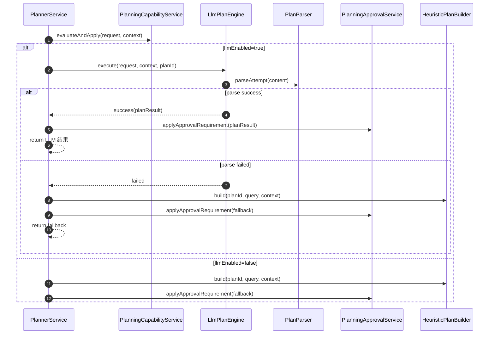

# planning 架构与扩展说明

## 1. 文档目标

- 面向新增成员快速理解 `planning` 包分层设计与关键职责。
- 给出一次标准策略扩展步骤，避免依赖历史实现知识。
- 明确主链路时序与可观测埋点位置，降低定位成本。

## 2. 包分层与依赖方向

`planning` 包遵循“编排层 -> 能力层/引擎层 -> 构建层/策略层 -> 解析层/遥测层/诊断层”单向依赖。

```text
PlannerService（编排）
  ├─ capability/PlanningCapabilityService（能力评估映射）
  ├─ approval/PlanningApprovalService（审批策略打标）
  ├─ engine/LlmPlanEngine（模型规划与修复）
  └─ builder/HeuristicPlanBuilder（规则回退构建）

LlmPlanEngine
  ├─ PlanningPromptBuilder（模板渲染）
  ├─ parser/PlanParser（结构化解析）
  ├─ telemetry/PlanTelemetry（链路观测）
  └─ JsonOutputRepairService（修复，不改业务语义）

strategy/PlanningStrategyRegistry
  └─ handlers/*（场景策略，按 order 调度）
```

### 2.1 关键约束

- `PlannerService` 仅负责流程编排，不承载规则细节与解析细节。
- `strategy` 子包禁止依赖 `engine/telemetry/approval/capability`。
- 解析失败类型统一来自 `PlanParseErrorTypes`，避免观测口径分裂。

## 3. 核心类职责

### 3.1 编排层

- `PlannerService`：组织“上下文映射 -> 能力评估 -> LLM 规划 -> 规则回退”，输出 `PlanResult`。
- `PlannerProperties`：控制 `llmEnabled/fallbackEnabled`，不携带业务分支语义。

### 3.2 能力与审批层

- `PlanningCapabilityService`：承接能力评估输入映射与推荐策略回写。
- `PlanningRecommendationMapper`：把评估建议转成 planning 上下文字段。
- `PlanningApprovalService`：统一注入 `requiresApproval/approvalSource` 到步骤策略。

### 3.3 引擎与解析层

- `LlmPlanEngine`：执行模型调用、修复、解析与 trace，输出 `LlmPlanEngineResult`。
- `PlanParser`：解析模型 JSON 到 `PlanParseAttemptResult`，失败类型显式化。
- `PlanParseErrorTypes`：解析错误词典，供 trace 和日志统一引用。

### 3.4 策略与构建层

- `PlanningStrategyRegistry`：按 `order` 排序执行策略，校验优先级冲突。
- `PlanningStrategyContext`：策略执行上下文，提供只读视图与受控追加接口。
- `HeuristicPlanBuilder`：规则回退规划，保证在 LLM 失败场景可产出步骤。

### 3.5 遥测与诊断层

- `PlanTelemetry`：封装规划阶段遥测入口（prompt trace、上下文事件）。
- `PlanningPromptTraceService`：专注 trace 组装与上报。
- `PlanningDiagnosticsSnapshotBuilder`：仅用于测试与诊断，主链路不依赖。

## 4. 主链路时序图



## 5. 策略扩展标准流程

### 5.1 新增策略处理器

1. 在 `strategy/handlers` 新建处理器，继承统一抽象基类。
2. 在 `PlanningStrategyOrders` 分配唯一 `order` 常量。
3. 在 `matches` 只判断命中条件，在 `handle` 只处理本策略步骤生成。
4. 使用 `PlanningStrategyContext.appendStep/appendDependency` 回写结果。

### 5.2 新增策略验收

- 增加处理器单测：命中、未命中、终止场景。
- 增加注册顺序测试：随机注册顺序下执行稳定。
- 执行全量回归：`mvn -q test`。

## 6. 观测建议

- `info`：规划开始/结束、策略终止、回退触发。
- `debug`：阶段耗时（context、evaluate、llm、fallback、parse、repair）。
- `warn`：可修复异常（解析失败、trace 构建失败、空模型输出）。
- `error`：不可恢复错误（策略冲突、核心依赖异常）。

## 7. 结论

- 当前 `planning` 架构已经形成稳定分层与清晰扩展入口。
- 后续迭代建议保持“新增能力下沉到子服务、编排层不扩胖”原则。
- 新增策略可在不改主链路行为前提下独立交付和回归验证。

