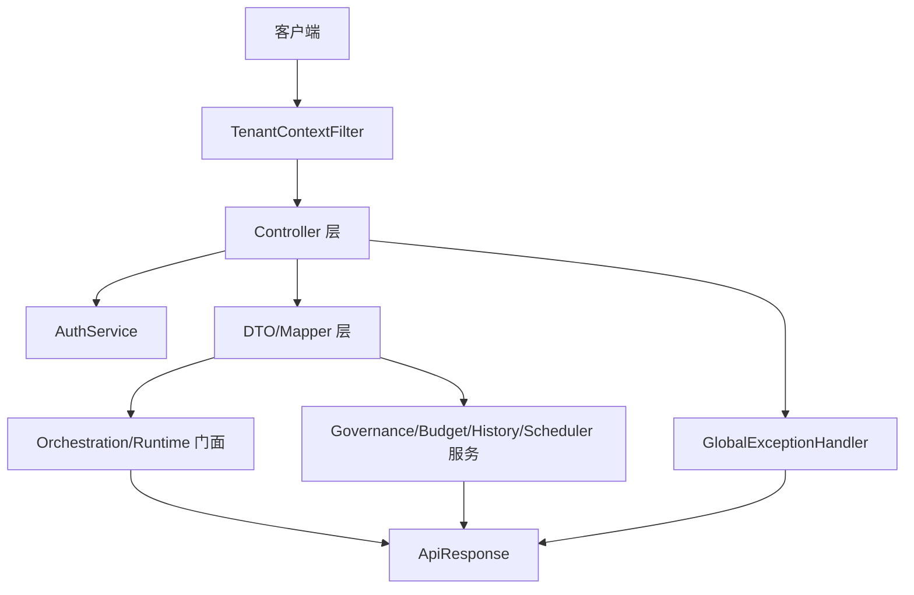
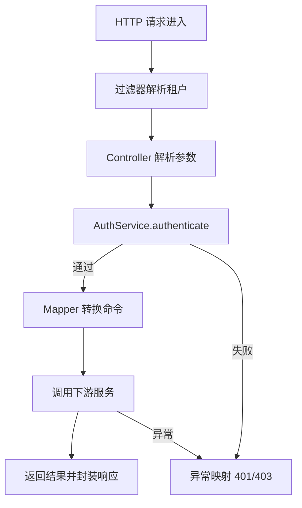
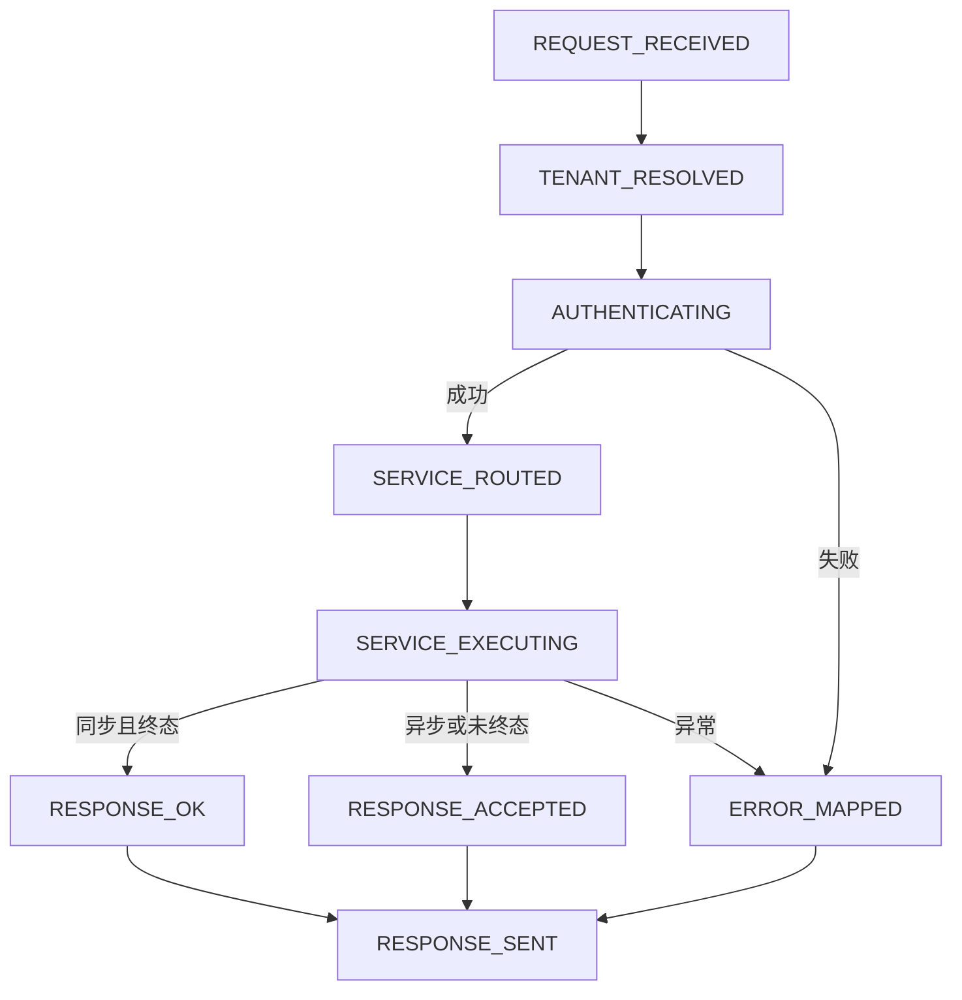
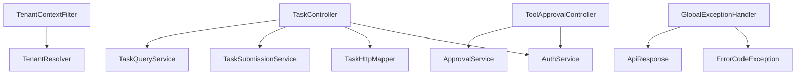

# `api` 包系统设计说明

## 1. 包定位与核心功能
- 包定位：`api` 是系统统一接入层，负责协议适配、鉴权协作、租户上下文注入和统一响应封装。
- 核心功能：
  - 提供任务、审批、预算、回放、时间线、调度、流式等 HTTP 接口。
  - 通过 `TenantContextFilter` + `TenantResolver` 落地多租户上下文。
  - 通过 `AuthService` 统一 API Key/JWT/可信上游鉴权。
  - 通过 Mapper 将 DTO 与领域命令解耦。
  - 通过全局异常处理器统一错误语义。

## 2. 分层线框图

## 3. 关键流程图

## 4. 状态流转图

## 5. 类职责与设计原因
- `TenantContextFilter`：统一租户上下文注入，避免控制器重复处理。
- `TaskController` 等控制器：仅负责协议层编排，保持领域逻辑下沉。
- `TaskHttpMapper`：集中转换规则，减少字段漂移。
- `GlobalExceptionHandler`：统一错误码与状态码映射。
- `ApiResponse`：统一返回结构，便于客户端处理。

## 6. 关键类直接关系图

## 7. 重点说明
- `api` 与 `security`、`orchestration`、`runtime` 连接最紧密。
- 接入层负责把同步/异步差异转成稳定接口语义。
- 所有图统一使用 `graph TB`。

