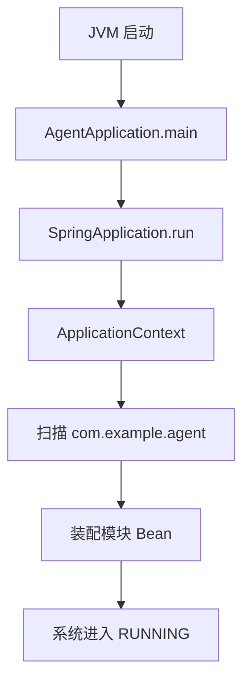
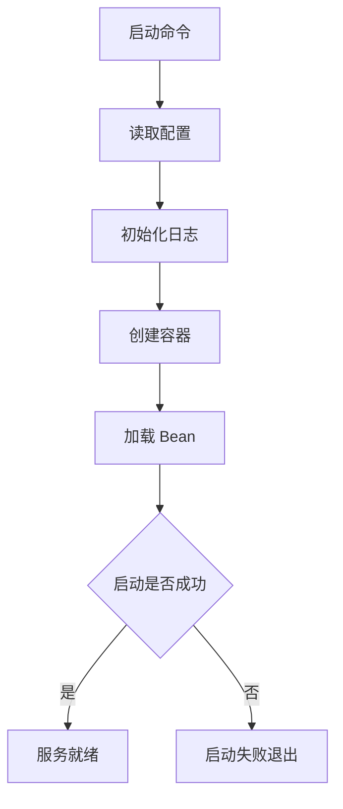
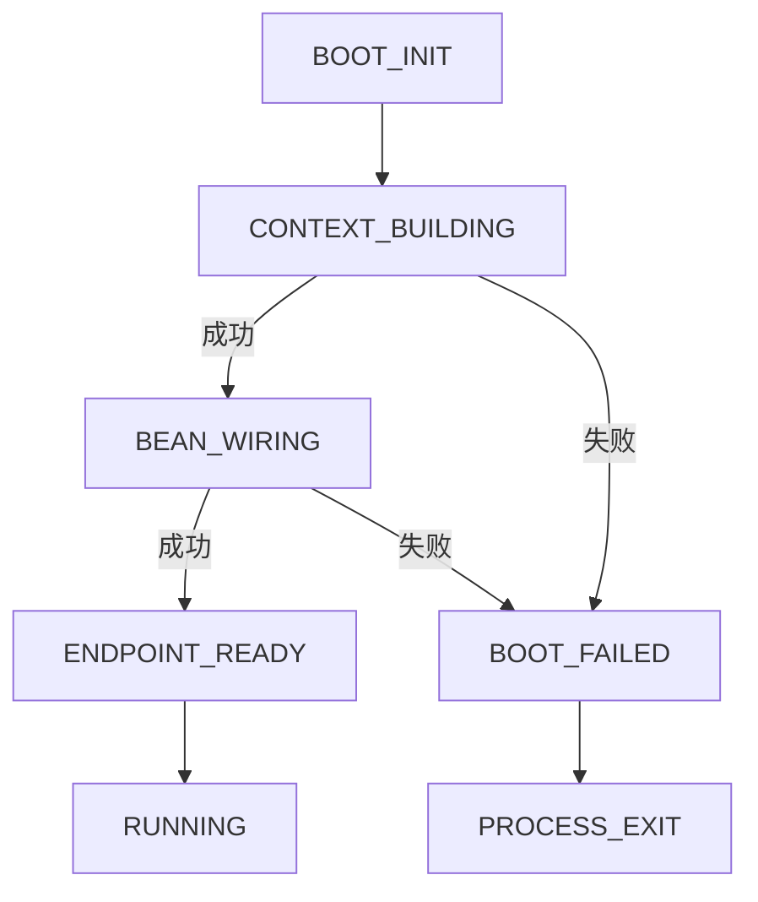
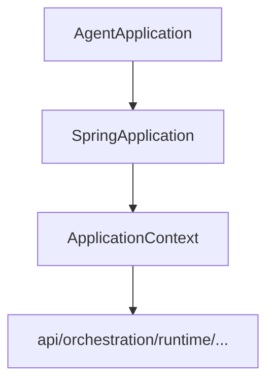

# `bootstrap` 包系统设计说明

## 1. 包定位与核心功能
- 包定位：`bootstrap` 是应用启动总入口，负责 Spring 容器引导与模块装配。
- 核心功能：
  - 定义 `AgentApplication` 主启动入口。
  - 通过 `scanBasePackages` 装配全部业务模块。
  - 启动成功后记录关键启动日志。

## 2. 分层线框图

## 3. 关键流程图

## 4. 状态流转图

## 5. 类职责与设计原因
- `AgentApplication`：保持启动入口单一，避免部署行为分叉。

## 6. 关键类直接关系图

## 7. 重点说明
- 启动入口虽小但关键，决定系统是否可正常装配。
- 所有图统一使用 `graph TB`。

