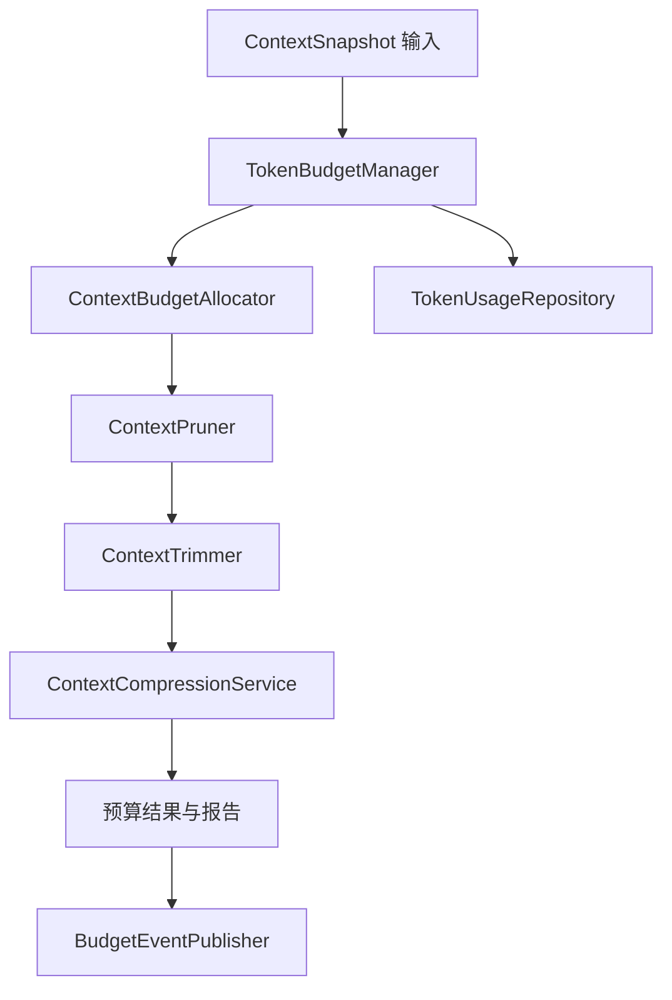
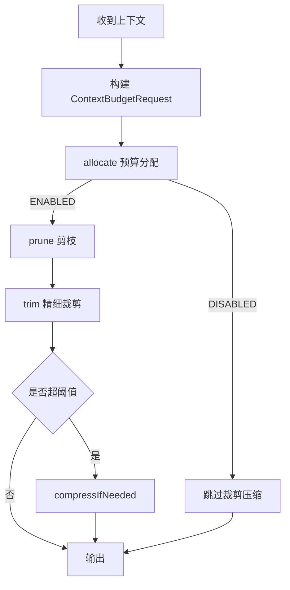
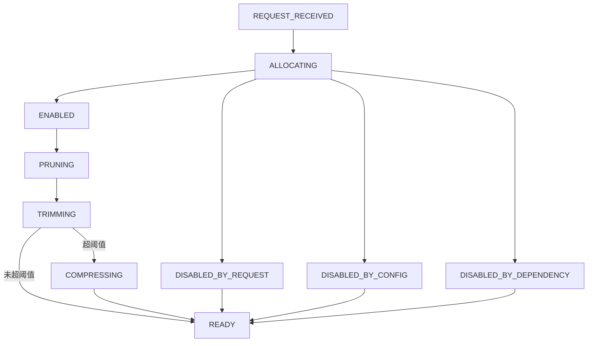
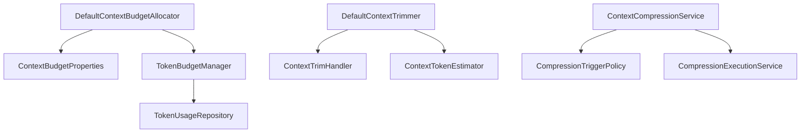

# `budget` 包系统设计说明

## 1. 包定位与核心功能
- 包定位：`budget` 管理 Token 成本、上下文预算分配、裁剪与压缩治理。
- 核心功能：
  - `TokenBudgetManager` 记录与统计用量。
  - `DefaultContextBudgetAllocator` 计算预算并产出分配状态。
  - `DefaultContextPruner` + `DefaultContextTrimmer` 两阶段上下文降载。
  - `ContextCompressionService` 在超阈值时触发压缩。
  - 发布预算事件与指标用于治理和观察。

## 2. 分层线框图

## 3. 关键流程图

## 4. 状态流转图

## 5. 类职责与设计原因
- `TokenBudgetManager`：统一成本台账，避免多点记账不一致。
- `DefaultContextBudgetAllocator`：聚焦预算分配计算，便于策略替换。
- `DefaultContextPruner`：先粗剪，降低精剪计算开销。
- `DefaultContextTrimmer`：按 section 插件化精剪，提升可维护性。
- `ContextCompressionService`：独立压缩链路，便于策略演进。

## 6. 关键类直接关系图

## 7. 重点说明
- `budget` 与 `capabilities.context` 联动决定上下文质量与成本平衡。
- 预算状态显式化提升问题定位效率。
- 所有图统一使用 `graph TB`。

