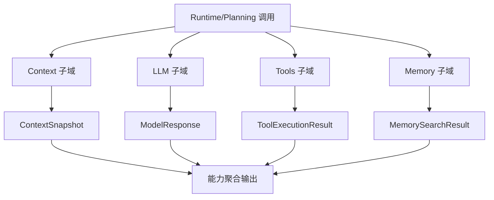
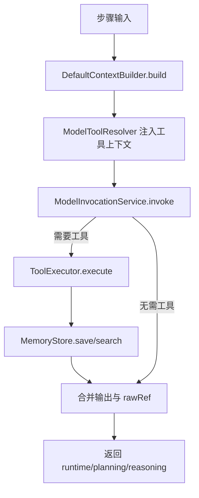
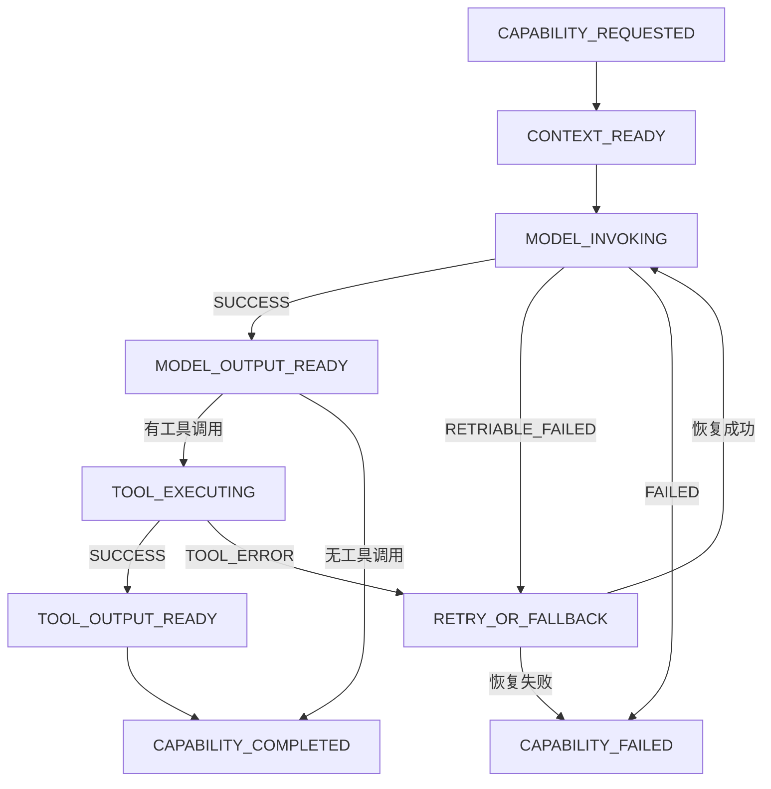
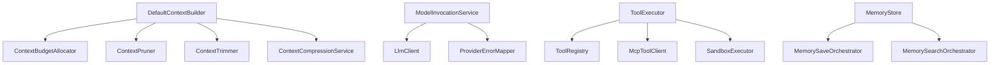

# `capabilities` 包系统设计说明

## 1. 包定位与核心功能
- 包定位：`capabilities` 提供上下文、模型、工具、记忆四大执行能力域。
- 核心功能：
  - `DefaultContextBuilder`：组装上下文快照并联动预算/裁剪/压缩。
  - `ModelInvocationService`：统一模型调用、错误映射与结果引用。
  - `ToolExecutor`：统一工具执行、缓存、重试、沙箱和 MCP 路由。
  - `MemoryStore`：统一记忆写入、检索、压缩入口。
  - Hook 与策略组件支撑能力扩展。

## 2. 分层线框图

## 3. 关键流程图

## 4. 状态流转图

## 5. 类职责与设计原因
- `DefaultContextBuilder`：集中编排上下文构建，减少流程碎片化。
- `ModelInvocationService`：屏蔽模型供应商差异，统一异常语义。
- `ToolExecutor`：聚合工具执行治理能力，保证路径可控。
- `MemoryStore`：门面化记忆能力，内部职责再拆分。
- `HookManager`：提供扩展点，降低主流程侵入。

## 6. 关键类直接关系图

## 7. 重点说明
- `capabilities` 是执行能力中台，决定任务执行上限。
- 与 `budget`、`security`、`streaming` 的协同保障可控可观测。
- 所有图统一使用 `graph TB`。

