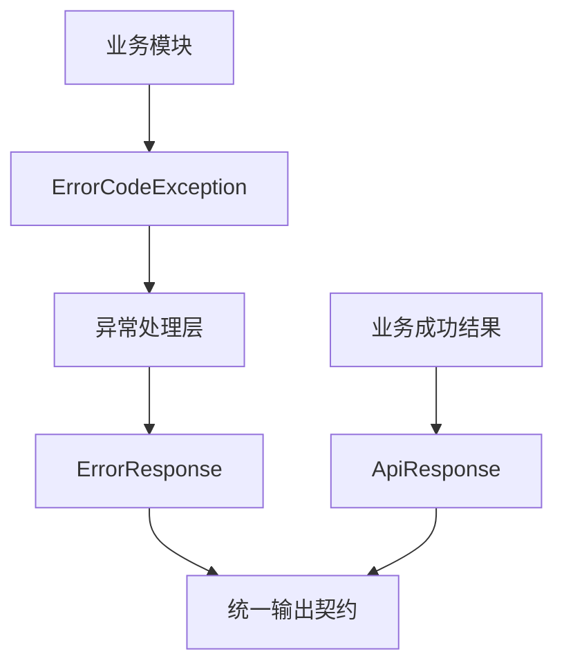
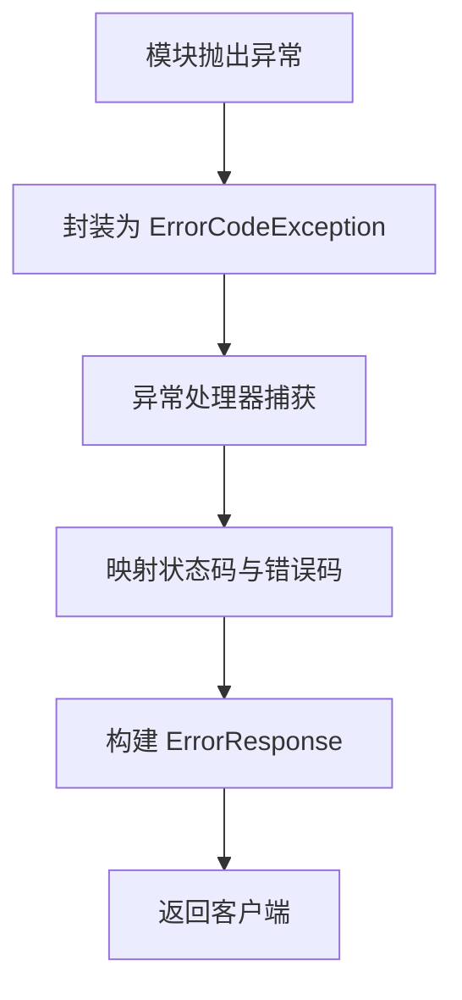
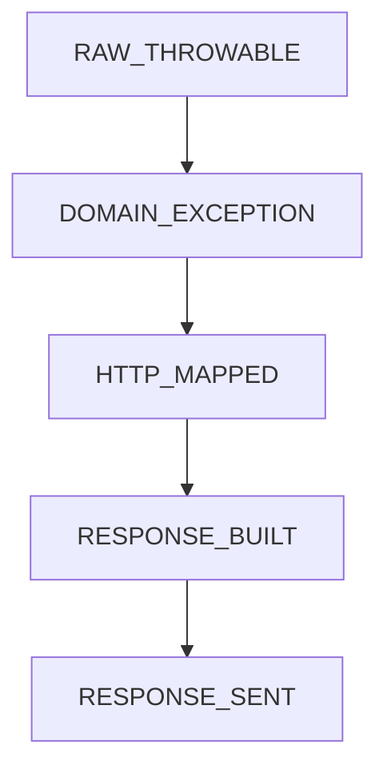
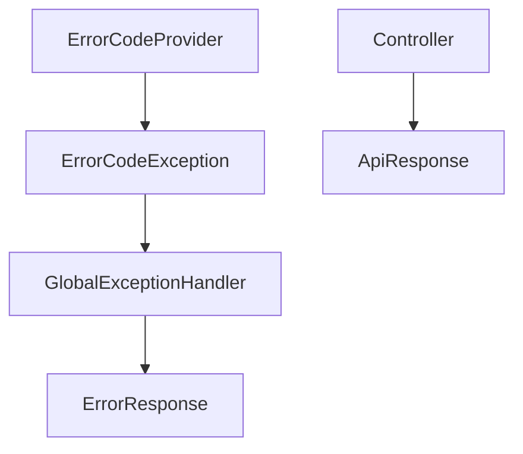

# `common` 包系统设计说明

## 1. 包定位与核心功能
- 包定位：`common` 提供跨模块共享的公共契约，主要包含错误模型与统一响应模型。
- 核心功能：
  - `ErrorCodeException` 统一承载业务错误码与 HTTP 状态。
  - `ErrorCodeProvider` 提供错误码访问协议，便于通用处理。
  - `ApiResponse`/`ErrorResponse` 统一成功与失败响应结构。
  - `SyncWaitTimeoutException` 表达同步等待超时语义。

## 2. 分层线框图

## 3. 关键流程图

## 4. 状态流转图

## 5. 类职责与设计原因
- `ErrorCodeException`：避免各模块自定义异常导致错误语义不统一。
- `ErrorCodeProvider`：确保通用异常处理逻辑可读取错误码。
- `ApiResponse`：统一成功响应字段，稳定客户端解析。
- `ErrorResponse`：统一失败响应格式，提升告警与排障效率。

## 6. 关键类直接关系图

## 7. 重点说明
- `common` 是接口一致性的基础层。
- 错误码标准化是跨模块协作和故障定位的关键。
- 所有图统一使用 `graph TB`。

