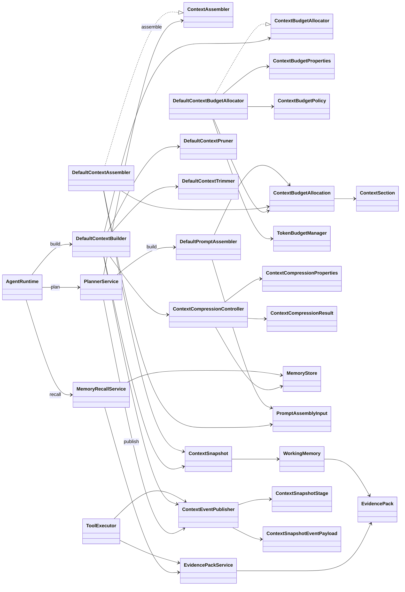
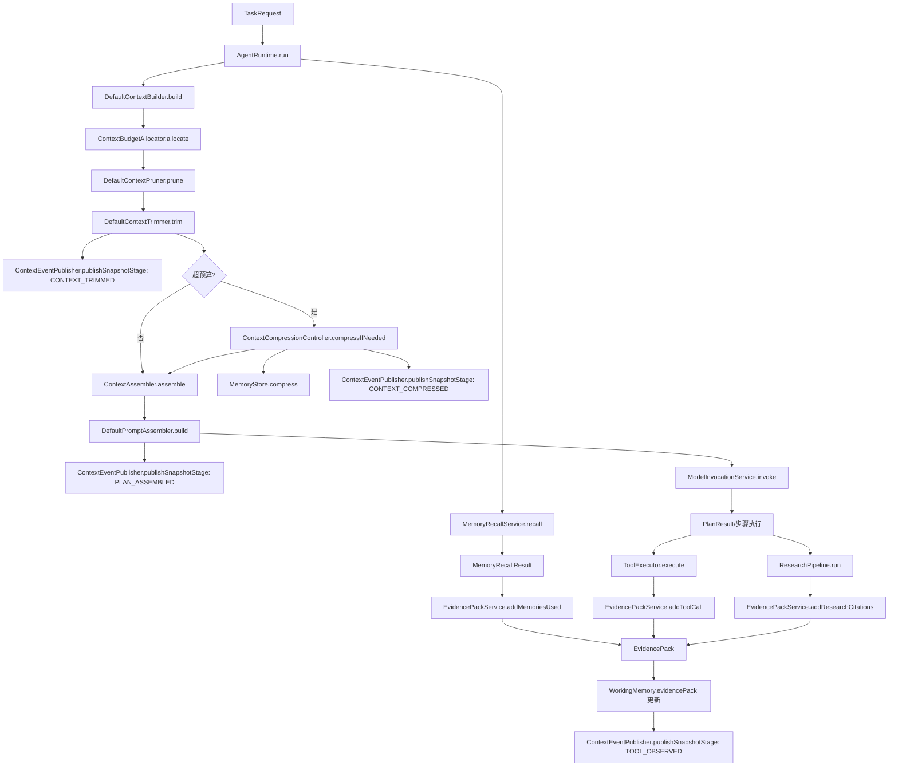

```mermaid
classDiagram
    direction LR

    AgentRuntime --> MemoryRecallService : recall
    AgentRuntime --> DefaultContextBuilder : build
    AgentRuntime --> PlannerService : plan

    PlannerService --> ContextAssembler : assemble
    PlannerService --> DefaultPromptAssembler : build
    PlannerService --> ContextEventPublisher : publish

    DefaultContextAssembler ..|> ContextAssembler

    DefaultContextBuilder --> ContextBudgetAllocator
    DefaultContextBuilder --> DefaultContextPruner
    DefaultContextBuilder --> DefaultContextTrimmer
    DefaultContextBuilder --> ContextCompressionController
    DefaultContextBuilder --> ContextEventPublisher
    DefaultContextBuilder --> ContextSnapshot

    DefaultContextBudgetAllocator ..|> ContextBudgetAllocator
    DefaultContextBudgetAllocator --> ContextBudgetProperties
    DefaultContextBudgetAllocator --> ContextBudgetPolicy
    DefaultContextBudgetAllocator --> ContextBudgetAllocation
    DefaultContextBudgetAllocator --> TokenBudgetManager

    ContextBudgetAllocation --> ContextSection

    ContextCompressionController --> ContextCompressionProperties
    ContextCompressionController --> ContextCompressionResult
    ContextCompressionController --> MemoryStore

    DefaultContextAssembler --> PromptAssemblyInput
    DefaultContextAssembler --> ContextSnapshot
    DefaultContextAssembler --> ContextBudgetAllocation

    DefaultPromptAssembler --> PromptAssemblyInput
    DefaultPromptAssembler --> ContextBudgetAllocation

    MemoryRecallService --> MemoryStore
    MemoryRecallService --> EvidencePackService

    EvidencePackService --> EvidencePack

    ContextSnapshot --> WorkingMemory
    WorkingMemory --> EvidencePack

    ToolExecutor --> EvidencePackService
    ToolExecutor --> ContextEventPublisher

    ContextEventPublisher --> ContextSnapshotStage
    ContextEventPublisher --> ContextSnapshotEventPayload
```

```mermaid
flowchart TD
    A[TaskRequest] --> B[AgentRuntime.run]
    B --> C[MemoryRecallService.recall]
    C --> C1[MemoryRecallResult]
    C1 --> C2[EvidencePackService.addMemoriesUsed]

    B --> D[DefaultContextBuilder.build]
    D --> E[ContextBudgetAllocator.allocate]
    E --> F[DefaultContextPruner.prune]
    F --> G[DefaultContextTrimmer.trim]
    G --> G1[ContextEventPublisher.publishSnapshotStage: CONTEXT_TRIMMED]
    G --> H{超预算?}
    H -- 否 --> I[ContextAssembler.assemble]
    H -- 是 --> J[ContextCompressionController.compressIfNeeded]
    J --> J1[MemoryStore.compress]
    J --> J2[ContextEventPublisher.publishSnapshotStage: CONTEXT_COMPRESSED]
    J --> I

    I --> K[DefaultPromptAssembler.build]
    K --> K1[ContextEventPublisher.publishSnapshotStage: PLAN_ASSEMBLED]
    K --> L[ModelInvocationService.invoke]
    L --> M[PlanResult/步骤执行]

    M --> N[ToolExecutor.execute]
    N --> O[EvidencePackService.addToolCall]
    M --> R[ResearchPipeline.run]
    R --> S[EvidencePackService.addResearchCitations]

    C2 --> EP[EvidencePack]
    O --> EP
    S --> EP
    EP --> P[WorkingMemory.evidencePack 更新]
    P --> Q[ContextEventPublisher.publishSnapshotStage: TOOL_OBSERVED]
```