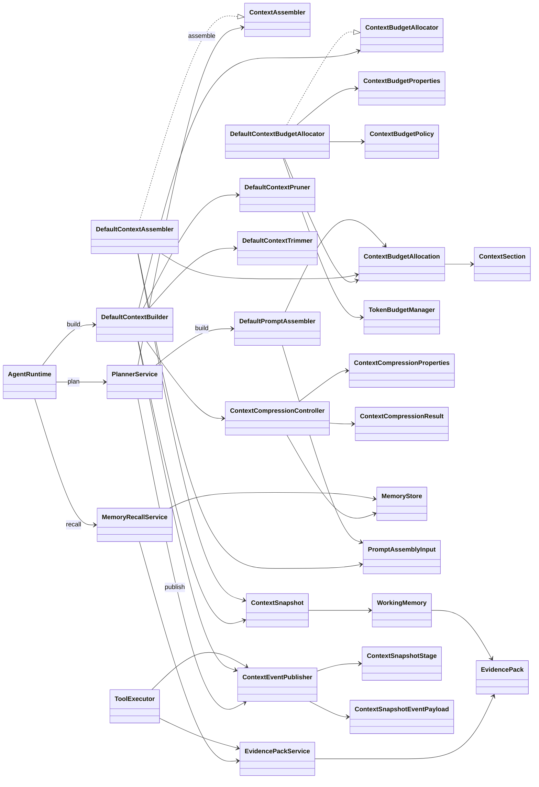
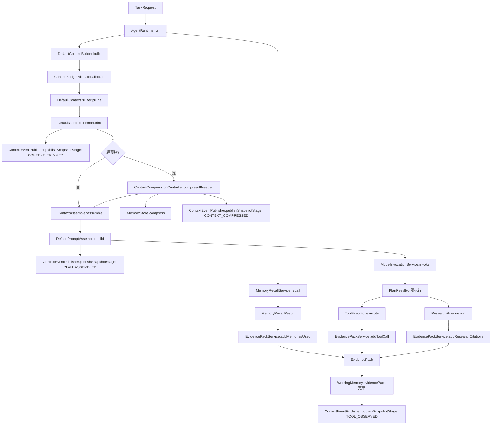

# 上下文工程一眼看懂

## 扫描范围与口径
- 扫描目录：`src/main/java`、`doc/`、`specs/`
- 只聚焦上下文构建、预算、裁剪、压缩、提示词装配、证据与记忆相关的主干类
- 类名以源码为准，若不存在则标注“(不存在)”

## 核心类职责与关系
### 构建与装配链路
- `DefaultContextBuilder`：实现 `ContextBuilder`，构建 `ContextSnapshot`；串联预算分配、裁剪、压缩，并发布阶段事件
- `ContextAssembler` / `DefaultContextAssembler`：将 `ContextSnapshot` 与 `ContextBudgetAllocation` 装配为 `PromptAssemblyInput`，补齐三段文本（`system`/`developer`/`user`）与预算估算
- `DefaultPromptAssembler`：将 `PromptAssemblyInput` 按预算裁剪，输出 `PromptBundle`，记录 `truncatedSections`
- `ContextSnapshot`：上下文快照载体，包含 `WorkingMemory`、`DomainKnowledge`、`LongTermMemory`、`ToolState` 等分区
- `PromptAssemblyInput`：三段式提示词输入与预算统计载体

### 预算与裁剪
- `ContextBudgetPolicy`：定义 `ContextSection` 分区比例与版本
- `ContextBudgetProperties`：配置预算总量、默认比例与裁剪顺序
- `ContextBudgetAllocator` / `DefaultContextBudgetAllocator`：根据 `ContextBudgetRequest` 生成 `ContextBudgetAllocation`
- `ContextBudgetAllocation`：保存总预算与各 `ContextSection` 预算
- `ContextSection`：上下文预算分区枚举
- `DefaultContextPruner`：按 `ContextPolicy` 的 `pruneOrder` 与数量上限裁剪 `EvidencePack`、记忆、引用等
- `DefaultContextTrimmer`：按预算执行令牌裁剪，生成 `ContextTrimReport`

### 压缩
- `ContextCompressionController`：裁剪后仍超预算时触发 `MemoryStore.compress`，回填 `WorkingMemory` 摘要并更新 `LongTermMemory`
- `ContextCompressionProperties`：压缩触发开关与冷却间隔
- `ContextCompressionResult`：记录触发原因、前后令牌与摘要版本

### 记忆与证据
- `MemoryRecallService`：召回 `MemoryRecord`，生成 `MemoryRecallResult`，并写入 `EvidencePack` 的 `memoriesUsed`
- `MemoryWriteService`：将输入/输出保存为 `MemoryRecord`
- `MemoryStore`：负责保存、检索、压缩记忆
- `MemoryRecord`：持久化记忆载体，包含 `ConversationSummary` 与 `WorkingMemorySummary`
- `WorkingMemory`：快照内工作记忆，承载 `EvidencePack`
- `EvidencePack` / `EvidencePackService`：聚合工具、记忆与研究引用证据
- `ConversationSummary` / `WorkingMemorySummary`：压缩后的结构化摘要来源

### 预算与成本联动
- `TokenBudgetManager`：阈值令牌限制被 `DefaultContextBudgetAllocator` 用于约束上下文总预算上限

### 事件发布
- `ContextEventPublisher`：发布快照与阶段事件
- `ContextSnapshotStage`：阶段枚举（`PLAN_ASSEMBLED`、`TOOL_OBSERVED`、`CONTEXT_TRIMMED`、`CONTEXT_COMPRESSED`）
- `ContextSnapshotEventPayload`：阶段事件载荷结构

### 类名核对
- `ContextBudget*` 族：`ContextBudgetPolicy`、`ContextBudgetProperties`、`ContextBudgetAllocator`、`ContextBudgetAllocation`

## 类关系图

## 端到端流程图

## 一页说明（输入/输出对齐源码）
- `TaskRequest` 与 `TenantContext` 进入 `AgentRuntime.run`，形成运行时 `runtimeContext`
- `MemoryRecallService.recall` 输入 `TaskRequest` 与 `runtimeContext`，输出 `MemoryRecallResult` 并写入 `EvidencePack`
- `ContextBuildRequest` 汇聚 `TaskRequest`、`MemoryRecallResult`、`runtimeContext`，交给 `DefaultContextBuilder.build`
- `ContextBudgetAllocator.allocate` 输入 `ContextBudgetRequest`，输出 `ContextBudgetAllocation` 与 `ContextSection` 预算
- `DefaultContextPruner.prune` 输入 `ContextSnapshot` 与 `ContextPolicy`，输出 `ContextPruneResult`
- `DefaultContextTrimmer.trim` 输入 `ContextSnapshot` 与 `ContextBudgetAllocation`，输出 `ContextTrimReport`
- `ContextEventPublisher.publishSnapshotStage` 在裁剪后发布 `ContextSnapshotStage.CONTEXT_TRIMMED`
- `ContextCompressionController.compressIfNeeded` 基于 `ContextCompressionProperties` 决定是否压缩并产出 `ContextCompressionResult`
- `ContextAssembler.assemble` 产出 `PromptAssemblyInput`，三段文本与预算统计就位
- `DefaultPromptAssembler.build` 产出 `PromptBundle`，并记录 `truncatedSections`
- `ContextEventPublisher.publishSnapshotStage` 在装配后发布 `ContextSnapshotStage.PLAN_ASSEMBLED`
- `ToolExecutor.execute` 写入工具证据并发布 `ContextSnapshotStage.TOOL_OBSERVED`
- `ResearchPipeline.run` 生成 `ResearchCitation`，通过 `EvidencePackService.addResearchCitations` 写入 `EvidencePack`
- `ModelInvocationService.invoke` 发起模型调用，结果由 `MemoryWriteService.saveTaskMemory` 落盘为 `MemoryRecord`

## 常见问题速查
- `truncatedSections` 为空
  - 可能原因：`DefaultContextAssembler` 初始化为空列表；`DefaultPromptAssembler` 未超预算或 `agent.prompt.trim.enabled=false` 时不会追加；`ContextBudgetAllocation` 缺失导致预算为 0
  - 排查要点：确认 `runtimeContext.contextBudget` 已写入；检查 `ContextBudgetAllocation.totalTokens` 与 `sectionTokens`；确认开关 `agent.prompt.trim.enabled`

- `evidenceCitationsCount` 为 0
  - 可能原因：未触发 `ResearchPipeline.run`；`EvidencePack` 未写入 `citations`；`WorkingMemory.evidencePack` 未同步
  - 排查要点：确认研究模式或调用链会执行 `EvidencePackService.addResearchCitations`；确认 `EvidencePack` 已写入 `WorkingMemory`；检查 `ContextEventPublisher` 是否能读取到 `EvidencePack` 统计

- 为什么触发压缩
  - 触发条件：`ContextCompressionProperties` 开启，且裁剪后总预算或分区预算超限
  - 排查要点：查看 `ContextTrimReport.totalAfterTokens`、`ContextBudgetAllocation.totalTokens` 与 `sectionTokens`；检查 `ContextCompressionProperties.triggerOverTotalBudget/triggerOverSectionBudget`

- 如何回滚压缩
  - 现状：`ContextCompressionController` 触发后直接回填 `WorkingMemory` 并新增 `LongTermMemory` 引用，未提供自动回滚
  - 方案：临时关闭 `agent.context.compression.enabled` 或关闭触发开关；或提高预算后重新执行上下文构建以获得未压缩快照

- 工具会卡住（审批）
  - 可能原因：`ExecutionControlService` 进入 `ExecutionControlState.WAIT_APPROVAL` 或 `ExecutionControlState.PAUSED`
  - 排查要点：检查 `runtimeContext.requiresApproval` 与 `StepRequest.requiresApproval`；观察审批事件与审批状态是否已完成
