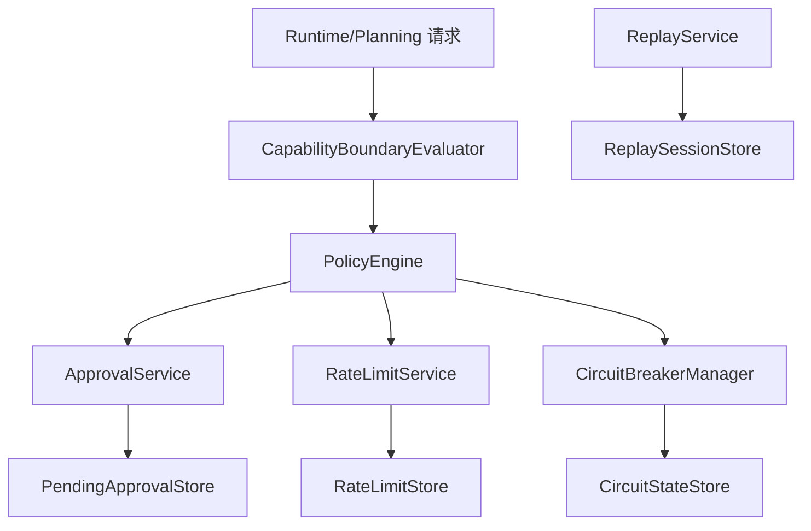
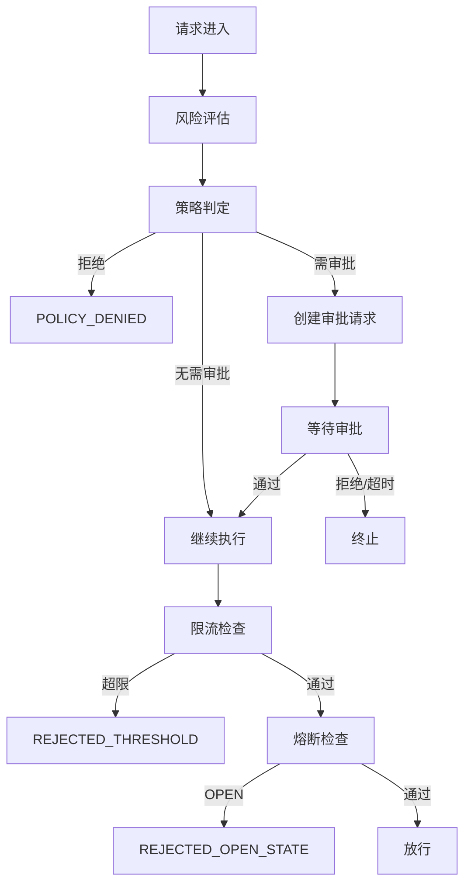
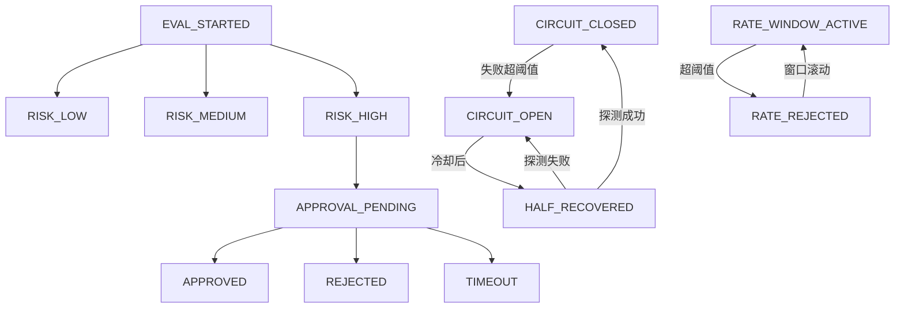
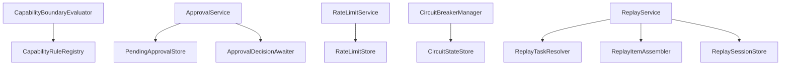

# `governance` 包系统设计说明

## 1. 包定位与核心功能
- 包定位：`governance` 提供执行治理与风险控制能力。
- 核心功能：
  - `CapabilityBoundaryEvaluator` 风险评估与策略建议。
  - `ApprovalService` 高风险操作审批流程管理。
  - `RateLimitService` 窗口限流保护。
  - `CircuitBreakerManager` 连续失败熔断与恢复。
  - `ReplayService` 回放能力支撑审计复盘。

## 2. 分层线框图

## 3. 关键流程图

## 4. 状态流转图

## 5. 类职责与设计原因
- `CapabilityBoundaryEvaluator`：先评估后执行，降低高风险误执行。
- `ApprovalService`：审批状态化，支持异步等待和外部决策。
- `RateLimitService`：提供流量护栏，保护下游。
- `CircuitBreakerManager`：阻断错误风暴扩散。
- `ReplayService`：补齐审计与复盘闭环。

## 6. 关键类直接关系图

## 7. 重点说明
- 治理能力是执行链路内建，不是外挂逻辑。
- 审批、限流、熔断、回放分别覆盖人治、流量、稳定、审计。
- 所有图统一使用 `graph TB`。

