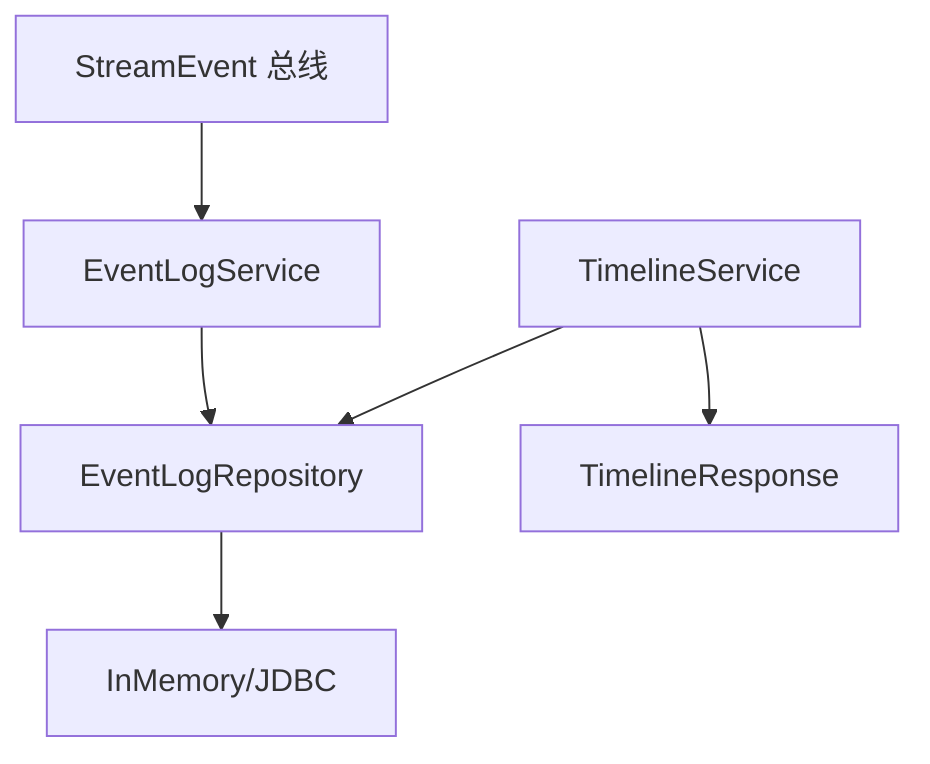
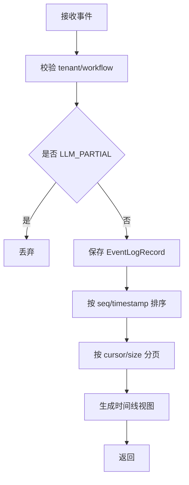
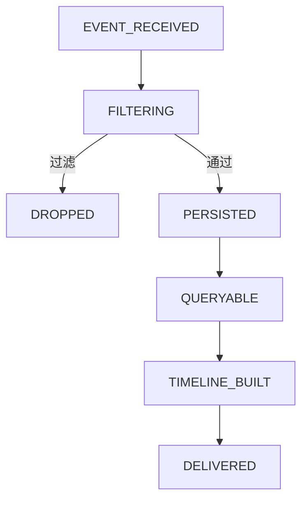
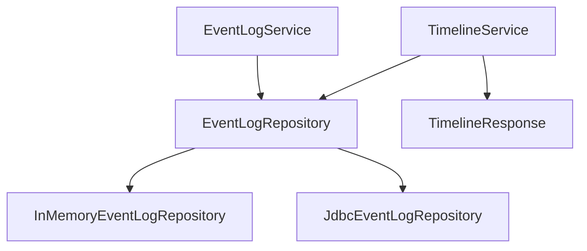

# `history` 包系统设计说明

## 1. 包定位与核心功能
- 包定位：`history` 负责事件持久化、分页检索和时间线聚合输出。
- 核心功能：
  - `EventLogService` 监听 `StreamEvent` 并落盘。
  - 过滤高频 `LLM_PARTIAL` 事件降低噪声。
  - `TimelineService` 输出 full/summary 视图。
  - 支持 InMemory/JDBC 两类仓储实现。

## 2. 分层线框图

## 3. 关键流程图

## 4. 状态流转图

## 5. 类职责与设计原因
- `EventLogService`：集中事件落盘，避免调用方重复实现。
- `EventLogRepository`：抽象存储，便于实现替换。
- `TimelineService`：聚合展示视图，不耦合写入流程。
- `EventLogRecord`/`TimelineResponse`：区分原始事实和展示模型。

## 6. 关键类直接关系图

## 7. 重点说明
- 读写分离便于历史能力独立演进。
- 序列号优先排序保证回放时序稳定。
- 所有图统一使用 `graph TB`。

