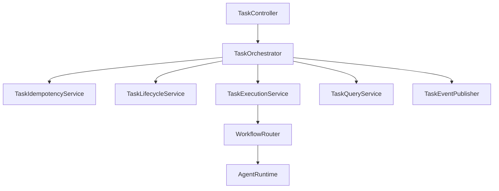
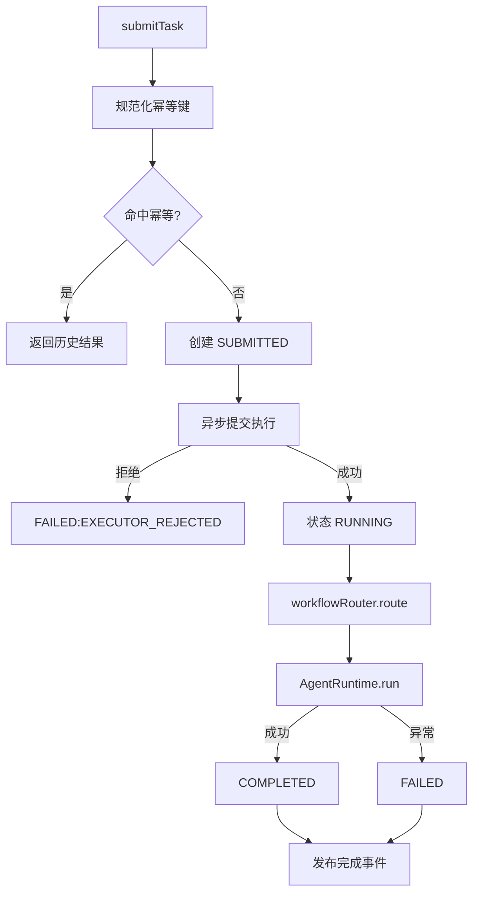
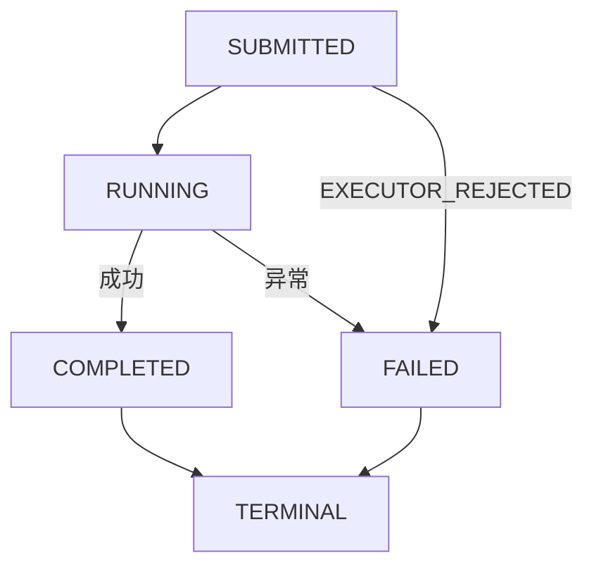
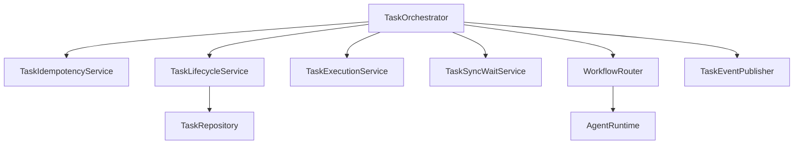

# `orchestration` 包系统设计说明

## 1. 包定位与核心功能
- 包定位：`orchestration` 负责任务生命周期编排、幂等控制和工作流路由。
- 核心功能：
  - `TaskOrchestrator` 统一提交与查询入口。
  - `TaskLifecycleService` 管理任务状态与结果持久化。
  - `TaskIdempotencyService` 保障幂等键复用。
  - `TaskExecutionService` 负责异步提交与拒绝处理。
  - `WorkflowRouter` 桥接到 `AgentRuntime`。
  - `MultiAgentCoordinator` 支撑多智能体协作。

## 2. 分层线框图

## 3. 关键流程图

## 4. 状态流转图

## 5. 类职责与设计原因
- `TaskOrchestrator`：提供统一编排门面。
- `TaskLifecycleService`：集中状态与持久化规则。
- `TaskIdempotencyService`：前置幂等，避免重复执行。
- `TaskExecutionService`：隔离线程池与调度细节。
- `DefaultWorkflowRouter`：隔离 runtime 细节，降低耦合。

## 6. 关键类直接关系图

## 7. 重点说明
- 任务状态路径明确，便于监控与故障归因。
- 幂等 + 拒绝保护提升高并发稳定性。
- 所有图统一使用 `graph TB`。

