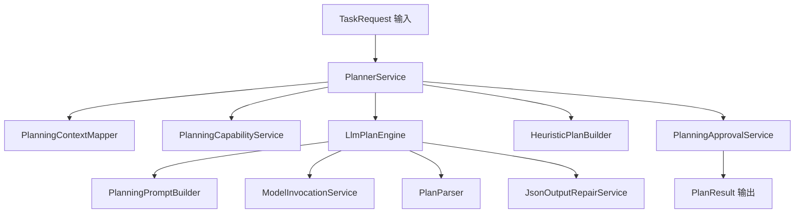
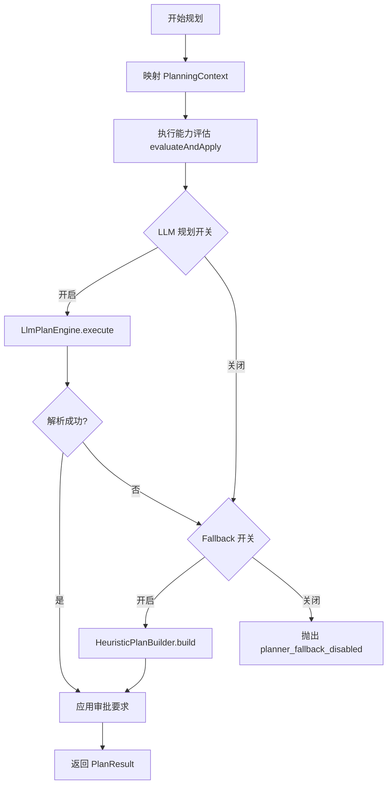
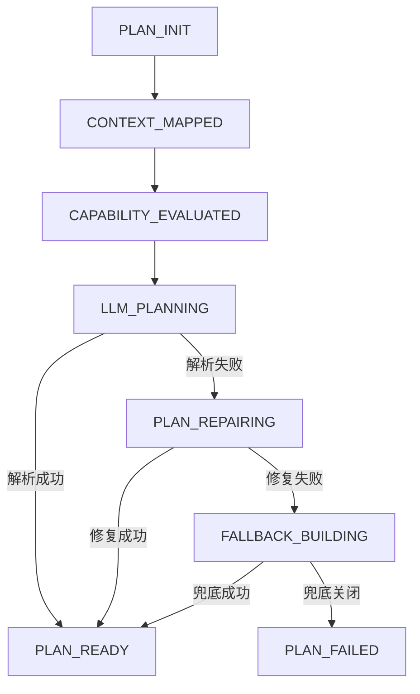
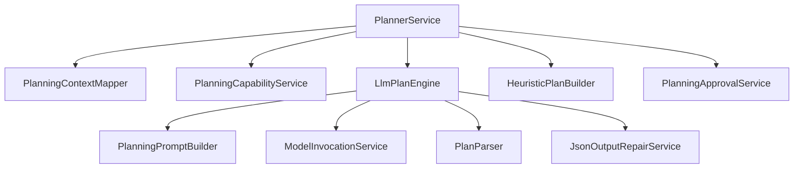

# `planning` 包系统设计说明

## 1. 包定位与核心功能
- 包定位：`planning` 负责把任务意图转为可执行计划，是运行时执行链路的上游稳定器。
- 核心功能：
  - `PlannerService` 统一规划入口，编排上下文映射、能力评估、LLM 规划与兜底规划。
  - `PlanningContextMapper` 将 `TaskRequest` 映射为规划上下文。
  - `PlanningCapabilityService` 接入治理评估结果，影响规划策略与审批要求。
  - `LlmPlanEngine` 负责提示词构建、模型调用、结构化解析与修复。
  - `HeuristicPlanBuilder` 在 LLM 规划失败时提供规则兜底。
  - `PlanningApprovalService` 把审批约束写入 `PlanResult`。

## 2. 分层线框图

## 3. 关键流程图

## 4. 状态流转图

## 5. 类职责与设计原因
- `PlannerService`：保持规划流程单一入口，便于统一日志、指标、故障定位与降级策略。
- `LlmPlanEngine`：隔离模型调用细节，避免规划流程被模型差异污染。
- `PlanParser`：将不稳定模型文本收敛为结构化步骤，提升执行确定性。
- `JsonOutputRepairService`：在解析失败时进行修复，显著降低规划失败率。
- `HeuristicPlanBuilder`：保证模型异常时系统仍可降级可用。
- `PlanningStrategyHandler` 家族：通过策略分派支持多规划模式演进。

## 6. 关键类直接关系图

## 7. 重点说明
- 规划包决定了 runtime 的执行质量上限与稳定性下限。
- 通过“解析 + 修复 + 兜底”三层保障提升计划可用性。
- 所有图统一使用 `graph TB`，与其它包文档保持一致。

