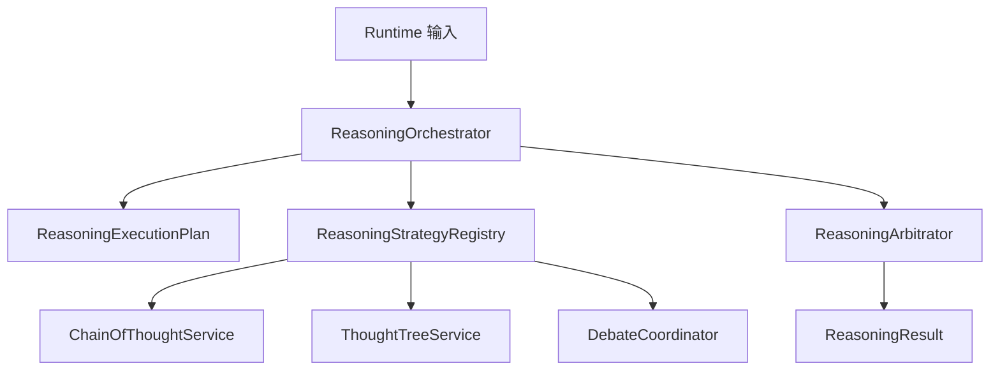
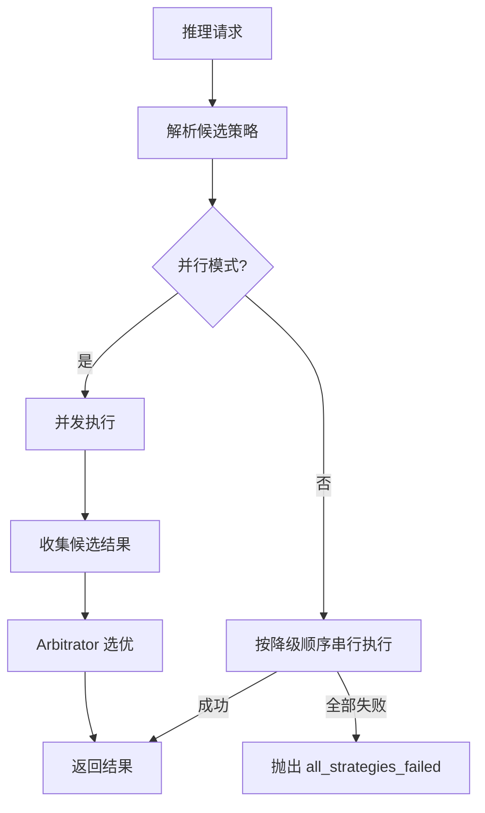
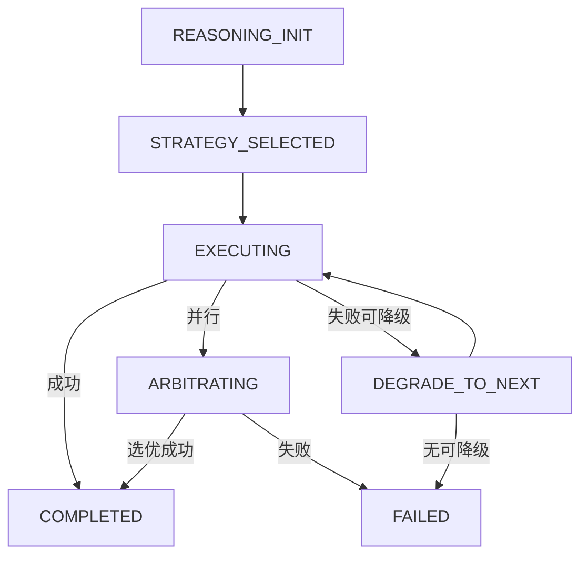
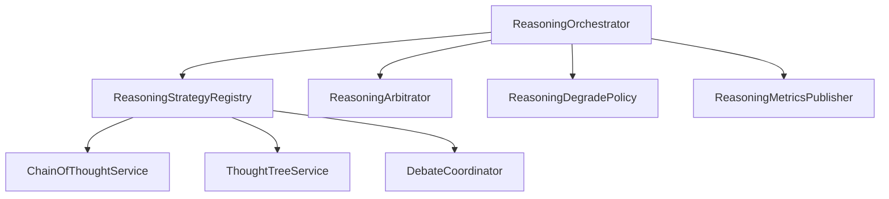

# `reasoning` 包系统设计说明

## 1. 包定位与核心功能
- 包定位：`reasoning` 提供多推理策略编排与选优能力。
- 核心功能：
  - `ReasoningOrchestrator` 支持串行降级与并行候选执行。
  - `ReasoningStrategyRegistry` 管理 COT、ThoughtTree、Debate 等策略。
  - `ReasoningArbitrator` 对并行候选进行仲裁选优。
  - `ReasoningDegradePolicy` 维护降级顺序。
  - `ReasoningMetricsPublisher` 输出推理指标。

## 2. 分层线框图

## 3. 关键流程图

## 4. 状态流转图

## 5. 类职责与设计原因
- `ReasoningOrchestrator`：统一执行模式决策，降低调用复杂度。
- `ReasoningStrategyRegistry`：解耦策略实现与编排。
- `ReasoningArbitrator`：统一候选质量判断标准。
- `ReasoningDegradePolicy`：降级链路配置化。
- 各策略服务：按推理范式分治实现。

## 6. 关键类直接关系图

## 7. 重点说明
- 通过策略组合平衡稳定性和效果上限。
- 串行降级机制可降低推理链路整体失败率。
- 所有图统一使用 `graph TB`。

