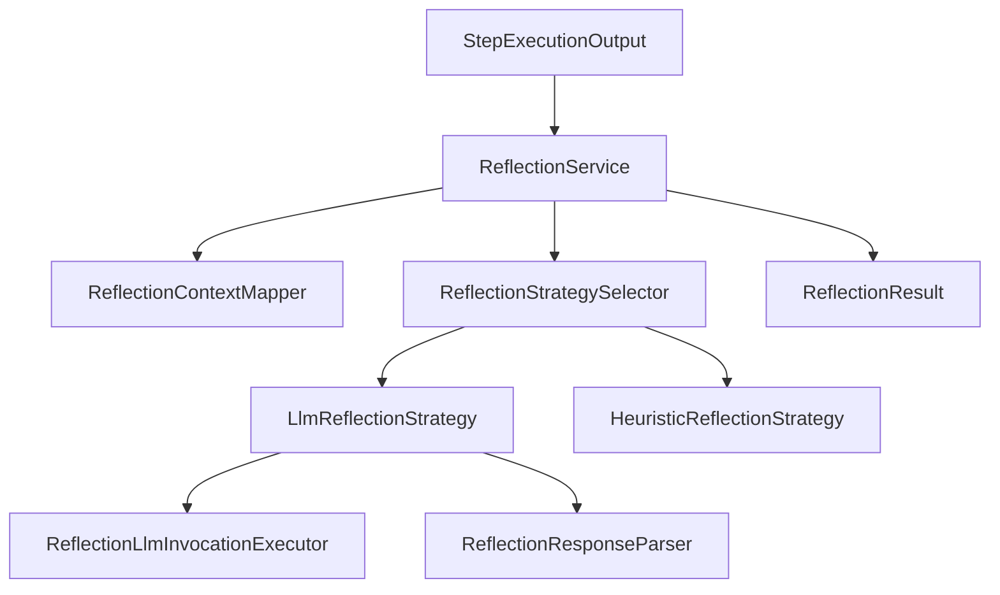
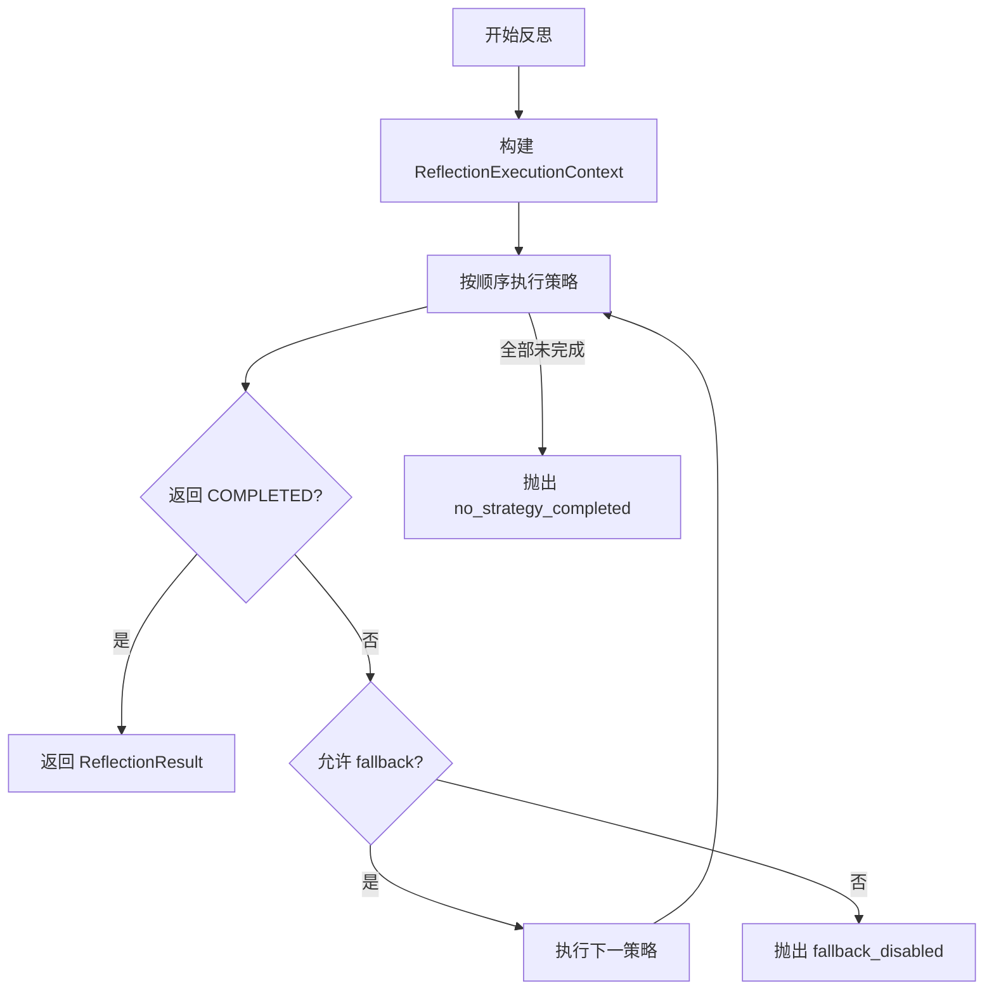
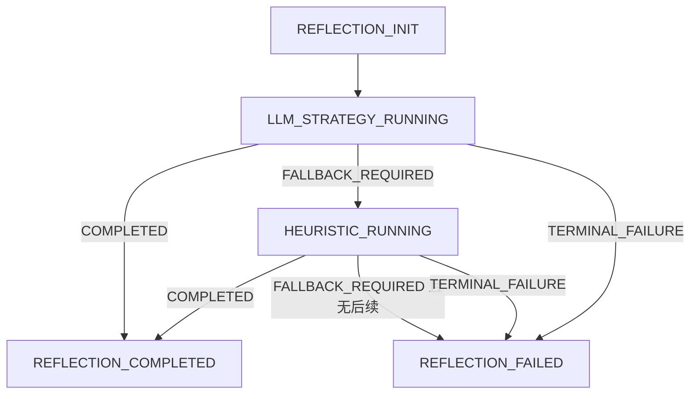
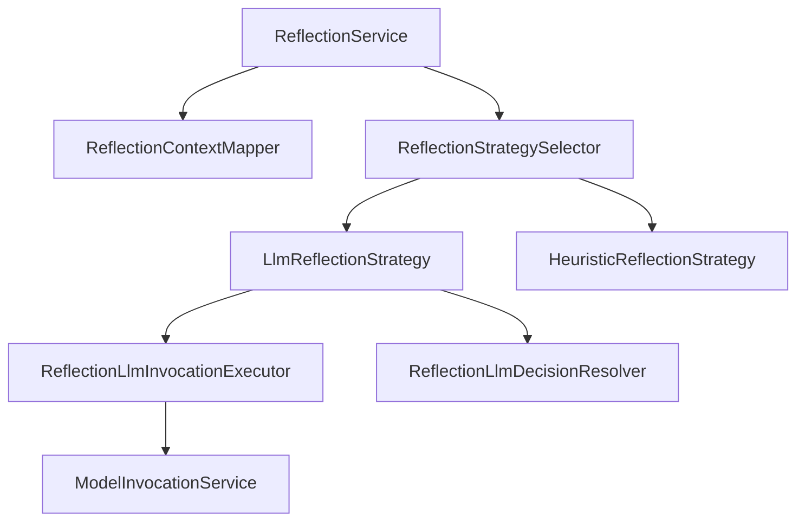

# `reflection` 包系统设计说明

## 1. 包定位与核心功能
- 包定位：`reflection` 负责对步骤输出进行质量评估，并决定是否重试或接受结果。
- 核心功能：
  - `ReflectionService` 统一反思入口与策略链编排。
  - `LlmReflectionStrategy` 提供模型驱动的质量判断与修复建议。
  - `HeuristicReflectionStrategy` 提供规则兜底评估。
  - `ReflectionLlmInvocationExecutor` 封装反思模型调用。
  - `ReflectionDecisionStatus` 显式表达 `COMPLETED/FALLBACK_REQUIRED/TERMINAL_FAILURE`。

## 2. 分层线框图

## 3. 关键流程图

## 4. 状态流转图

## 5. 类职责与设计原因
- `ReflectionService`：集中策略链编排，降低调用方复杂度。
- `ReflectionStrategySelector`：通过顺序与开关控制策略执行。
- `LlmReflectionStrategy`：提升复杂语义质量判断能力。
- `HeuristicReflectionStrategy`：在模型失败时提供低成本稳定兜底。
- `ReflectionDecision`：结构化决策结果，避免隐式布尔语义误判。

## 6. 关键类直接关系图

## 7. 重点说明
- `reflection` 与 runtime 恢复链路联动，是执行收敛质量的重要一环。
- 决策状态显式化后更便于监控与调优。
- 所有图统一使用 `graph TB`。

