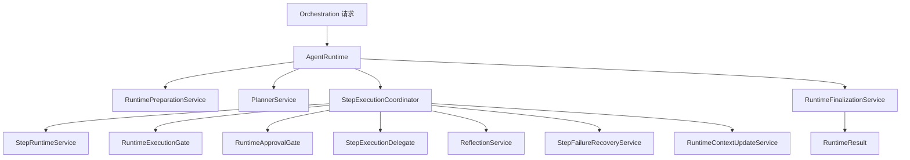
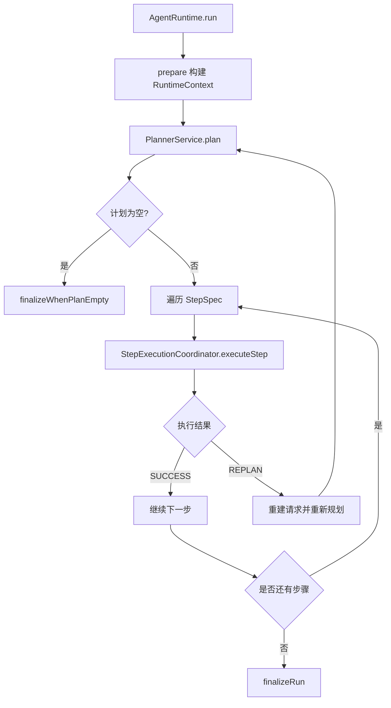
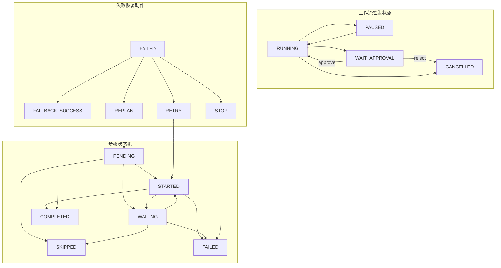
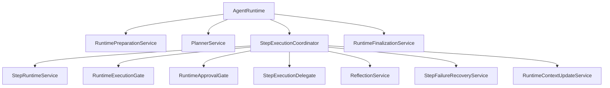

# `runtime` 包系统设计说明

## 1. 包定位与核心功能
- 包定位：`runtime` 是任务执行主引擎，负责编排准备、计划执行、步骤状态迁移、失败恢复与最终收敛。
- 核心功能：
  - `AgentRuntime` 组织主循环：`prepare -> plan -> step loop -> finalize`。
  - `StepExecutionCoordinator` 负责单步执行编排（控制门禁、执行、反思、恢复、上下文更新）。
  - `StepRuntimeService` + `StepStateMachine` 管理步骤记录、状态迁移与事件发布。
  - `RuntimeExecutionGate` + `RuntimeApprovalGate` 处理暂停/恢复/取消/审批阻塞。
  - `StepFailureRecoveryService` 提供 `RETRY/REPLAN/FALLBACK/STOP` 恢复策略。
  - `RuntimeFinalizationService` 汇总执行输出并生成 `RuntimeResult`。

## 2. 分层线框图

## 3. 关键流程图

## 4. 状态流转图

## 5. 类职责与设计原因
- `AgentRuntime`：保持主循环边界清晰，避免步级细节分散到多个入口。
- `StepExecutionCoordinator`：聚合步级核心逻辑，是稳定性和恢复能力中枢。
- `StepRuntimeService`：统一步骤记录、事件发布和状态落盘，保证时序一致性。
- `StepStateMachine`：集中状态迁移规则，防止非法迁移。
- `RuntimeExecutionGate`/`RuntimeApprovalGate`：将控制平面从执行平面解耦。
- `StepFailureRecoveryService`：独立错误分类与恢复策略，便于后续演进。

## 6. 关键类直接关系图

## 7. 重点说明
- `runtime` 是系统执行稳定性的核心，强调状态正确性、恢复性与可观测性。
- 控制状态机、步骤状态机、恢复动作三层共同确保执行收敛。
- 所有图统一使用 `graph TB`，与其它包文档保持一致。

