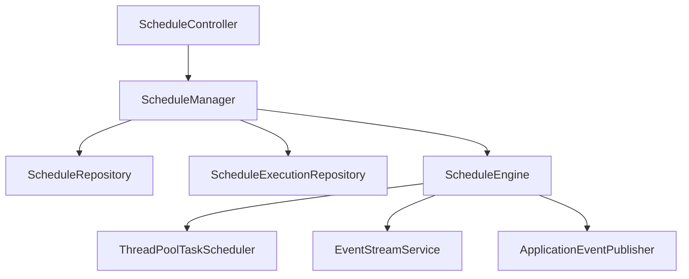
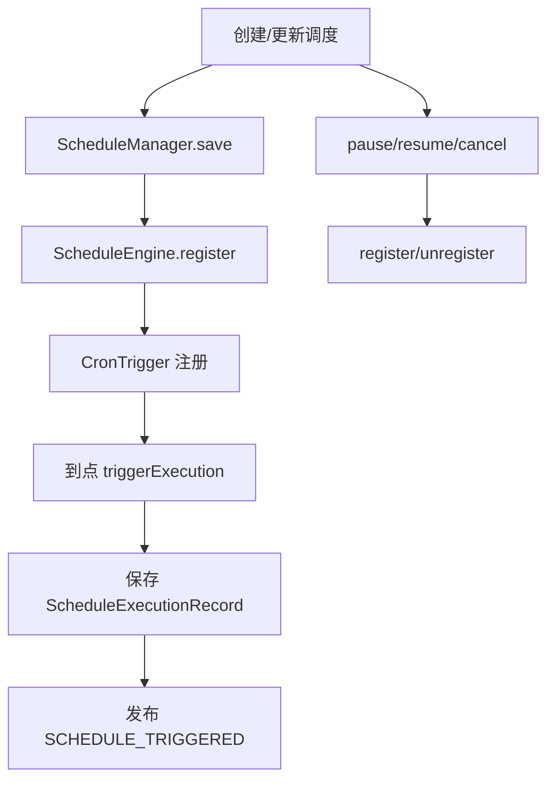
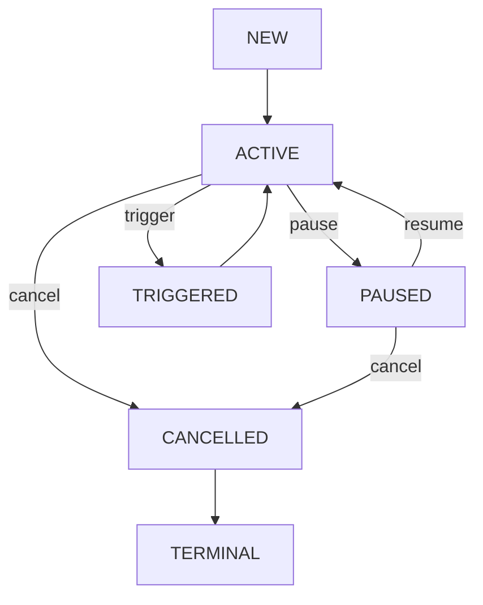
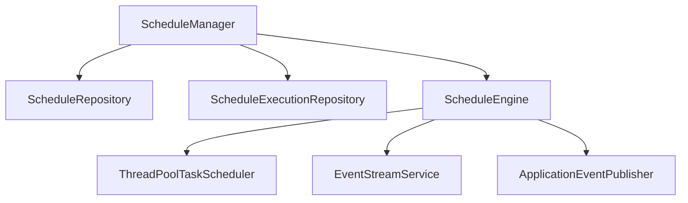

# `scheduler` 包系统设计说明

## 1. 包定位与核心功能
- 包定位：`scheduler` 负责计划任务管理与 Cron 触发，并把触发行为接入统一事件流。
- 核心功能：
  - `ScheduleManager` 负责创建、更新、暂停、恢复、取消、删除、分页查询。
  - `ScheduleEngine` 负责调度注册、反注册、Cron 到点触发。
  - `ScheduleRepository` 与 `ScheduleExecutionRepository` 管理配置与执行记录。
  - 触发时发布 `SCHEDULE_TRIGGERED` 事件供下游消费。

## 2. 分层线框图

## 3. 关键流程图

## 4. 状态流转图

## 5. 类职责与设计原因
- `ScheduleManager`：统一管理入口与租户边界校验，避免配置操作分散。
- `ScheduleEngine`：专注执行引擎职责，隔离调度框架细节。
- `ScheduleRepository`：抽象调度配置存储，支持内存/数据库切换。
- `ScheduleExecutionRepository`：记录执行事实，支撑审计与统计。

## 6. 关键类直接关系图

## 7. 重点说明
- 调度配置状态与执行记录分离，便于管理与审计。
- 调度触发通过事件总线进入系统观测链路。
- 所有图统一使用 `graph TB`。

