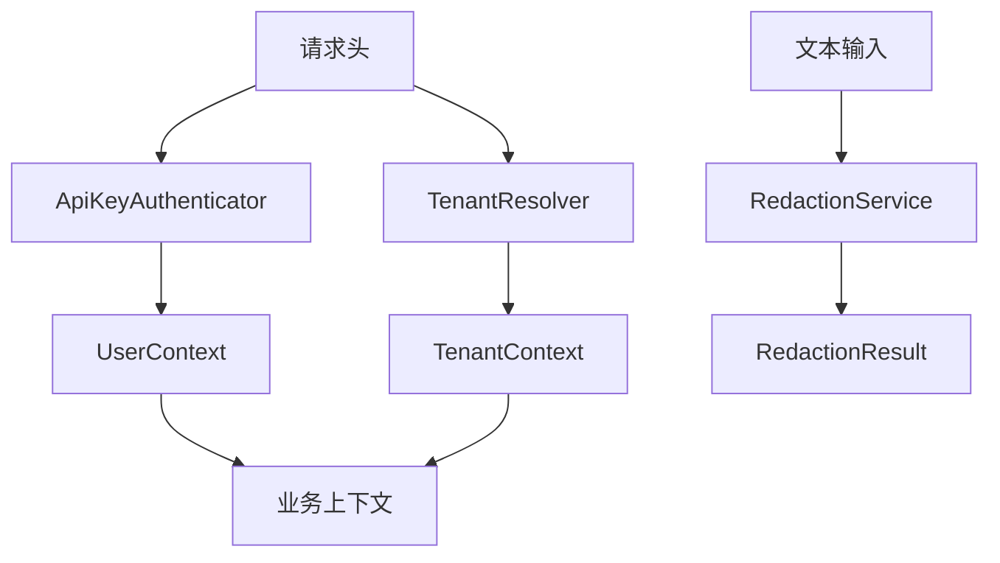
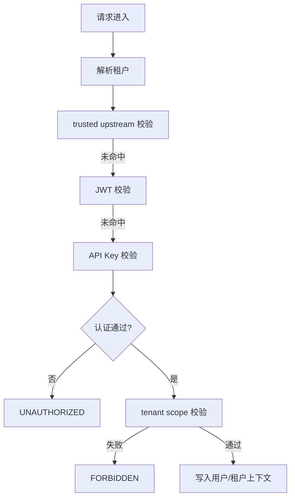
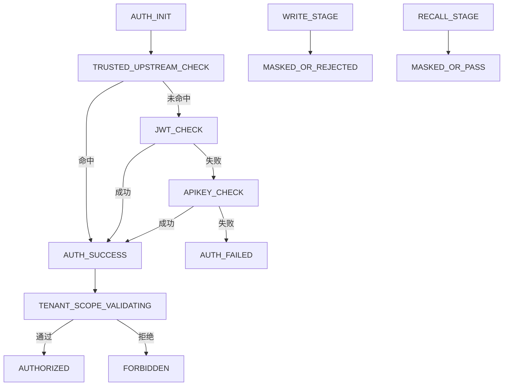
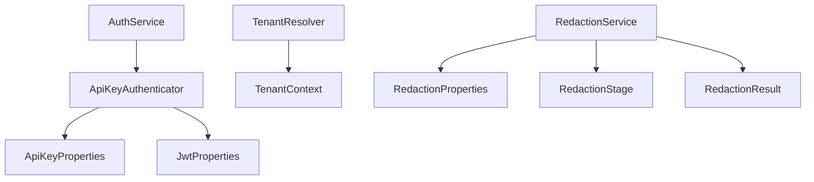

# `security` 包系统设计说明

## 1. 包定位与核心功能
- 包定位：`security` 是系统安全边界，覆盖认证、租户作用域校验与脱敏治理。
- 核心功能：
  - `ApiKeyAuthenticator` 支持 trusted-upstream/JWT/API-Key 三类路径。
  - `TenantResolver` 解析 `TenantContext`。
  - `AuthService` 提供认证抽象。
  - `RedactionService` 统一敏感信息识别与掩码处理。
  - `RedactionStage` 区分 WRITE 与 RECALL 阶段策略。

## 2. 分层线框图

## 3. 关键流程图

## 4. 状态流转图

## 5. 类职责与设计原因
- `ApiKeyAuthenticator`：统一认证行为，避免多入口不一致。
- `TenantResolver`：提前建立租户边界。
- `AuthService`：抽象认证接口，便于扩展。
- `RedactionService`：统一敏感数据治理规则。
- `RedactionProperties`：策略配置化，支持分环境调优。

## 6. 关键类直接关系图

## 7. 重点说明
- 认证优先级链路明确，兼容网关与直连场景。
- 作用域校验 + 脱敏形成双重安全防线。
- 所有图统一使用 `graph TB`。

