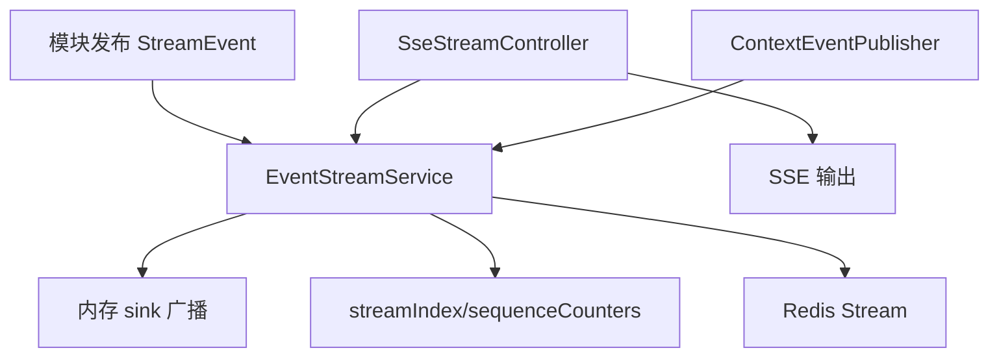
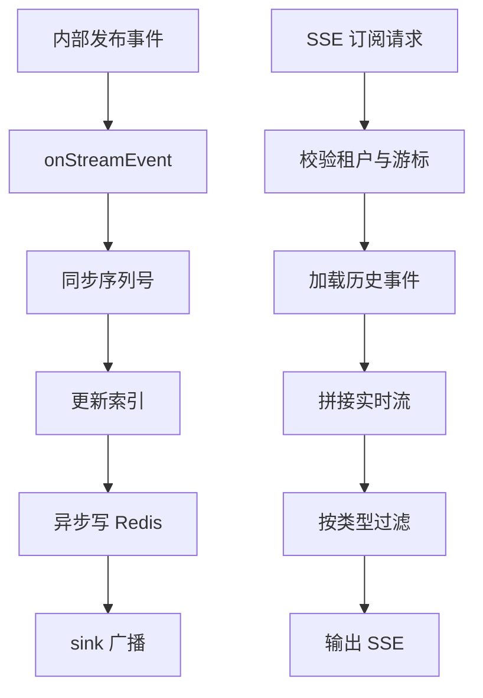
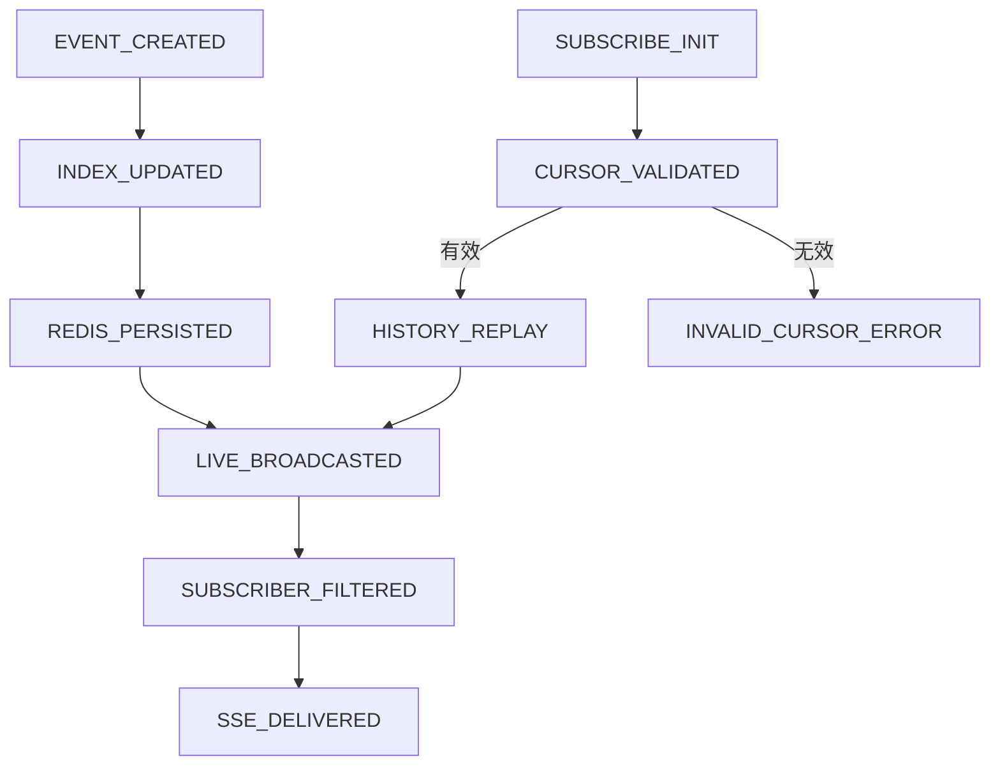
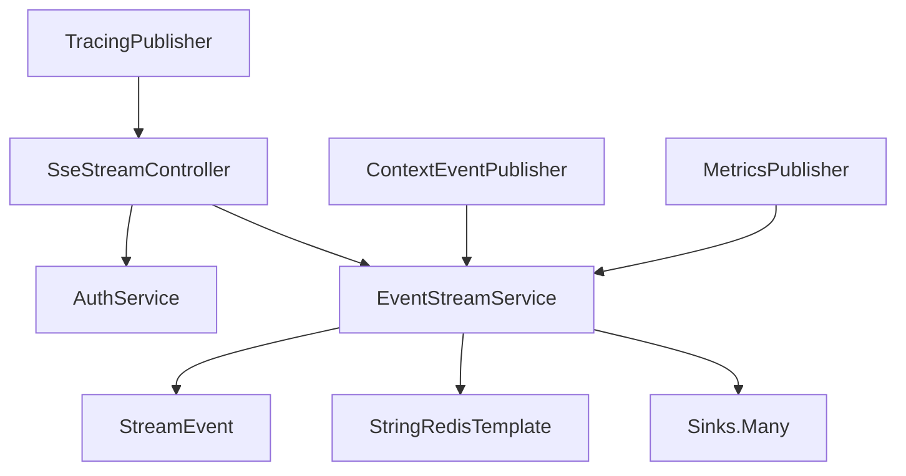

# `streaming` 包系统设计说明

## 1. 包定位与核心功能
- 包定位：`streaming` 是实时事件总线，提供事件入流、订阅推送、历史游标和可观测能力。
- 核心功能：
  - `EventStreamService` 负责索引、序列号、Redis 持久化与订阅过滤。
  - `SseStreamController` 提供 SSE 接口与首事件超时控制。
  - `ContextEventPublisher` 发布上下文阶段事件。
  - `EventType` 统一全系统事件语义。
  - `MetricsPublisher`/`TracingPublisher` 支撑链路观测。

## 2. 分层线框图

## 3. 关键流程图

## 4. 状态流转图

## 5. 类职责与设计原因
- `EventStreamService`：统一流式能力，防止多模块重复建设通道。
- `SseStreamController`：专注协议层、认证、超时与游标处理。
- `EventType`：统一事件语义，降低协作歧义。
- `ContextEventPublisher`：使上下文构建过程可追踪。
- `MetricsPublisher`/`TracingPublisher`：支持性能和故障诊断。

## 6. 关键类直接关系图

## 7. 重点说明
- 历史回放与实时订阅统一于同一服务，语义一致。
- 序列号机制是断线续传和时序稳定的关键。
- 所有图统一使用 `graph TB`。

