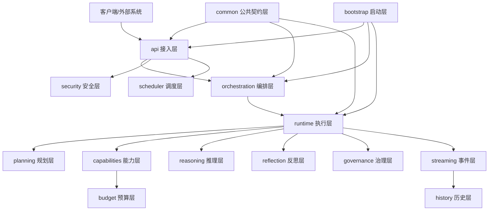
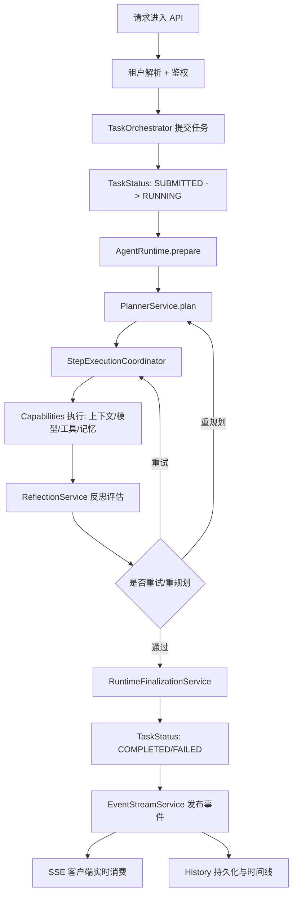
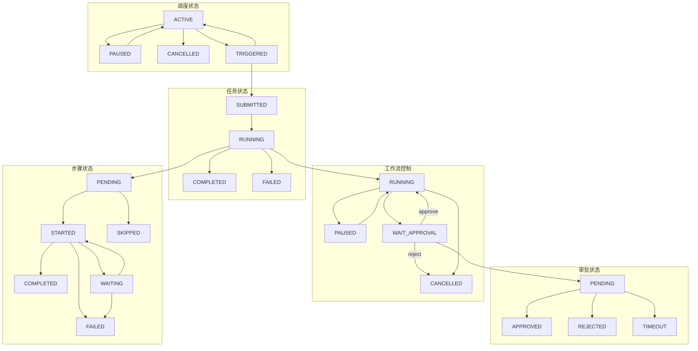
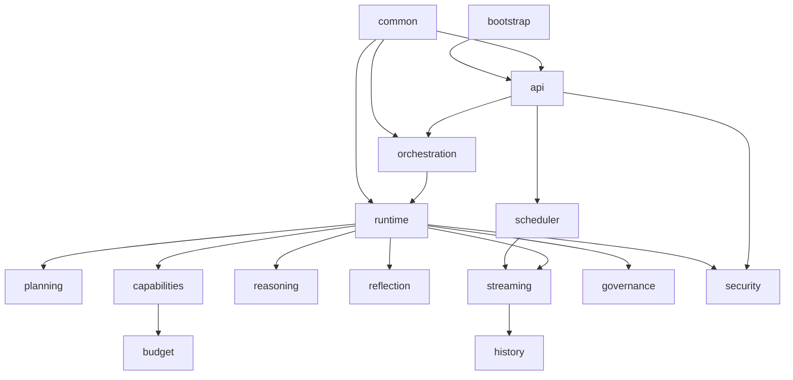

# 智能体系统总体架构设计说明

## 1. 模块总览
- 覆盖核心包：`api`、`bootstrap`、`budget`、`capabilities`、`common`、`governance`、`history`、`orchestration`、`planning`、`reasoning`、`reflection`、`runtime`、`scheduler`、`security`、`streaming`。
- 架构目标：多租户前提下实现可规划、可执行、可治理、可观测、可回放的智能体系统。
- 主链路：`api -> orchestration -> runtime -> capabilities -> streaming`。

## 2. 总体分层线框图

## 3. 总体流程图

## 4. 总体状态流转图

## 5. 模块直接关系图

## 6. 架构重点说明
- 状态驱动：任务、工作流、步骤、审批、调度都有清晰状态机。
- 执行闭环：`planning -> runtime -> reflection -> recovery` 构成自修复闭环。
- 治理内建：审批、限流、熔断、回放是主链路内建能力。
- 可观测优先：关键节点全部事件化，支持实时观察与历史复盘。
- 安全左移：租户解析、鉴权、脱敏前置到入口和能力层。

## 7. 演进建议
- 持续保持 `orchestration` 与 `runtime` 边界稳定。
- 对 `capabilities` 高复杂子域继续解耦。
- 基于历史事件和预算数据做动态阈值调优。
- 保持状态图与事件枚举同步维护。

