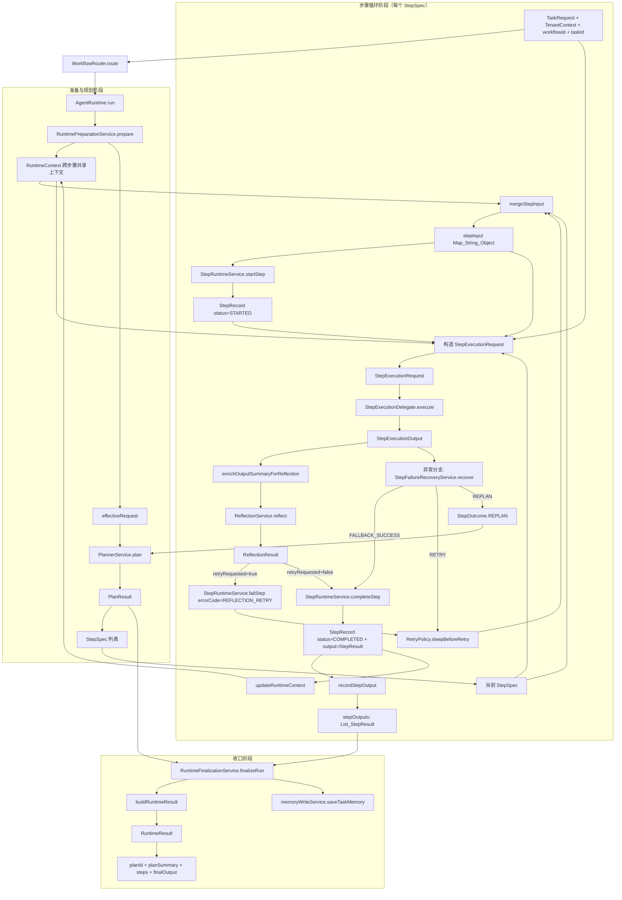

# 运行时对象流转详图（对象流程 + 中间过程流转）

> 说明：本图基于当前主链路 `WorkflowRouter.route -> AgentRuntime.run -> StepRuntimeService.completeStep -> RuntimeFinalizationService.finalizeRun`，覆盖你指定的全部对象：
> `RuntimeContext`、`StepSpec`、`stepInput`、`StepRecord`、`StepExecutionRequest`、`StepExecutionOutput`、`ReflectionResult`、`StepResult`、`RuntimeResult`、`StepResultMeta`、`RawRef`、`StepResultRaw`、`StructuredResult`、`StepResultSummary`、`StepResultRefSet`。

---

## 一、对象流程图（宏观对象生命周期）



---

## 二、对象中间过程流转图（字段级/对象级详细流）

```mermaid
graph TB
    subgraph S0[StepSpec 与 stepInput 形成]
        S1[StepSpec stepType/arguments/context/dependsOn/policy]
        S2[RuntimeContext.asMap]
        S3[mergeStepInput]
        S4[stepInput]
        S1 --> S3
        S2 --> S3
        S3 --> S4
        S3 --> S3A[promoteApprovalFields 提升 requiresApproval/approvalSource]
        S3A --> S4
    end

    subgraph S1A[StepRecord 启动态]
        R1[StepRuntimeService.startStep]
        R2[StepRecord STARTED]
        R3[stepId/workflowId/stepSeq/type/status=STARTED/attempt/input=stepInput/tenantId/startedAt]
        S4 --> R1
        R1 --> R2
        R2 --> R3
    end

    subgraph S2A[StepExecutionRequest 装配]
        Q1[StepExecutionRequest]
        S1 --> Q1
        S4 --> Q1
        S2 --> Q1
        R2 --> Q1
        Q1 --> Q2[包含: step/taskRequest/stepInput/runtimeContext/tenantContext/workflowId/taskId/seqCounter/record/eventPublisher]
    end

    subgraph S3A[StepExecutionOutput 生成]
        E1[StepExecutorRouter.execute]
        E2[StepExecutionOutput.fromPayload]
        E3[payload]
        E4[toolName]
        E5[rawRef 字符串]
        E6[refs Map]
        E7[summary Map]
        Q1 --> E1
        E1 --> E2
        E2 --> E3
        E2 --> E4
        E2 --> E5
        E2 --> E6
        E2 --> E7
    end

    subgraph S4A[ReflectionResult 决策分支]
        RF1[ReflectionService.reflect]
        RF2[ReflectionResult]
        RF3[retryRequested]
        RF4[report.score/report.notes]
        E2 --> RF1
        RF1 --> RF2
        RF2 --> RF3
        RF2 --> RF4
        RF3 -->|true| RF5[failStep + RETRY]
        RF3 -->|false| RF6[进入 completeStep]
    end

    subgraph S5A[StepResult 组装（completeStep 内部）]
        C1[buildStepResult]
        RF6 --> C1
        E2 --> C1
        R2 --> C1

        C2[StepResult]
        C1 --> C2

        C3[StepResultMeta]
        C4[RawRef]
        C5[StepResultRaw]
        C6[StructuredResult]
        C7[StepResultSummary]
        C8[StepResultRefSet]

        C2 --> C3
        C2 --> C4
        C2 --> C5
        C2 --> C6
        C2 --> C7
        C2 --> C8
    end

    subgraph S5B[StepResultMeta 填充来源]
        M1[来源: StepRecord + StepExecutionOutput]
        M2[stepId 来源 record.stepId]
        M3[seq 来源 record.stepSeq]
        M4[type 来源 record.type]
        M5[status 来源 record.status COMPLETED]
        M6[attempt 来源 record.attempt]
        M7[toolName 来源 output.toolName]
        M8[timing.startedAt/endedAt/durationMs]
        M1 --> C3
        M1 --> M2
        M1 --> M3
        M1 --> M4
        M1 --> M5
        M1 --> M6
        M1 --> M7
        M1 --> M8
    end

    subgraph S5C[RawRef 填充来源]
        RR1[来源: StepExecutionOutput.rawRef 字符串]
        RR2[rawRef 以 rawref: 开头 映射 RawRef.refId]
        RR3[否则映射 RawRef.key]
        RR4[store=mem/mediaType=application/json/createdAt=now]
        E5 --> RR1
        RR1 --> RR2
        RR1 --> RR3
        RR2 --> C4
        RR3 --> C4
        RR4 --> C4
    end

    subgraph S5D[StepResultRaw 填充来源]
        RW1[来源: StepExecutionOutput.payload]
        RW2[RawOutputEnvelopeBuilder.build(payload)]
        RW3[data 来源 envelope.data]
        RW4[truncated 来源 envelope.truncated]
        E3 --> RW1
        RW1 --> RW2
        RW2 --> RW3
        RW2 --> RW4
        RW3 --> C5
        RW4 --> C5
    end

    subgraph S5E[StructuredResult 填充来源]
        ST1[来源: stepType + toolName + resultMap + rawRefKey]
        ST2[StructuredExtractorRegistry.extract]
        ST3[StructuredResult 泛型结构化结果]
        ST4[常见类型: StructuredResult_RecordsetData]
        ST5[常见类型: StructuredResult_SqlData]
        ST6[默认类型: StructuredResult_DefaultStructuredData]
        ST7[refs.rawRef 兜底回填 rawRefKey]
        E3 --> ST1
        E4 --> ST1
        C4 --> ST1
        ST1 --> ST2
        ST2 --> ST3
        ST3 --> ST4
        ST3 --> ST5
        ST3 --> ST6
        ST3 --> ST7
        ST3 --> C6
    end

    subgraph S5F[StepResultSummary 填充来源]
        SM1[来源优先: output.summary]
        SM2[若缺失或状态不匹配: StepOutputSummaryBuilder.build 重建]
        SM3[text/outputSummary/toolResultSummary/stepSummary]
        SM4[inputDigest/outputDigest/truncated/reason]
        E7 --> SM1
        SM1 --> SM2
        SM2 --> SM3
        SM2 --> SM4
        SM3 --> C7
        SM4 --> C7
    end

    subgraph S5G[StepResultRefSet 填充来源]
        RS1[refs.rawRef 来源 RawRef.refId 优先 回退 RawRef.key]
        RS2[decisionRawRef/summaryRawRef/toolRawRef/modelRawRef 来源 output.refs]
        RS3[若全部为空则 refs=null]
        C4 --> RS1
        E6 --> RS2
        RS1 --> C8
        RS2 --> C8
        RS3 --> C8
    end

    subgraph S6A[StepResult 回写与上下文推进]
        N1[record.output = StepResult]
        N2[stepOutputs.add(StepResult)]
        N3[updateRuntimeContext]
        N4[lastStepId/lastStepType/lastStepSummary]
        N5[lastStepRawOutput/lastStepRawRef/lastStepRawRefs/lastStepRawTruncated]
        N6[lastOutputSize + steps历史]
        C2 --> N1
        N1 --> N2
        N1 --> N3
        N3 --> N4
        N3 --> N5
        N3 --> N6
    end

    subgraph S7A[RuntimeResult 收口]
        F1[RuntimeFinalizationService.finalizeRun]
        F2[buildRuntimeResult]
        F3[RuntimeResult]
        F4[planId 来源 plan.planId]
        F5[planSummary 来源 plan.summary]
        F6[steps 来源 stepOutputs(List_StepResult)]
        F7[finalOutput 来源 优先取最后一步 raw.data 其次 structured.dataAsMap 再次 summary]
        N2 --> F1
        F1 --> F2
        F2 --> F3
        F2 --> F4
        F2 --> F5
        F2 --> F6
        F2 --> F7
    end
```

---

## 三、关键对象的一句话定位（便于读图）

- `RuntimeContext`：跨步骤共享的运行态上下文容器，承接上一轮步骤关键信息并参与下一轮 `stepInput` 合并。
- `StepSpec`：规划输出的步骤定义对象，是每轮执行请求的静态配置源。
- `stepInput`：`StepSpec + RuntimeContext` 的动态合并视图，是本轮步骤真实执行输入。
- `StepRecord`：步骤运行轨迹实体，承接 `STARTED/COMPLETED/FAILED` 状态流转与 `StepResult` 回写。
- `StepExecutionRequest`：步骤执行器消费的标准输入对象，封装执行所需全部上下文。
- `StepExecutionOutput`：步骤执行器产出的标准输出对象，后续会拆解为 `StepResult` 各子对象。
- `ReflectionResult`：反思阶段决策对象，决定继续完成、重试或进入异常恢复分支。
- `StepResult`：步骤最终对外输出聚合对象，包含 `meta/rawRef/raw/structured/summary/refs`。
- `RuntimeResult`：整次运行收口对象，包含 `planId/planSummary/steps/finalOutput`。
