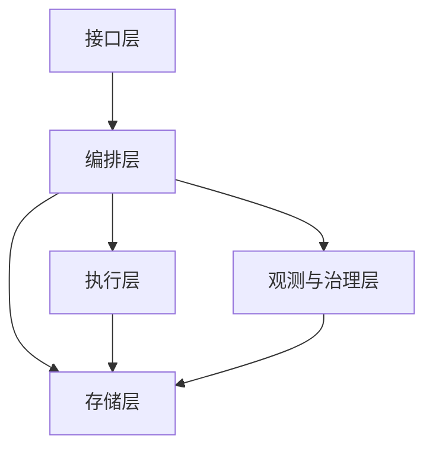
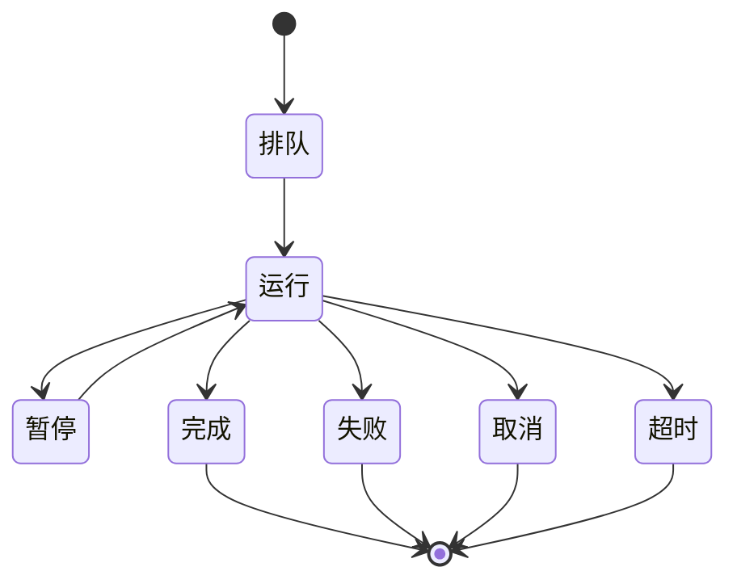

# 技术架构与实现计划

## 1 总体架构概览

### 分层结构图


### 核心数据流
- 任务创建 -> 编排 -> 工具执行 -> 事件与时间线 -> 结果输出
- 结果输出通道
```
SSE
```
- 同步查询

### 端到端流程层映射

#### 战略层
```
A1
Strategic Layer
```
主要模块
```
orchestrator
governance
persistence
```
关键产出
- 目标与成功标准
- 约束与预算分配
- 里程碑与优先级

#### 战术层
```
A2
Tactical Layer
```
主要模块
```
orchestrator
persistence
```
关键产出
- 任务树与依赖关系
- 子任务编排顺序
- 周期性任务定义

#### 推理层
```
A3
Reasoning Layer
```
主要模块
```
orchestrator
runtime
persistence
```
关键产出
- 策略选择与风险等级
- 工具候选集合
- 可行性判断结论

#### 行动计划层
```
A4
Action Planning
```
主要模块
```
orchestrator
governance
persistence
```
关键产出
- 可执行步骤清单
- 依赖与资源约束
- 人工介入点

#### 执行层
```
A5
Execution
```
主要模块
```
runtime
governance
persistence
```
关键产出
- 工具结果与产物引用
- 错误分类与资源消耗
- 执行进度与状态

#### 反馈层
```
A6
Feedback
```
主要模块
```
orchestrator
observability
persistence
```
关键产出
- 结果评估与归因
- 改进建议与回放结论
- 反馈闭环信号

#### 记忆层
```
A7
Memory
```
主要模块
```
persistence
orchestrator
```
关键产出
- 上下文快照与压缩摘要
- 经验池与检索索引
- 回溯与审计依据

### 技术栈约束
```
Spring Boot 3
WebFlux
Temporal
PostgreSQL
Redis
Micrometer
OpenTelemetry
```

### 技术栈用途
- 核心服务框架与运行时
- 实时流式输出
- 工作流编排与长任务治理
- 状态、审计与配置存储
- 会话与缓存
- 指标与追踪

## 2 模块划分与职责边界

### 模块与包结构建议
模块
```
server
orchestrator
runtime
persistence
observability
governance
```

包结构示例
```
com.example.agent.server
com.example.agent.orchestrator
com.example.agent.runtime
com.example.agent.persistence
com.example.agent.observability
com.example.agent.governance
```

### 接口与流式接入模块
```
server
```
输入
- 外部请求与认证上下文
- 实时流订阅参数
输出
- 任务创建与查询结果
- 实时事件流输出
禁止
- 不承载编排决策
- 不直接执行工具
- 不绕过持久化模块写入

### 任务编排与生命周期模块
```
orchestrator
```
输入
- 任务描述与上下文
- 预算、优先级与人工介入策略
- 调度与周期性触发信息
输出
- 状态流转与任务结果
- 事件与时间线记录
- 调度与重放控制结果
禁止
- 不直接访问外部系统
- 不执行工具调用
- 不绕过持久化模块写入

### 工具运行时模块
```
runtime
```
输入
- 工具元数据与版本信息
- 工具调用请求与参数
- 资源约束与风险等级
输出
- 工具执行结果
- 工具执行事件与产物引用
禁止
- 不承担编排决策
- 不存储长期业务状态
- 不绕过治理策略

### 存储与上下文模块
```
persistence
```
输入
- 任务与步骤状态
- 事件与审计记录
- 工具产物元数据
- 策略与配额配置
- 上下文快照与记忆索引
输出
- 读写结果与查询视图
- 审计与时间线检索能力
禁止
- 不执行编排逻辑
- 不承担工具调用
- 不输出未授权数据

### 观测模块
```
observability
```
输入
- 日志、指标与追踪数据
- 成本与预算事件
输出
- 监控与告警结果
- 指标与追踪查询
- 成本与运营报表
禁止
- 不修改业务状态
- 不改变编排决策

### 治理模块
```
governance
```
输入
- 预算与成本规则
- 策略与风险配置
- 限流与配额参数
- 审批与授权决策
输出
- 准入与阻断结果
- 限流与降级指令
- 审批状态变更
禁止
- 不执行工具调用
- 不绕过审计记录

### 能力域到模块与数据流映射
任务编排与生命周期
```
orchestrator
server
persistence
```
关键数据流
- 任务创建 -> 编排 -> 状态流转 -> 时间线

工具执行与结果规范
```
runtime
governance
observability
```
关键数据流
- 工具调用 -> 结果采集 -> 事件记录

长任务与恢复
```
orchestrator
```
关键数据流
- 编排 -> 重试与补偿 -> 重放

上下文与记忆
```
persistence
orchestrator
```
关键数据流
- 上下文写入 -> 压缩 -> 回溯

可观测性
```
observability
persistence
```
关键数据流
- 事件 -> 指标与追踪 -> 审计

安全与治理
```
governance
server
runtime
persistence
```
关键数据流
- 鉴权与策略 -> 调用准入 -> 审计记录

对外接口与集成
```
server
orchestrator
observability
```
关键数据流
- 请求 -> 事件流输出 -> 查询回放

## 3 领域模型与状态机

### 任务与运行实例
```
Task
Run
```
任务实例承载目标、预算、租户与会话上下文
运行实例承载执行周期、步骤状态、成本与时间线引用

### 任务状态机


状态约束
- 终态不可逆
- 暂停仅由运行进入
- 恢复仅由暂停进入
- 重放仅基于终态历史
- 幂等创建返回同一状态

### 子任务与多智能体聚合模型
- 父子关系形成任务树或依赖图
- 依赖关系采用有向无环图
- 汇总状态由子任务终态驱动
- 汇总结果包含去重与合并规则

### 人工介入点的数据结构与状态变化
数据字段
```
approval_id
task_id
run_id
action
state
actor_id
reason
created_at
updated_at
```
状态变化
- 请求发起
- 等待决策
- 通过
- 拒绝
- 超时

## 4 事件模型与时间线

### 事件分类
工作流生命周期事件
```
WORKFLOW_STARTED
WORKFLOW_COMPLETED
WORKFLOW_CANCELLED
WORKFLOW_TIMEOUT
ERROR_OCCURRED
```
智能体事件
```
AGENT_STARTED
AGENT_COMPLETED
AGENT_THINKING
```
工具事件
```
TOOL_INVOKED
TOOL_OBSERVATION
```
模型交互事件
```
LLM_PROMPT
LLM_PARTIAL
LLM_OUTPUT
```
协作事件
```
DELEGATION
TEAM_RECRUITED
TEAM_RETIRED
MESSAGE_SENT
MESSAGE_RECEIVED
ROLE_ASSIGNED
```
进度与等待事件
```
PROGRESS
DATA_PROCESSING
WAITING
```
人工介入事件
```
APPROVAL_REQUESTED
APPROVAL_DECISION
```
恢复事件
```
ERROR_RECOVERY
```

### 事件字段草案
必须包含字段
```
tenant_id
task_id
trace_id
tool_id
error_class
cost
token
```
完整字段集合
```
workflow_id
run_id
step_id
session_id
user_id
agent_id
event_type
message
payload
timestamp
seq
stream_id
duration_ms
status
model
provider
```

### 时间线生成规则
- 以事件顺序与序号作为排序基准
- 状态变更事件进入时间线主轴
- 流式输出事件用于实时呈现
- 时间线可由事件历史重建
- 生成结果进入审计与查询

### 实时流事件消息结构
```
SSE
```
字段草案
```
id
event
data
retry
last_event_id
```

### 断线续传方案
游标语义
```
cursor
```
偏移语义
```
offset
```
令牌语义
```
token
```
- 断线续传基于任务与会话上下文校验
- 重连后按游标或偏移回放事件

## 5 长任务编排设计

```
Temporal
```

### 职责边界
```
Workflow
Activity
```
- 编排层仅承担确定性决策与状态流转
- 外部副作用放入执行单元
- 事件与时间线写入通过执行单元统一触发

### 幂等键策略
```
task_id + step_id
task_id + run_id + attempt
schedule_id + run_id
```

### 重试与超时策略
- 重试上限与退避边界按失败类型配置
- 超时包含单次超时与整体超时
- 权限拒绝与参数错误不进入重试
- 配置入口统一归属治理模块

### 补偿与恢复策略
- 外部副作用必须配置补偿步骤
- 补偿结果写入事件与审计
- 补偿失败进入人工介入队列

### 控制信号与重放
- 暂停、恢复、取消进入事件流与审计
- 重放基于事件历史保证输出一致
- 重放不触发重复外部副作用

## 6 数据存储设计

关系存储
```
PostgreSQL
```

任务运行表
```
task_run
```
关键字段
```
task_run_id
task_id
run_id
tenant_id
session_id
status
start_at
end_at
priority
budget
```
索引建议
```
idx_task_run_tenant_id
idx_task_run_status
idx_task_run_created_at
```
保留策略
- 热数据保留 30 天
- 归档保留 1 年

任务步骤表
```
task_step
```
关键字段
```
step_id
task_id
run_id
agent_id
tool_id
status
start_at
end_at
error_class
```
索引建议
```
idx_task_step_task_id
idx_task_step_status
idx_task_step_agent_id
```
保留策略
- 保留 180 天

事件日志表
```
event_log
```
关键字段
```
event_id
task_id
run_id
tenant_id
event_type
seq
stream_id
timestamp
payload
```
索引建议
```
idx_event_log_task_id
idx_event_log_tenant_id
idx_event_log_timestamp
```
保留策略
- 实时事件流窗口不少于 24 小时
- 审计事件保留 1 年

审计日志表
```
audit_log
```
关键字段
```
audit_id
tenant_id
actor_id
action
resource_type
resource_id
decision
timestamp
```
索引建议
```
idx_audit_log_tenant_id
idx_audit_log_timestamp
idx_audit_log_action
```
保留策略
- 保留 1 年

产物表
```
artifact
```
关键字段
```
artifact_id
task_id
run_id
tool_id
type
uri
size
checksum
expires_at
```
索引建议
```
idx_artifact_task_id
idx_artifact_tool_id
idx_artifact_expires_at
```
保留策略
- 元数据保留 180 天
- 存储介质按过期时间清理

周期调度表
```
schedule
```
关键字段
```
schedule_id
tenant_id
cron
timezone
status
next_run_at
last_run_at
max_budget
```
索引建议
```
idx_schedule_tenant_id
idx_schedule_status
idx_schedule_next_run_at
```
保留策略
- 调度配置长期保留

工具注册表
```
tool_registry
```
关键字段
```
tool_id
name
version
category
risk_level
status
schema
updated_at
```
索引建议
```
idx_tool_registry_name
idx_tool_registry_version
idx_tool_registry_status
```
保留策略
- 保留所有版本记录

策略表
```
policy
```
关键字段
```
policy_id
name
version
mode
hash
status
updated_at
```
索引建议
```
idx_policy_name
idx_policy_version
idx_policy_status
```
保留策略
- 保留所有版本记录

租户配额表
```
tenant_quota
```
关键字段
```
tenant_id
token_limit
rate_limit
concurrency_limit
updated_at
```
索引建议
```
idx_tenant_quota_updated_at
```
保留策略
- 保留当前与历史版本

成本账本表
```
cost_ledger
```
关键字段
```
ledger_id
tenant_id
task_id
run_id
tool_id
model
provider
input_tokens
output_tokens
total_tokens
cost
currency
timestamp
```
索引建议
```
idx_cost_ledger_tenant_id
idx_cost_ledger_task_id
idx_cost_ledger_timestamp
```
保留策略
- 保留 1 年
- 按租户归档

上下文快照表
```
context_snapshot
```
关键字段
```
snapshot_id
tenant_id
session_id
task_id
summary
created_at
```
索引建议
```
idx_context_snapshot_session_id
idx_context_snapshot_created_at
```
保留策略
- 保留 180 天

记忆索引表
```
memory_item
```
关键字段
```
memory_id
tenant_id
session_id
task_id
content_ref
version
created_at
```
索引建议
```
idx_memory_item_session_id
idx_memory_item_created_at
```
保留策略
- 依版本策略保留

缓存与会话存储
```
Redis
```
用途
- 会话上下文缓存
- 幂等去重与短期锁
- 限流计数与配额窗口
- 实时事件流缓冲
- 断线续传游标

## 7 工具运行时与结果规范落地

```
Tool Runtime
ToolResult
```

### 工具注册与发现
- 注册包含能力、风险等级与版本
- 支持停用、删除与版本切换
- 工具变更进入审计记录
- 工具列表支持标签与能力检索

### 参数校验与权限校验
- 参数完整性与类型校验为必经步骤
- 内容安全与大小限制在执行前完成
- 权限与租户校验在调用前完成
- 校验失败直接终止执行流程

### 风险等级与审批挂点
- 高风险工具进入人工介入流程
- 风险等级影响资源配额与网络访问
- 审批结果写入审计与事件流

### 结果语义与承载方式
结果形态
```
text
json
table
file
stream
```
承载规则
- 结果包含来源工具、状态、耗时与摘要
- 大结果仅保留引用与元数据
- 结果落库与事件记录保持一致

### 大结果集策略
- 分页读取
- 导出到存储介质
- 上传到对象存储并返回引用

## 8 成本、预算、限流与策略治理

### 统计口径
- 任务级统计
- 会话级统计
- 工具级统计
- 成本账本作为事实来源

### 超预算处理
- 超限直接阻断
- 超限触发降级路径
- 超限触发人工介入

### 速率与并发治理
- 租户维度限流
- 用户维度限流
- 工具维度限流
- 提供方速率感知治理

### 策略治理
策略模式
```
off
dry-run
enforce
```
治理要求
- 默认拒绝与最小权限优先
- 决策结果写入审计记录
- 灰度发布按租户或用户分组

## 9 安全与多租户

### 身份与凭据
认证方式
```
JWT
API Key
```
- 身份上下文从认证结果注入
- 凭据加密存储与轮换
- 凭据访问记录进入审计

### 工具访问控制
- 工具白名单与最小权限策略
- 高风险操作需要人工确认
- 策略评估结果进入事件流

### 网络访问边界
- 默认拒绝外网访问
- 允许列表作为唯一放行来源
- 网络访问进入审计与限流

### 多租户隔离点
- 接口层按租户鉴别与授权
- 编排层校验租户上下文一致
- 执行层隔离资源与会话
- 存储层强制租户过滤
- 观测层按租户分域与脱敏

### 默认拒绝外网访问的实现边界
- 治理层下发网络策略
- 执行层按策略放行
- 违规访问记录并阻断

## 10 可观测性与服务水平目标

### 日志字段规范
```
tenant_id
task_id
run_id
step_id
trace_id
tool_id
agent_id
event_type
error_class
cost
token
```

### 指标与追踪清单
- 任务成功率与失败率
- 事件流延迟与吞吐
- 工具调用耗时与错误分类
- 预算消耗与超限次数
- 调度任务成功率与失败率
- 资源使用与并发量

### 追踪要求
- 任务到工具的链路全覆盖
- 追踪标识在日志与事件中一致
- 关键链路采样率高于普通链路

### 告警与服务水平目标
- 任务成功率不低于 99.5%
- 事件流中位延迟不高于 2 秒
- 关键错误告警触达时间不超过 5 分钟
- 预算超限告警与人工介入联动

### 审计与回放
- 事件与时间线可查询
- 回放输出与历史一致
- 取证信息包含输入、决策与结果摘要

## 11 里程碑与交付切片

M1
- 最小闭环可运行
- 实时事件流与任务查询
- 核心编排与工具执行
- 状态与审计落库
- 基础预算与策略治理
- 多租户隔离与基础观测

M2
- 稳定性与治理增强
- 多智能体依赖编排与汇总
- 周期任务与恢复补偿
- 速率感知限流与成本优化
- 审计与时间线增强

M3
- 未来扩展
- 跨地域部署与容灾
- 跨组织协作与授权
- 长期记忆与知识库
- 策略与成本自优化

## 需求覆盖矩阵
| 能力域 | 对应章节 |
| --- | --- |
| 任务编排与生命周期 | 1, 2, 3, 5 |
| 工具执行与结果规范 | 1, 2, 7 |
| 长任务与恢复 | 3, 5 |
| 上下文与记忆 | 1, 2, 6 |
| 可观测性 | 4, 10 |
| 安全与治理 | 2, 8, 9 |
| 对外接口与集成 | 1, 2, 4 |
